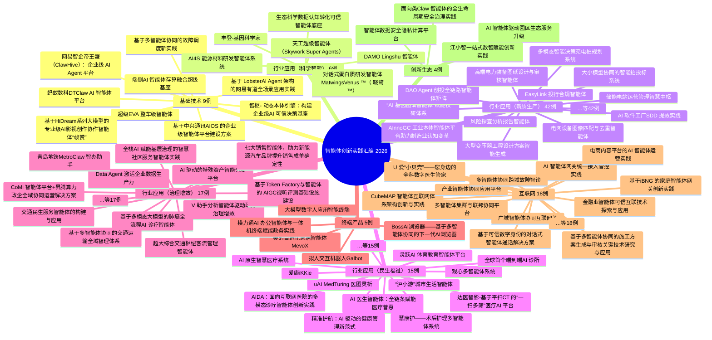

# 中国信通院《2026 智能经济新形态——智能体创新实践汇编》案例提取

> 本文档依据原文，按 **申报单位简介 / 案例简介 / 技术创新点 / 应用价值与效益** 四个维度提取各案例信息；各部分均控制在 300 字以内，原文含表格者尽量保留表格结构。

- **案例总数**：116 个
- **板块划分**：8 大板块（基础技术、科学智能、新质生产、民生福祉、治理增效、终端产品、互联网、创新生态）
- **配套导航**：左右对称交互式思维导图见 `智能体创新实践汇编_思维导图.html`

## 一、左右对称思维导图（结构导航）

下图为 Mermaid 文本版结构图（根在中心、板块左右对称分布）；完整交互式可视化请打开配套 HTML 文件。

## 二、案例明细

### 板块1：智能体+ 基础技术（9 例）

#### 案例1：超级EVA 整车级智能体

- **申报单位**：上海阶跃星辰智能科技股份有限公司（原文页码 folio 14）
- **申报单位简介**：阶跃星辰是行业领先的通用大模型创业公司，坚定探索实现通用人工智能的道路。公司于2023 年4
    
  月成立，聚集人工智能领域的顶尖人才，已对外发布Step 系列通用大模型矩阵，覆盖了从语言、多
    
  模态到推理的全面能力，并面向开发者连续开源多个业内领先的多模态大模型。产业应用方面，阶跃
    
  星辰聚焦智能终端Agent，已在汽车、手机、具身智能、IoT 等关键应用场景与行业头部公司达成深
    
  度合作。此外，阶跃星辰已在金融财经，内容创作等领域携手合作伙伴，共同打造垂直场景下的创新
    
  C 端应用体验。
- **案例简介**：2026 年4 月，阶跃星辰联合吉利、千里科技推出超级EVA——中国首个量产落地的整车级智能体，首发搭
    
  载于极氪8X。基于阶跃星辰旗舰基座模型Step 3.5 Flash，超级EVA 打破座舱、智驾、底盘、动力域的信
    
  息孤岛，实现" 舱驾融合、对话即执行
    
  执行"。
    
  应用场景中，用户以自然语言发出复合指令，智能体可自主拆解意图、规划多途经点路线、动态调度订餐、
    
  泊车等生态服务，全程无需人工分步操作。其具备情绪感知、环境理解、行程规划、整车控制、生态服务
    
  五大能力矩阵，支持口语化地标识别、上下文记忆与主动关怀。
    
  人机协同上，用户从" 操作者" 转变为" 监督者"，智能体承担认知与操作负荷。商业化…

**原文表格：**

| 维度 指令理解 | 传统语音助手 需要明确、结构化指令 | 超级EVA 智能体 理解模糊语义，如" 顺便"" 帮我找" |
| ------- | ----------------- | ----------------------------- |
| 任务规划    | 单次任务执行            | 多步骤自主规划与拆解                    |
| 系统协同    | 仅控制座舱设备           | 原生融合智驾、底盘、动力、数字生态             |
| 交互方式    | 被动应答              | 主动思考、主动提醒、人格化陪伴               |
| 记忆能力    | 无记忆               | 长期记忆用户偏好                      |

- **技术创新点**：
    
  Step 3.5 Flash 基座模型作为超级EVA 的核心认知引擎，采用稀疏混合专家（MoE）架构，总参数量达
    
  196B，通过智能路由动态激活约110 亿参数，实现17.8 倍参数压缩效率，兼顾大模型知识容量与小模型推
    
  理速度。针对车载Agent 对实时性的严苛要求，阶跃星辰引入三路多Token 预测（MTP-3）技术，在单次
    
  前向传播中并行预测4 个token，将解码效率提升3 至4 倍，峰值推理速度达350 TPS，保障复杂复合指令
    
  的毫秒级响应。模型配备256K 超长上下文窗口，采用滑动窗口注意力与全注意力3:1 交错机制，使系统具
    
  备跨小时的长程记忆与情境化推理能力。此外，阶跃星辰…

**原文表格：**

| 层级 感知层 | 核心能力 端到端语音大模型 + 视觉理解大模型（Step-Vision） | 用户体验价值 像与人对话一样自然交流 |
| ------ | ------------------------------------ | ------------------ |
| 认知层    | 交 WAM 世界行为模型 + Step 3.5 Flash 基座模型   | 理解意图、自主规划          |
| 执行层    | 千里浩瀚G-ASD 4.0 + 底盘/ 动力/ 车身域融合        | 从" 说" 到" 做" 无缝衔接   |

- **应用价值与效益**：2026 年4 月17 日，超级EVA 整车级智能体随极氪8X 完成全球首发量产交付，标志着整车智能体跨越了
    
  从实验室到规模商用的关键门槛。市场端反响强烈，上市30 分钟内大定订单突破1 万台，Ultra 及以上高
    
  配版本占比达95.6%，平均订单价格超过40 万元，充分验证智能化已从附加配置升级为核心购买驱动力。
    
  实施过程采用" 联合定义—并行开发—量产验证" 的敏捷路径。三方团队在项目初期即同地办公，联合锁
    
  定功能边界、安全标准与场景优先级；模型训练、系统集成与整车测试并行推进，阶跃算法团队驻场千里
    
  进行车载场景微调，吉利同步开放底层域控制器接口与数据权限，将传统车企18 至24 个月的…

**原文表格：**

| 限 端到端语音交互 超级EVA 情感智能体基础能力 | 首发搭载 首发搭载 | 银河M9（2025 年8 月）、极氪8X（2026 年3 月） 包括意图理解、任务执行、情感语音交互 |
| ------------------------- | --------- | -------------------------------------------------- |
| 仅 WAM 2.0 整车大脑            | 首发搭载      | 极氪8X 首发                                            |
| 视觉理解能力                    | 首发搭载      | 极氪8X 首发                                            |
| 流动记忆功能                    | 首发搭载      | 短期记忆 + 长期记忆                                        |
| 千里浩瀚G-ASD 4.0             | 首发搭载      | 极氪8X 首发                                            |
| AI 终点领航（停车场内）             | 首发搭载      | G-ASD 4.0 核心能力                                     |
| 高速L3 级辅助驾驶                | 计划推送      | " 法规允许条件下"2026 年推送                                 |
| 低速L4 级功能                  | 计划推送      | 需等待法规开放                                            |
| 超级EVA 深度规划能力              | 持续迭代      | WAM 1-2 周迭代周期，OTA 持续升级                             |
| 多智能体深度协同（完整1+2+N）         | 分阶段开放     | 目前座舱+ 智驾联动                                         |

| 数据项                   | 数值        | 数据来源与统计口径           |
| --------------------- | --------- | ------------------- |
| 极氪8X 48 小时订单超3 万      | ~30,000 台 | 极氪官方公布              |
| 极氪8X Ultra 版及以上高配占比   | 95.6%     | 极氪4 月交付数据公告         |
| 极氪8X 上市不到半小时大定破万      | ~10,000 台 | 2026 年4 月17 日上市发布会  |
| 极氪8X 上市13 天交付近3,500 辆 | ~3,500 台  | 极氪5 月交付公告           |
| 银河M9 预售24 小时订单破4 万    | ~40,000 台 | 吉利银河官方微博（2025 年8 月） |
| 银河M9 上市24 小时大定2.3 万   | ~23,000 台 | 吉利汽车官方公布（2025 年9 月） |

#### 案例2：端侧AI 智能体存算融合超级基座

- **申报单位**：上海无量火智能科技有限公司（原文页码 folio 20）
- **申报单位简介**：上海无量火智能科技有限公司成立于2026 年4 月，总部位于上海张江，是一家专注于端侧人工智
    
  能基础设施与智能体平台的硬核科技企业。公司自主研发了端侧AI 超级引擎Ember 与智能体平台
    
  FlareOS，主打“端侧XPU 统一智能调度”与“AI 内存压缩技术”，可将大模型内存容量压缩90% 以上，
    
  解决端侧内存墙。在此底座上，公司推出了端侧多模态智能体FlareOS，支持自主GUI 屏幕感知、规
    
  划与跨App 执行，保障本地零知识安全人机协同。公司与世界领先的终端与芯片厂商达成深度战略
    
  合作，共同推动端侧智能体在终端的规模落地。
- **案例简介**：传统个人智能体与大模型受“内存墙”制约，在16GB 端侧设备上难以流畅运行。本项目推出“端侧AI 智
    
  能体存算融合超级基座”，以Ember 端侧AI 超级引擎为性能底座，以FlareOS 为运行环境。核心部署端
    
  侧智能体FlareOS，具备“视觉+ 文本”多模态感知能力，支持自主GUI 屏幕感知、规划与跨App 工具调用，
    
  可在本地隐私隔离沙箱内自动执行跨软件复杂任务( 如早间工作清扫、侧边栏助手)。通过AI 内存压缩技术，
    
  将大模型内存占用压缩90% 以上，实现1000B 级模型在本地流畅部署。项目打通了离线智能体“调度- 压
    
  缩- 安全-GUI 执行”闭环，实现了端侧智能体的规模落地。
- **技术创新点**：
    
  本项目首创了基于“芯片- 存储- 调度- 智能体应用”全栈软硬协同的端侧智能体基础技术，核心创新包括：

1. 基于FlareOS 的“感知- 规划- 执行”闭环多模态智能体(FlareOS)
     
   在应用层，自研双引擎驱动的端侧多模态智能体FlareOS, 首创基于“视觉Grounding”的GUI 屏幕感知技
     
   术，实时理解UI 界面控件。智能体引入主动“反思与纠错”规划机制，可在本地隐私沙箱内高精度模拟鼠标、
     
   键盘及OS 级API 调用，跨软件自动执行复杂工作流，实现物理级的高阶人机协同。
2. 端侧零知识安全与隐私隔离沙箱
     
   智能体运行在FlareOS 的隐私隔离沙箱中。系统引入零知识安全架构，…

- **应用价值与效益**：本项目已在多个战略级终端与芯片平台中完成联调与落地验证，成效显著：

1. 智能PC 本地智能体落地
     
   基于Ember 与FlareOS，与AI PC 厂商成功实现端侧智能体全离线部署。支持自主登录邮箱、IM 软件，一
     
   键归纳昨日工作并生成日程备忘;“支持跨PDF/ 网页等多源文档的内容提取、知识检索及本地草稿撰写。
     
   通过本地沙箱模拟执行，不仅100% 保护用户隐私，在16GB 设备上实现首字延迟(TTFT)<500ms，生成速
     
   度>20TPS，打通了端侧智能体人机协同的最后一公里。
2. 手机
     
   手机端侧智能体
     
   与头部芯片厂商合作，将Ember 超级引擎深度整合至移动平台，在智能手机端实现了流畅…

#### 案例3：基于 LobsterAI Agent 架构的网易有道全场景应用实践

- **申报单位**：网易有道信息技术（原文页码 folio 24）
- **申报单位简介**：网易有道成立于 2006 年，并于 2019 年成功登陆纽交所，成为网易旗下首家独立上市公司。公司始
    
  终秉承“学习高效，取之有道”的理念，致力于以技术创新驱动学习变革。经过多年的技术迭代， 网
    
  易有道于 2023 年推出了国内首个教育大模型“子曰”，并以此为技术底座，构建了跨场景的 AI 原生
    
  产品矩阵，涵盖国民级应用“有道词典”、行业标杆“有道词典笔”和全新“有道龙虾”桌面智能体
    
  等智能学习与办公产品。目前，“子曰”大模型已在口语练习、家庭辅导等多个场景率先落地，持续
    
  通过 AI 生产力赋能用户与企业。
- **案例简介**：项目面向办公提效与智能体应用落地场景，依托网易有道子曰自研大模型等技术的积累，并以 LobsterAI 作
    
  为开源桌面端 Agent 基座，构建覆盖写作、调研、数据看板、内容监控、重复任务自动化、多 Agent 协作
    
  体应用体系。
    
  及多模态生成等场景的智能体应
    
  LobsterAI 以 OpenClaw 为核心智能体执行引擎，在其上扩展图形化交互界面、专家套件、Skill 能力体系、
    
  多 Agent / 子 Agent 协作、生图生视频、IM 接入、自动化任务等外延能力，形成可私有化部署、可二次开发、
    
  可端侧运行、可跨场景复用的开源 Agent 技术架构。项目已在网易集团范围内安装和使用，并在…
- **技术创新点**：
    
  依托网易有道自研子曰通用大模型的技术积累，搭配开源 Lobster AI 桌面端全场景智能体基座，形成通用
    
  型端侧智能体全套技术体系，围绕开源框架、系统协同、任务运行、多模型兼容四大维度实现技术突破，
    
  解决了全场景智能体云端部署成本高、端侧落地性能弱、定制化难度大、数据安全性不足等行业痛点。
    
  1、LobsterAI 坚持开源透明和本地优先的产品设计，项目  100% 开源，并采用  MIT 协议，便于企业、院校
    
  和开发者进行代码审计、私有化部署和二次开发。产品不强制用户登录， 不以账号体系作为基础使用前提，
    
  也不默认采集用户业务数据，能够更好适配政企、院校及内部办公等对数据安全要求较高的场景…
- **应用价值与效益**：LobsterAI 主要服务办公人群，聚焦知识工作中的高频低效环节，帮助用户完成文章写作、资料调研、数据
    
  整理、报表看板生成、网页与内容监控、定时任务执行、自动化重复操作等工作。通过 Agent 自动规划、
    
  工具调用和多步骤任务执行，用户可以将原本需要人工反复操作的流程交由智能体完成，从而提升办公效
    
  率和任务完成质量。
    
  1、落地实施关键步骤
    
  项目以“开源桌面 Agent 平台 + 多模型能力接入 + 场景化工具生态”为实施路径，分阶段推进落地。第一
    
  阶段聚焦底座建设，完成 LobsterAI 桌面端 Agent 框架、本地任务执行、会话管理、权限控制和产物展示
    
  等基础能力；第二阶段聚焦能力扩…

#### 案例4：基于HiDream系列大模型的专业级AI影视创作协作智能体“帧赞”

- **申报单位**：智象未来（原文页码 folio 28）
- **申报单位简介**：智象未来(HiDream.ai）是全球领先的多模态生成式人工智能创新企业。作为国内最早布局多模态生
    
  成式AI 的企业之一，我们正致力于打造下一代“原生全模态世界模型”，向着世界模型领域的全球
    
  领先企业不断迈进。作为专注于AIGC 领域研发超过10 年的全球领先技术团队，公司核心团队汇聚了
    
  来自全球顶尖高校及微软、腾讯、字节等科技企业的研究与管理人才，也是国内唯一由院士领衔、在
    
  AI 视觉生成领域兼具前沿技术研究和大规模产业落地经验的创新公司。依托自研的HiDream 系列大
    
  模型强大的视觉内容理解与生成能力，智象持续打造面向商业营销、影视创作、社媒内容创作三大场
    
  景的AIGC 创新产品，形成…
- **案例简介**：本案例主要介绍智象未来的专业级AI 影视创作协作智能体“帧赞”。
    
  作为国内首批AIGC 影视制作探索与推动者，基于智象多年深耕于AI 影视产业的经验积淀，帧赞依托自研
    
  多模态大模型，以电影级画质生成能力和“创意- 分镜- 成片”全流程打通的核心能力，为专业影视创作
    
  团队提供了兼顾高品质和高效率的协作创作工具。累积目前已入驻专业团队与生态合作伙伴超千家，累计
    
  00 分钟+。
    
  制作短漫剧5000
- **技术创新点**：
    
  4 月，作为全球领先的多模态生成式人工智能创新企业，智象未来正式发布全球首个专业级AI 影视创作协
    
  作智能体——“帧赞”。官方网站与产品同步上线，以电影级画质生成能力和“创意- 分镜- 成片”全流
    
  程打通的核心实力，为专业影视创作团队提供了兼顾品质与效率的全新解法。
    
  “帧赞”以“专业创作、全链闭环、团队协同、精细管理”为核心，打造了六大行业领先的产品能力，直
    
  击影视创作全流程的核心痛点，让专业团队真正实现用AI 完成精品化、工业化、规模化的创意内容生产。

1. 全流程：从剧本到成片，一站式AI 赋能影视创作全链路
     
   从剧本智能解析，自动拆解核心场景、角色、镜头需求；到AI 辅助分镜创作，快速输…

- **应用价值与效益**：案例整体落地情况介绍：
    
  上线仅12 小时，由智象未来“帧赞”提供AI 全流程工业化技术支持的奇幻悬疑 AI 仿真人短剧《秦岭青铜
    
  诡事录》，登顶腾讯视频竖屏热播榜，成为2026 年 AI 短剧赛道标志性爆款。
    
  该剧由耀客传媒、三川传媒与42 工作室联合出品，剧集依托“帧赞”专业级 AI 影视创作与协作平台，打
    
  破传统 AI 工具碎片化、单人作业、生成不可控的创作模式，通过一站式全链路工业化流程、多角色线上协
    
  同创作，实现从创意构思到成片交付的闭环，重新定义 AIGC 专业剧集的工业化创作标准，为AI 影视高质量、
    
  高效率的工业化转型，提供可落地、可复制的路径。
    
  在《秦岭青铜诡事录》制作中，团…

#### 案例5：基于多智能体协同的故障调度新实践

- **申报单位**：中国移动通信集团福建有限公司（原文页码 folio 40）
- **申报单位简介**：中国移动通信集团福建有限公司是中国移动有限公司的全资子公司。现已建成覆盖范围广、业务品种
    
  多、通信质量高的综合通信网络，具备行业领先的经营管理制度。公司下辖9 个地市分公司、1 个直
    
  属中心，82 个县（市、区）分公司和营销中心，1 个控股公司，建有中国移动大模型产业创新基地（福建）、
    
  中国移动- 宁德时代信息能源联合研究院。2024 年，公司营运收入持续增长，超290 亿；客户规模
    
  超3000 万，宽带客户超1000 万，5G 终端客户数接近2000 万，区域主要运营商地位得到巩固。公
    
  司始终牢记国之大者，攻坚克难，主动作为，积极作答“活优富美”新福建建设答卷，发挥“5G+ 算
    
  力+AI”…
- **案例简介**：在“人工智能+”行动计划深入推进的背景下，中国移动福建公司将九天大模型能力深度融入通信网络运
    
  维体系，开创了AI 赋能传统基础设施智能化升级的创新范式。此举积极响应数字经济发展与数字中国建设
    
  战略，以人工智能驱动网络运维从自动化向认知化、自优化跃迁，加速构建以AI 为核心引擎的新质生产力，
    
  为通信行业数智化转型树立标杆，助力国家智能化基础设施体系高质量发展。
    
  面对日均4500 起故障任务，传统调度模式凸显三大结构性痛点：一是跨域调度定界定位能力不足，重复
    
  派单严重；二是传统调度流程依赖预定义、硬编码的传统集成方式，无法适应快速变化的网络环境；三是
    
  单故障需6 次通话、20 次信息查询，年耗5…
- **技术创新点**：
    
  一、事件识别与关联分析能力增强
    
  1、引入Prefi xSpan 序列挖掘算法与资源图谱技术，实现跨专业事件自
    
  件自动关联。例如：传输
    
  输光缆中断会导
    
  致互联网CMNET 链路中断、集客专线阻断、家宽OLT 上联单边路由中断、家宽PON 口故障和无线基站批
    
  量退服等衍生问题，利用AI 算法实现根因发掘。
    
  2、影响分析与定界能力提升
    
  建立业务SLA 关联AI 模型算法，量化故障对用户的影响程度，根据受影响用户数、业务类型（如5G 专网、
    
  政企专线）、SLA 等级自动判定事件级别。 定界定位平均时长由40 分钟压缩至20 分钟。
    
  3、建立分级调度机制
    
  构建“事件调度控制模块”，作为调度大脑，支持动态…
- **应用价值与效益**：一、重点建设功能1：增强故障分析和处置方案决策
    
  增强故障分析和处置方案决策能力重点增强故障分析和处置方案决策两方面能力，一是通过Prefi xSpan 序
    
  列挖掘算法与资源图谱技术增强无线、传输、动力、IP 网/ 城域网专业根因事件识别能力，精准定位根因事件；
    
  二是通过A2A-T 协同各专业智能体输出处置方案能力，增强无线、传输、动力、IP 网/ 城域网和家宽8 个
    
  专业的20 类故障根因事件的解决方案输出能力，从解决建议输出转变为明确的调度方案输出，提升首调准
    
  确率至80%。
    
  二、重点建设功能2：构建指挥调度综合智能体- 意图识别能力
    
  采用判别式AI（Bert）提取关键信息，并补全故障上下文…

#### 案例6：基于中兴通讯AIOS 的企业级智能体平台建设方案

- **申报单位**：中兴通讯股份有限公司（原文页码 folio 46）
- **申报单位简介**：中兴通讯是全球领先的综合通信信息解决方案提供商，致力于为全球电信运营商、政企客户和消费
    
  者提供创新技术与产品解决方案。公司坚持自主创新，在5G、云计算、大数据、人工智能等领域持
    
  续投入，构建“连接+ 算力+ 能力”融合的数字基础设施底座。近年来，中兴通讯积极推进AI 原生
    
  战略，自主研发Co-Claw 企业级AI 智能体平台，推动AI 能力在营销、供应链、工程服务、财务、
    
  IT、人力等核心业务流程中的深度集成与规模化落地，打造“AI+ 业务”融合范式，助力企业智能化
    
  升级与高质量发展。
    
  联合申报单位  | 北京兴云数科技术有限公司
    
  北京兴云数科技术有限公司（简称“兴云数科”）是中兴通讯旗下专…
- **案例简介**：2026 年通用人工智能进入产业规模化落地关键期，但企业普遍面临AI 能力孤岛、开发门槛高、系统集成
    
  难、安全合规缺失等痛点。中兴通讯联合全资子公司北京兴云数科，依托自研AIOS 智能操作系统打造Co-
    
  Claw 企业级AI 智能体平台，创新实现端云协同双形态部署、标准化Skill 资产生态、全流程自动化研发流
    
  水线、四重企业级安全防护四大核心能力突破，彻底打破传统AI 应用碎片化、定制化、难推广的建设瓶颈。
    
  平台已覆盖营销、供应链、财务、人力等全业务域，服务用户3.5 万+，沉淀技能1400+、下载量48 万次、
    
  调用量200 万次，孵化120 余个成熟的智能体应用场景。通过人机协同模式革…
- **技术创新点**：
    
  体平台以统一AIOS 底座
    
  支持文字、语音、群聊、Agent 互联等交互方式。核心技术包括：Agent 控制器、Agent 执行时、Agent 插件，
    
  构建统一自规划智能体框架。平台兼容多种终端（通用、OS、专业终端），并融合丰富生态，如多领域套件、
    
  多来源Skill 及海量MCP Server，实现跨系统、跨设备的智能协同与扩展。该平台的创新覆盖以下几个维度：
    
  图1 基于中兴AIOS 底座的企业级智能体平台
    
  端云协同双形态架构创新：针对大型企业统一管控与隐私安全的双重诉求，创新打造云端+ 本地端协同的
    
  双形态架构。云端预装标准化技能、开箱即用，支持企业规模化统一部署、集中管控；本地端在用户…
- **应用价值与效益**：平台已实现中兴通讯全域规模化落地，覆盖全员、渗透全业务流程，形成“人人用智能、事事有赋能”的
    
  常态化智能化运营模式，各项落地数据真实量化、成效突出，具备极强的示范价值。目前平台全面融入研发、
    
  办公、营销、供应链、工程、财务、运维等核心环节，成为企业数字化转型的核心基础设施。
    
  营销客户交易场景：聚焦客户拓展、商机挖掘、投标报价、合同履约全流程赋能。智能配置报价智能体可
    
  自动解读客户需求、匹配产品型号、生成配置清单、输出基准报价、分析竞品优劣势，直接提升一线营销
    
  工作效率35% 以上；
    
  供应链场景
    
  深度落地供应商直发走账、无效空运分析、库存管控等核心场景。供应商直发走账智能体串联多系统实现
    
  流程…

#### 案例7：蚂蚁数科DTClaw AI 智能体平台

- **申报单位**：蚂蚁区块链科技（原文页码 folio 50）
- **申报单位简介**：蚂蚁数科是蚂蚁集团的科技业务商业化的核心板块，于2024 年6 月起独立运营。蚂蚁数科诞生于全
    
  球最复杂的金融科技战场，立足于蚂蚁集团前沿技术实践，历经了亿级用户、万亿级交易与风险的实
    
  战淬炼，其历史可以追溯到2015 年的区块链技术创新实验室。这之后的十年中，蚂蚁数科持续在区
    
  块链、隐私计算、可信AI 等前沿技术领域进行投入，并在产业中落地生根，用数字技术服务实体经济。
    
  蚂蚁数科始终致力于通过人工智能和区块链融合技术，构建可信、智能、协作的科技引擎，成为全球
    
  企业数智化升级和绿色可持续发展的首选伙伴。
- **案例简介**：DTClaw 是蚂蚁数科研发的 AI 智能体平台，并于2026 年年初正式推出。作为自主智能体技术的重要进展，
    
  它全面兼容 OpenClaw 等行业生态，以协议深度融合与能力全面升级，为开发者与企业打造无门槛接入体验，
    
  推动自主智能体安全与专业能力迈上
    
  迈上新的台阶。
    
  DTClaw 以协议深度融合与能力全面升级，为开发者与企业打造无门槛接入体验。它不仅是一套工具，更是
    
  深度理解行业规制、具备持续自进化能力、并内置金融级安全底座的数字合伙人——让每一次自主决策，
    
  都经得起考验。
    
  DTClaw 提供7×24 小时在线的专属智能体服务，具备全栈金融级安全标准，全面保障数据安全与用户隐私。
    
  与此同时…
- **技术创新点**：
    
  DTClaw 主要面向金融、营销、数据等专业领域，提供7×24 小时在线专业智能体服务，具备全栈金融级安
    
  全标准，全面保障数据安全与用户隐私。在安全可信方面，DTClaw 深度理解行业规制，独创CARLI 五维防
    
  护模型，为AI 配备可靠的“刹车”与“黑匣子”，构建起完整的智能体运行安全护栏。
    
  （1）CARLI 五维安全防护模型
    
  针对OpenClaw 类产品普遍存在的默认配置短板、提示注入防护不足、恶意插件投毒等突出风险，DTClaw
    
  独创CARLI 五维防护模型，并凭借全链路安全防护能力，通过中国信通院组织的“OpenClaw 类智能体安
    
  全防护产品能力评测”全部测评项，成为国内首批通过该…
- **应用价值与效益**：DTClaw 已应用于20 余个专业虾应用场景，包括：医疗、金融、新能源、数据、营销、风控等场景，其性
    
  多轮压力测试验证。
    
  能指标已通过多轮
    
  · 连接韧性：
    
  性：WebSocket 建连成功
    
  成功率在高并发模拟场景下趋近 100%
    
  · 极速
    
  景下首 Token 响应时间低至 504ms
    
  极速响应：标准查询场景下
    
  · 业务处理
    
  达到行业领先水平
    
  处理成功率：达
    
  · 稳定性：核心链路 SLA 99.9%，应急预案完善，定期演练
    
  与此同时，DTClaw 参与了行业权威基准PinchBench 的横向评测，在模拟真实复杂办公环境的深度横向对
    
  比中，综合得分优于官方公布的同模型基准分值：
    
  · GLM-…

#### 案例8：网易智企帝王蟹(ClawHive): 企业级 AI Agent 平台

- **申报单位**：杭州网易智企科技有限公司（原文页码 folio 56）
- **申报单位简介**：网易智企是网易旗下的一站式企业AI 应用服务提供商。依托网易二十余年技术积累，网易智企将AI
    
  技术与企业全链路业务场景深度融合，构建可持续运行的智能化业务体系，为娱乐、社交、游戏、零售、
    
  制造、金融等行业提供全栈AI 驱动的产品与解决方案，助力企业提升效率，实现商业增长。目前已
    
  服务数百万家企业客户。
- **案例简介**：帝王蟹（ClawHive）是网易智企推出的企业级 AI Agent 统一管理平台，致力于让个人 AI 助手升级为企业
    
  可管控、可复用、可传承的数字员工。平台围绕智慧传承、安全可信、价值可见、渐进落地四大核心价值，
    
  帮助企业低成本、低风险落地 AI Agent，解放生产力，让组织智慧持续增值。
    
  平台支持业务人员 10 分钟内搭建专属 AI 助手，同时具备多模型接入、业务系统集成与企业级安全等能力。
    
  当前已与国内主流 MaaS 平台达成战略合作，并完成昇腾 NPU 国产化算力适配，可满足信创合规要求。
    
  应用层面，该平台聚焦销售增长、私域经营、企业应用交付、安全治理四大高价值场景，已沉淀出面向销
    
  …
- **技术创新点**：
    
  帝王蟹围绕智慧传承、安全可信、价值可见、渐进落地四大核心价值，构建面向企业级应用的智能体技术体系，
    
  核心创新体现在以下方面：
    
  （一）分层架构与渐进部署
    
  平台采用终端层、核心层、模型层、集成层、管理层五层架构，覆盖 IM 接入、智能体编排、模型调度、工
    
  具调用、业务系统集成与统一管控。企业可先从会议纪要、销售辅助等高频场景切入，再逐步扩展至跨部
    
  门流程，降低一次性系统改造风险。
    
  （二）多模型路由与国产化适配
    
  平台兼容 DeepSeek、智谱、MiniMax、通义千问、文心一言、盘古等主流模型，并通过任务复杂度感知机
    
  制为不同任务匹配合适模型，在效果、时延与成本之间实现动态平衡。模型层支持昇腾 …
- **应用价值与效益**：帝王蟹已在销售辅助、会议纪要、HTML 网页设计、热点文案生成等场景中形成可落地的智能体应用，并沉
    
  淀出标准化实施路径。
    
  在销售场景中，销售人员可通过语音或文字指令调用平台，完成客户记录、拜访总结、日报周报生成、客
    
  户应答辅助、销售作战方案输出和销售对练复盘，推动优秀销售经验在组织内部复用。在会议纪要场景中，
    
  录音文件经平台转写后生成结构化纪要，智能体自动提取待办事项并分配至相关责任人，相关内容同步沉
    
  淀至项目空间，便于后续查阅、复盘和跨部门协同。在内容生产场景中，业务人员可通过自然语言描述需求，
    
  生成 HTML 页面、热点文案和配图内容，降低非技术岗位在轻量页面制作和日常内容生产中的操作门…

#### 案例9：智枢- 动态本体引擎：构建企业级AI 可信决策基座

- **申报单位**：北京中数睿智科技有限公司（原文页码 folio 60）
- **申报单位简介**：北京中数睿智科技有限公司（简称“中数睿智”），以“让AI 从数字世界走向物理世界”为使命愿景。
    
  依托全球领先的人工智能技术与动态本体技术，打造出因果世界模型（Causal World Model）、智能
    
  体空间（Agent Space）与智能体操作系统（Agent OS）一体化AI 原生智能体基础设施。致力于为
    
  物理世界各类生产场景提供“超高效、零幻觉、高可靠”的AI 服务，持续引领全球AI 技术的发展方向。
    
  目前公司技术已在电力、石油、工业制造、矿产开发、航空航天、综合交通、生物医药等关键生产与
    
  决策场景，实现了智能生产力规模落地。服务数十家央企，落地数百个智能体应用场景，全面重塑产
    
  业数…
- **案例简介**：本案例聚焦中数睿智自主研发的“智枢- 动态本体引擎”。该产品是连接企业原始数据与AI 智能应用的
    
  智能桥梁，通过对象层、逻辑层、动作层三层架构，将企业零散的业务数据、专家经验和业务流程转化为
    
  AI 可理解、可执行的结构化知识。该引擎已通过中国信息通信研究院中国泰尔实验室的权威检测，成为国
    
  内首个通过该机构卓越级测试的动态本体引擎产品。它从根本上解决了大模型在企业核心业务中“不可理
    
  解、不可信、不可控”的痛点，为金融风控、能源调度、工业运维等高要求场景提供了可信、可解释的智
    
  能决策基座。
- **技术创新点**：
    
  1、三层架构的语义建模与全生命周期管理：创新性地提出“对象层- 逻辑层- 动作层”三层动态本体架构。
    
  对象层统一业务概念，建立跨部门、跨系统的通用业务语言体系，消除语义歧义；逻辑层将业务专家的决
    
  策经验、行业规范与流程逻辑，转化为AI 可精准识别、严格执行的标准化规则库；动作层将决策结果与企
    
  业实际业务系统操作深度联动，构建“决策- 执行”的全流程业务闭环。同时，将本体的全生命周期管理
    
  拆解为“建、现、演、用”四大核心步骤：建（自动化本体构建）、现（可视化专家评审）、演（反事实
    
  推理推演）、用（面向通用大模型与智能体的快速应用），形成一套完整、可落
    
  落地的技术架构。
    
  2、自动化本体构建与动态…
- **应用价值与效益**：1、实施过程与关键步骤：采用FDE（前向部署工程师）模式，派遣工程师深入客户现场，结合动态本体技
    
  术进行本体构建与智能体开发。关键步骤包括：首先，通过自动化本体构建工具，快速梳理客户业务文档、
    
  数据库结构，形成领域本体草图；其次，由业务专家通过可视化评审界面进行校验与微调，确保本体准确
    
  反映业务实际；最后，将本体与AI 智能体开发平台对接，通过本体执行优化器（OAG）自动生成结构化的
    
  执行计划，实现业务逻辑的自动化执行。
    
  2、遇到的问题及解决方案：
    
  （1）数据异构问题：在油气田抽油机故障预警中，多模态数据（视频、音频、实时产量）难以统一解析。
    
  动态本体通过“本体对象-数据智能映射”与虚拟化技…

### 板块2：智能体+ 行业应用（科学智能）（6 例）

#### 案例1：AI4S 能源材料研发智能体系统

- **申报单位**：上海电气集团股份有限公司中央研究院（原文页码 folio 66）
- **申报单位简介**：上海电气是全球领先的工业级绿色智能系统解决方案提供商，专注于能源、工业两大主战场。在能源
    
  领域，上海电气打造“风光储氢”多能互补和“源网荷储”一体化解决方案，构建遍布全球的“全方
    
  位”新型电力系统和“立体式”零碳产业园区，为世界带来全方位的能源革命；在工业领域，上海电
    
  气以扎实的极限制造能力聚焦船舶工业、陆上交通、航空航天、智能电网、油气化工五大核心产业链，
    
  同时提供工业母机及基础件、数字医疗、智慧楼宇等解决方案。上海电气拥有超过120 年的发展历史，
    
  创造了多个世界、国内以及行业第一，荣获中国工业大奖，品牌价值达2506.06 亿元，位列中国机械
    
  行业榜首。
- **案例简介**：基于上海电气百年积累的高价值材料与工业数据资源，打造数据与机理融合的材料垂类模型与智能体系统，
    
  实现材料数据挖掘- 多尺度计算-AI 材料预测-AI 工艺优化- 智能表征- 应用服役全链条贯通，通过“材
    
  料+ 数据” 加速材料开发与应用。AI4S 材料研发智能体系统以通用大模型为调度中枢，区分任务类型实
    
  施差异化作业：标准化科研任务由智能体全流程自主完成，高精尖、高风险复杂场景采用“智能体执行+
    
  专家审核”协作机制，最终形成大模型调度+ 垂类模型推理+ 知识增强的一体化智能研发架构。当前已应
    
  用于电催化二氧化碳转化催化剂设计、电储能正极工艺优化、热储能熔盐配方优化、水处理渗透汽化膜材
    
  料设计…
- **技术创新点**：

1. 科研智能体平台
     
   智算融合的弹性调度架构：针对科研场景异构算力需求研发的智算融合调度内核，创新性地将AI 智算与高
     
   通量计算统一调度与管理。基于容器化技术实现算力资源的弹性伸缩与动态分配，高效支撑材料垂类模型
     
   开发与高通量计算任务。
     
   组件化智能体融合编排框架：针对科研数据质量要求高、任务精度复杂度高、私有知识安全受控等特点进
     
   行深度适配，具备MCP 工具交互和高精度语料解析能力，支持大模型、知识库、API 等组件的可视化编排
     
   与持续优化。
     
   专业工具集成与端到端工作流：将DFT 计算工具、AI 预测模型等专业工具封装为MCP 与Tools，开发具备
     
   自主性和交互能力的科学智能体。工作流引擎…

- **应用价值与效益**：针对能源材料性能预测、工艺识别、表征识别等共性研发需求，AI4S 能源材料研发智能体系统在保障精度
    
  与可靠性的同时，减少人工重复工作，适配多类新材料智能研发场景。材料预测、工艺优化等智能体已应
    
  用于催化、储能材料研发等场景，依托多源数据可自动完成模型训练、性能预测、工艺分析、参数优选等工作，
    
  替代传统试错实验与人工分析，相对传统模型开发周期缩短60% 以上；SEM 扫描电镜形貌图像识别、OM
    
  光学显微镜缺陷识别、XRD 晶体结构分析、有机分子结构识别等智能体，已应用于能源催化、增材制造等
    
  材料研发场景，可全自动批量解析量化微观形貌、粒径、孔隙、结构等特征，识别精度超90%，较传统人
    
  工识别效…

#### 案例2：DAMO Lingshu 智能体

- **申报单位**：阿里巴巴达摩院（原文页码 folio 70）
- **申报单位简介**：达摩院围绕基础科学、创新性技术和前沿应用技术开展研发，聚焦数据科学领域的“智能”和“计
    
  算”两大方向，致力于打通基础科研与产业应用，探索技术产品化、产品市场化路径。在AI、芯片、
    
  AI For Science 等方向持续推进原创技术突破与应用落地，已形成覆盖大模型、科学计算、材料研发、
    
  生命科学和产业智能化的综合研发能力。团队汇聚科研与工程人才，长期面向重大科学问题和产业需
    
  求建设可复用技术平台，推动人工智能从单点算法走向真实场景中的系统化应用，并通过模型、工具
    
  和平台能力协同，支撑科研创新、工程转化与产业升级。
    
  联合申报单位  | 中
    
  中国人民大学系教育部直属高校，位列国家首批“双一流”（…
- **案例简介**：面向材料研发与生命科学中任务链条长、工具割裂、验证成本高、跨学科门槛高的共性瓶颈，DAMO
    
  Lingshu 智能体构建了“两个领域模型+ 一个科研平台”的AI4S 应用范式：以材料基础模型Elements+ 智
    
  能体系统ElementsClaw 和虚拟细胞模型Lingshu-Cell 为垂直能力底座，由科研智能体平台统一承载自然
    
  语言交互、任务规划、工具调用、结果解释、证据追溯与专家确认。在超导材料发现中，平台可完成候选生成、
    
  性质预测、文献核验、合成建议与实验验证闭环；在药物相关细胞扰动模拟中，可预测细胞转录组响应，
    
  辅助机制分析、候选优化和实验设计。案例体现了智能体从“调用工具”向“组织…
- **技术创新点**：
    
  本案例的技术创新在于将垂直科学模型从“单点算法”升级为可被智能体持续调度、验证和沉淀的科研能力
    
  单元。主要创新点包含：（1）双领域模型底座：材料方向以1B 参数Elements 为基础，在约1.25 亿原子、
    
  分子和晶体结构上预训练，沉淀Elements-T、Elements-C、Elements-E、Elements-G 等工具，覆盖超导临
    
  界温度预测、超导分类、热力学稳定性评估和晶体结构生成；生命科学方向以Lingshu-Cell 为虚拟细胞模型，
    
  采用掩码离散扩散架构，直接建模约1.8 万个基因的转录组状态分布，支持药物相关的遗传扰动、细胞因子
    
  作为任务理解与规划中枢，
    
  扰动及细胞状态…
- **应用价值与效益**：平台已完成两类核心场景验证，形成可演示、可验证、可扩展的科研服务底座。
    
  材料研发场景已接入真实科研流程并产出实验验证结果：ElementsClaw 围绕超导材料发现，先对MPDS、
    
  Kagome 等结构数据进行高通量筛选，再结合文献检索与语义推理完成知识核验，随后利用验证样本自
    
  进化生成Elements-C 分类技能，并在Hf-Zr-Re、Zr-V-Re 等体系中开展候选优选和实验验证。智能体系
    
  统在240 万稳定晶体中筛选出6.8 万个高置信超导候选，并实验合成验证4 个新型超导体，形成从目标
    
  提出、候选筛选、知识验证到实验确认的闭环能力。量化效率上，传统DFT 方法单晶体筛查需数小时，
    
  …

#### 案例3：对话式蛋白质研发智能体MatwingsVenus ™( 晓鹜™）

- **申报单位**：上海天鹜科技有限公司（原文页码 folio 74）
- **申报单位简介**：上海天鹜科技有限公司（简称“天鹜科技”），创立于2021 年，由上海交通大学的精英团队创建，
    
  是一家AI 驱动的全栈式蛋白质研发平台公司，通过构建“人无我有”的超大规模蛋白质序列数据集/
    
  标签库，并以此为基石打造了蛋白质设计通用大模型，实现了直接面向产业需求的功能蛋白精准设计。
    
  以自研蛋白质大模型为核心引擎，天鹜科技开发科研智能体与自动化实验装置，打造了AI 蛋白质研
    
  发全栈式平台：从市场/ 文献/ 专利调研，到分子设计、小试验证、中试工艺优化，直至生产放大。
    
  通过AI 全面走进产业应用场景，突破现有人类专家的认知边界，更快更好地开发以蛋白质为底层芯
    
  片的各类生物产品，如创新药、大健康、农业…
- **案例简介**：过去十年，人工智能的应用主要聚焦于数字世界——理解语言、生成内容、分析数据，在生物制造领域也
    
  不例外，如天鹜科技2025 年聚焦于蛋白质设计大模型的能力建设，并成功推动10 余款颠覆性成果进入工
    
  业化生产。与此同时，物理世界与虚拟世界之间的效率代差也日益凸显：AI 虽能快速生成设计方案，却仍
    
  受制于物理实验验证慢、链路长、协同弱的现实瓶颈。
    
  天鹜科技发布对话式蛋白质研发智能体 MatwingsVenus ™（晓鹜™）。用户在平台上通过对话智能体完成
    
  行业研究、标签数据库检索、蛋白质设计、自动化实验验证、专家在线协同等一系列工作， 实现“设计即验证、
    
  的智能化研发模式。
    
  验证即迭代”的智
    
  不仅…
- **技术创新点**：
    
  MatwingsVenus ™ 的核心技术能力与创新点，在于把蛋白质研发从“单点工具”升级为“预测—设计—执
    
  行—检测—反馈”闭环的全栈式蛋白质研发平台。其创新体现在以下方面：
    
  首先体现在感知规划能力上。平台可通过自然语言接收用户需求，自动理解目标蛋白、应用场景、性能约
    
  束与研发优先级，并将复杂任务拆解为序列发现、定向进化、从头设计、结构分析、候选筛选和实验验证
    
  等子任务，形成从需求画像到方案生成的智能规划链路。
    
  其次，平台具备强大的工具调用能力。MatwingsVenus ™ 整合了200+ 蛋白质设计工具，50+ 经平台认证
    
  的专家，以及30+ 各领域专家调优的skills，并支持百亿级…
- **应用价值与效益**：目前，MatwingsVenus ™ 平台已经在创新药及合成生物学领域完成多个案例，展示了 AI 设计与自动化验
    
  证一体化平台的实际应用能力。
    
  头设计与验证
    
  应用案例一：免疫调控受体靶点的AI 从头设
    
  在某免疫调控受体靶点的从头设计项目中，天鹜科技基于自主研发的MatwingsVenus ™ 平台，成功获得
    
  数十个具备体外细胞阻断活性的全新 binder 分子，完成了从头设计 binder 的全流程验证，展现了 AI 驱动
    
  的蛋白质创新药物研发实力。
    
  这一成果的取得并非易事。由于选靶新颖，缺乏同类药物分子参考，且靶点表面以极性区域为主，缺少典
    
  型高成药性结合热点，增加了稳定紧密结合蛋白设计的…

#### 案例4：丰登·基因科学家

- **申报单位**：上海人工智能实验室（原文页码 folio 78）
- **申报单位简介**：上海人工智能实验室是我国人工智能领域的新型科研机构，开展战略性、原创性、前瞻性的科学研究
    
  与技术攻关，突破人工智能的重要基础理论和关键核心技术，打造“突破型、引领型、平台型” ，一
    
  体化的大型综合性研究基地，支撑我国人工智能产业实现跨越式发展，目标建成国际一流的人工智能
    
  实验室，成为享誉全球的人工智能原创理论和技术的策源地。
    
  联合申报单位 | 崖州湾国
    
  崖州湾国家实验室是中央管理的新型科研事业单位，以支撑国家“南繁硅谷”战略和种业发展为己任。
    
  崖州湾国家实验室聚焦种子创新中的重大科学与技术问题，瞄准国家粮食安全重大需求和国际科技前
    
  沿，努力引领未来学术方向，推动种业“卡脖子”关键核心技术突破…
- **案例简介**：当前作物基因功能研究面临周期长、超90% 基因功能未知的瓶颈。上海人工智能实验室联合崖州湾国家实
    
  验室等单位，在“丰登·种业大模型”（SeedLLM）的基础上，面向分子设计育种场景，研发了具有自主知
    
  识产权的生物育种领域首个科研智能体“丰登·基因科学家”（GeneScientist），研发。基因科学家具备海
    
  量知识整合、基因- 性状非线性预测与自主实验设计三大核心能力，其中知识总结效率达人工数百倍，预
    
  测准确率超越国际主流模型。基因科学家采取了“干湿闭环”的人机协同模式，目前已在水稻、玉米中成
    
  功挖掘并验证数十个新基因功能。作为我国首个生物育种科研智能体，获评《科技日报》“十四五硬核成果”、…
- **技术创新点**：
    
  本案例围绕智能体三大核心能力，在垂直领域认知、推理规划与系统协同层面实现关键技术突破，并具有
    
  自主知识产权：
    
  知识总结归纳：突破传统文献检索与人工梳理瓶颈，研发多源异构农业文献自动化解析引擎。依托大模型
    
  语义理解与实体关系抽取技术，动态整合全球98% 以上作物研究资料，构建高维“基因– 性状– 环境”三
    
  维知识图谱。引入动态更新与知识冲突消解机制，实现海量碎片化数据的结构化对齐，为智能体提供高保真、
    
  可溯源的认知基座，知识归纳的效率约为研究生的440 倍，DeepSeek R1 的52 倍，显著提升了科研效率。
    
  基因– 性状关联预测：摒弃传统依赖序列同源性的线性比对范式，首创“知识图谱拓扑分…
- **应用价值与效益**：本案例已在崖州湾国家实验室水稻育种场景实现科学发现落地。实施关键步骤包括：①基于“丰登·种业
    
  大模型”（SeedLLM）构建水稻基因知识图谱，完成全域知识结构化；②智能体对全基因组进行非线性关
    
  联预测，筛选高置信度候选基因；③自动生成标准化实验方案，科研人员执行湿实验与田间验证；④验证
    
  数据回流驱动模型迭代优化。
    
  落地过程中主要挑战及解决方案：一是多源数据异构，通过统一语义本体与实体对齐技术，实现文献、组学、
    
  表型数据的融合解析；二是预测结果置信度波动，引入多模型集成校准与专家反馈机制，关键基因筛选准
    
  确率超过现有生信工具。
    
  应用成效显著：以水稻基因为例，基因科学家预测某基因与根长、耐旱性、…

#### 案例5：生态科学数据认知转化可信智能体底座

- **申报单位**：北京中科院软件中心有限公司（原文页码 folio 82）
- **申报单位简介**：北京中科院软件中心有限公司（软件中心）成立于1986 年，前身为国家牵头建立的“北京软件实验室”，
    
  系中国科学院最早完成转制的应用型研究机构之一。公司聚焦生成式人工智能、大模型智能体等前沿
    
  十余项。
    
  技术，长期承担国家级科研攻关任务，累计获得国家及省部级科技奖励十余
    
  软件中心在智能体系统工程化与科学智能（AI for Science）落地应用方面形成了体系化技术能力，构
    
  建了涵盖多模态数据治理、可信知识增强、模型调度与动态交互的完整技术栈。近年来，公司重点围
    
  绕“行业智能体与垂直场景应用”方向持续推进核心架构与技术中台研发，形成了面向“复杂数据解
    
  析与自主认知转化”的科学智能体系列化解决方案…
- **案例简介**：积极响应国家“人工智能+”战略，本案例依托国家级科研攻关任务（中央引导地方科技发展资金项目
    
  LSKJ202459），直击海量生态传感器数据（如UAV 多模态数据）难以高效转化为科学认知与公众服务的行
    
  业痛点。本项目创新性地构建了“状态门控智能体架构（SGAA）”与“混合型IDC-RAG 机制”，在行业
    
  内率先攻克了通用大模型在科学领域落地时存在的“逻辑推理弱、幻觉高发、实时性差”等致命问题。目前，
    
  该智能体系统已在拉鲁湿地成功进行工程化验证，实现了从复杂多模态生态数据到动态、可信数字空间的
    
  高效自主构建。该系统不仅重塑了生态监测与科学发现的范式，更为国家公园、自然保护区、科研基地等
    
  垂直场景…
- **技术创新点**：
    
  本案例突破了传统单体大模型的架构瓶颈，构建了以无人机多模态知识库为底座、以SGAA（状态门控智能
    
  体架构）为中枢、以可信输出为保障的新一代科学智能体技术体系。该底层架构及其核心交互机制已获得
    
  国家发明专利授权（CN121387281B），具备坚实的自主知识产权壁垒，如图 1 所示。
    
  图 1 国家发明专利授权（CN121387281B）

1. 突破秒级交互时延的状态门控双路径智能体
     
   能体架构（SGAA）
     
   针对科学探索场景对高频交互的严苛要求，系统受认知心理学“双系统理论”启发，构建了FSM（有限状态机）
     
   与大模型解耦的双路径调度中枢。对于高频基础请求，由FSM 直接调度“快路径”规则缓存响应，…

- **应用价值与效益**：图 4 拉鲁湿地生态科学数字平台
    
  依托本智能体底座，团队研发并上线了“拉鲁湿地生态科学数字平台”，已在西藏拉鲁湿地国家级自然保
    
  护区成功落地示范应用，实现从技术原型向可运行软件产品的跨越，数字平台如图 4 所示。

1. 科学数据驱动的智能展厅即时构建
     
   突破传统“图文上墙”模式，系统上线了涵盖648 种野生鸟类（包含525 种基础图谱及123 种依托无人机
     
   实测数据扩展的本地特有鸟类）的多模态知识库。在鸟类种群智能展厅中，用户可直接输入复杂逻辑请求（如
     
   “展示分布在湿地且非雀形目的濒危鸟类”），智能体将在毫秒内自主完成意图解析、数据过滤、知识编排，
     
   并实时驱动三维界面生成环形/ 网格化矩阵分布…

#### 案例6：天工超级智能体（Skywork Super Agents）

- **申报单位**：昆仑万维科技股份有限公司（原文页码 folio 86）
- **申报单位简介**：昆仑万维成立于2008 年，2015 年登陆深交所，目前旗下业务覆盖 AGI 与 AIGC、信息分发、元宇宙、
    
  社交娱乐及游戏等多个领域。自2022 年确立"ALL in AGI 与AIGC" 战略以来，已经构建起完整的技术
    
  生态体系。公司不断拓展海外市场边界，服务覆盖全球100 多个国家和地区。截至目前，全球平均
    
  月活跃用户近 4 亿，市场遍及中国、东南亚、非洲、中东、北美、南美、欧洲等地，海外收入占比达
    
  94%。作为中国领先的人工智能科技公司，昆仑万维已经构建起由AI 智能助手、AI 视频、AI 音乐与音频、
    
  AI 游戏、AI 社交等组成的多元AI 业务矩阵。
- **案例简介**：天工超级智能体（Skywork Super Agents）是昆仑万维于2025 年5 月22 日全球发布的“AI Offi  ce 智能体”。
    
  它基于AI Agent 架构与Deep Research 技术，旨在颠覆传统Offi  ce 工作流。首发即在GAIA 榜单获 82.42 分，
    
  第一。
    
  超越 OpenAI 与 Manus，全球第一
    
  平台采用“5+1”架构：5 个专家智能体分别专注于文档、PPT、表格、网页、播客的一站式生成，1 个
    
  通用智能体接入数十个MCP 工具，处理图片、音乐、视频等多模态创意任务。其核心是集成了Deep
    
  Research 能力的文档、PPT、表格三大智能体，可提供专家…
- **技术创新点**：

1. 感知与规划：自动化需求澄清与溯源
     
   澄清卡片机制：首创“澄清卡片”功能，在任务启动前通过填空、选择题主动询问用户目标、背景及限制条件，
     
   并生成待办清单供二次确认，确保精准理解意图，解决AI“没搞清楚需求就开干”的痛点。
     
   天工超级智能体（Skywork Super Agents）的「溯源」功能则解决了AI 幻觉问题。「文档」、「PPT」和「表
     
   格」智能体生成的所有内容，均带有清晰可追溯的来源，用户可直接从原始语境中验证信息。这种透明度
     
   对于需要给出合理性论证的专业人士、追求精确性的研究人员、必须引用可靠文献的学生至关重要。
2. 工具调用：多模态深度调研能力（V2 版本）
     
   Skywork …

- **应用价值与效益**：1. 天工超级智能体（Skywork Super Agents）的「文档」、「PPT」和「表格」三大智能体应用效果：
    
  天工（Skywork）在它的「文档」智能体里集成了Deep Research 能力。我们自研了Deep Research 模型，
    
  提供基于模型深度思考和推理能力的信息检索，增加搜索的广度和宽度，以及信息检索效率。通过强化学
    
  习增加模型search 能力的泛化性，为用户生成内容提供高质量的源信息。
    
  案例：“京东外卖市场竞争分析”——输入：2025 年期间，京东凭借何种资源和策略入局外卖领域，与美
    
  团、淘宝展开竞争，美团和淘宝分别采取了哪些针对性的防御与反击措施，整个竞争过程中三…

### 板块3：智能体+ 行业应用（新质生产）（42 例）

#### 案例1：“AI 基因图谱智能体”赋能投研体系

- **申报单位**：上海汇正财经顾问有限公司（原文页码 folio 96）
- **申报单位简介**：上海汇正财经顾问有限公司（以下简称“我司”）是经中国证监会核准的持牌证券投资咨询机构。
    
  我司依法持有证监会核发的《经营证券期货业务许可证》（证券投资咨询资格），具备合法有效的
    
  证券投资咨询业务从业资质（详见附件1）。获国家高新技术企业认定。公司构建“研究+ 数据+ 工
    
  具+ 培训”多元化服务体系，自主研发金斗云智投APP，累计迭代数十个版本，日均数据处理量达
    
  10TB，注册用户超百万。公司拥有1 项已获得的发明专利“基于数据分类处理的选股控制方法、装置
    
  及系统”以及4 项公开申请中发明专利、104 项软件著作权，核心技术团队150 余人。2025 年成功
    
  申报并开展上海市经信委“基于人工智能…
- **案例简介**：面向证券投研，构建“诊股小模型+ 解读大模型”双模型协同的基因图谱智能体，具备行情解析、财务诊断、
    
  合规话术生成三项核心能力，服务投顾诊股、合规质检、投教内容生产三大场景。系统嵌入企微工作台后，
    
  单股分析由30 分钟缩短至30 秒，报告生成由4 小时缩短至5 分钟，合规审查覆盖率100%。项目已通过
    
  上海市经信委答辩且进入实施阶段，具备“新质生产力”典型特征。
    
  2026 年实现图谱框架覆盖A 股公司、诊股小模型上线以及大模型完成财报解读与公告分析、合规引擎上线、
    
  内部企微全量推广。
    
  2027 年会实现图谱升级动态追踪、异动秒级推送、诊股扩展至组合扫描与板块研判、大模型多模态升级、
    
  覆盖语音与…

**原文表格：**

| 备案事项     | 状态  | 说明                  |
| -------- | --- | ------------------- |
| 算法安全自评估  | 进行中 | 正在编制算法机制机理分析、安全评估报告 |
| 训练数据合规审查 | 进行中 | 数据来源、标注规范、合规性审查进行中  |
| 算法备案申报   | 计划中 | 将在算法模型定版后正式提交       |

| 投资者等级 | 可匹配的产品/ 服务等级   |
| ----- | -------------- |
| C1    | 仅R1            |
| C2    | 交 仅R1          |
| C3    | R3、R2、R1       |
| 限 C4  | R4、R3、R2、R1    |
| C5    | R5、R4、R3、R2、R1 |

- **技术创新点**：
- **应用价值与效益**：如图2 应用后效果对比图：
    
  系统嵌入企业微信工作台后，投顾的工作方式发生了根本性转变，从过去“人力盯盘、只能覆盖少数核心
    
  标的”，升级为“系统驱动、可覆盖全市场所有股票”。具体数据如下：单股分析从30 分钟的手工梳理压
    
  缩至约30 秒的系统输出，效率提升60 倍，让投顾有能力覆盖全部A 股，而非以往的重点股票池；研究报
    
  告生成从4 小时的撰写缩短至约5 分钟，效率提升48 倍，使全市场快速扫描与批量跟踪成为可能；人均
    
  日服务客户从50 人次扩容至300 人次，覆盖半径扩大6 倍，实现从“服务少数大客户”到“触达全量客
    
  户”的跨越；释放出的时间让投顾转向客户需求挖掘与资产配置方案制定，高端服务…

**原文表格：**

| 合作机构        | 限 数量 | 说明                          |
| ----------- | ---- | --------------------------- |
| 云服务商        | 2 家  | 阿里云（通义大模型）、火山引擎（豆包大模型）      |
| 数据供应商       | 4 家  | 东方财富Choice 数据库、同花顺、冈底斯、恒生聚源 |
| 仅 其他技术 合作伙伴 | 3 家  | 腾讯云、百度智能云（千帆大模型平台）、每经科技     |

| 重点合作机构             | 合作内容               | 合作形式 |
| ------------------ | ------------------ | ---- |
| 阿里云计算有限公司          | 通义大模型、云基础设施、GPU 算力 | 技术服务 |
| 火山引擎（北京字跳网络技术有限公司） | 豆包大模型              | 技术服务 |
| 百度智能云              | 千帆大模型平台            | 平台服务 |
| 舆情、研报数据供应商         | 媒体、财务指标、A 股全市场数据等  | 数据服务 |

| 指标       | 数据                  | 说明            |
| -------- | ------------------- | ------------- |
| 累计注册用户数  | 超400 万人             | 金斗云智投APP 注册用户 |
| 日均活跃用户   | 10 万+               |               |
| 付费用户数    | 覆盖全国华东、华南、华北等主要经济区域 | 分层渗透策略        |
| 投顾团队覆盖   | 200 人+              | 用 内部投顾全量推广    |
| 普惠金融目标覆盖 | 500 万人次中小投资者        | 项目全面建成后       |
| 人均日服务客户  | 从50 人次提升至300 人次     | 使 上线后将提升6 倍   |

| 指标       | 上线前     | 上线后    |
| -------- | ------- | ------ |
| 单股分析时间   | 学 30 分钟 | 30 秒   |
| 研究报告生成时间 | 4 小时    | 5 分钟   |
| 人均日服务客户数 | 流 50 人次 | 300 人次 |

| 业务环节       | 传统模式                | AI 赋能后               | 效率提升          |
| ---------- | ------------------- | -------------------- | ------------- |
| 投顾诊股       | 人工30 分钟/ 股，仅覆盖重点股票池 | 30 秒/ 股， 覆盖全A 股5000+ | 60 倍          |
| 报告撰写       | 限 4 小时/ 篇           | 5 分钟/ 篇              | 48 倍          |
| 客户服务       | 人均50 人次/ 日          | 人均300 人次/ 日          | 6 倍           |
| 仅 人均日服务客户数 | <40%（3-4 小时耗费基础分析）  | 显著释放至客户需求 挖掘与资产配置    | 高端占比 10% →40% |

| 指标         | 上线前       | 上线后        | 改善幅度              |
| ---------- | --------- | ---------- | ----------------- |
| 合规审查覆盖率    | <5%（人工抽检） | 100%（全量覆盖） | 覆盖率提升20 倍         |
| 营销话术违规率    | 15%       | <5%        | 下降67%             |
| 人工合规 审查工作量 | 100%      | 减少80%      | 释放80% 人力          |
| 漏查错判率      | >15%      | <5%        | 降低10 个百分点         |
| 风险提示嵌入     | 人工遗漏      | 100% 自动嵌入  | 符合《证券投资顾问 业务暂行规定》 |

| 指标           | 数据        | 说明          |
| ------------ | --------- | ----------- |
| 全面上线后年服务预计收入 | 5000 万元   |             |
| AI 提效        | 250 万元/ 年 | 基础工作效率提升60% |

| 监控维度   | 监控指标                   | 告警阈值                    | 响应级别 |
| ------ | ---------------------- | ----------------------- | ---- |
| GPU 算力 | 交 GPU 利用率/ 显存/ 温度      | GPU>85%/ 显存>90%/ 温度>80℃ | P2   |
| 诊股小模型  | 响应时延/ 查询QPS/ 错误率       | 时延>500ms/ 错误率>1%        | P1   |
| 解读大模型  | 限 推理延迟/Token 消耗/ 调用失败率 | 延迟>30s/ 失败率>2%          | P0   |
| 数据管道   | 日均10TB 处理量/ 数据延迟/ 丢失率  | 延迟>5 分钟/ 丢失率>0.01%      | P1   |
| 仅 合规引擎 | 实时审查覆盖率/ 违规拦截率         | 覆盖率<100%/ 拦截失败          | P0   |

| 故障级别           | 响应时间  | 处理时限  | 预案                   |
| -------------- | ----- | ----- | -------------------- |
| P0 严重 （大模型不可用） | 5 分钟  | 1 小时  | 降级至诊股小模型独立服务+ 规则引擎兜底 |
| P1 重要 （数据延迟）   | 15 分钟 | 4 小时  | 切换备用数据源（多供应商互备）      |
| P2 一般 （性能波动）   | 30 分钟 | 24 小时 | GPU 弹性扩容+ 负载调整       |

| 安全领域  | 措施                          |
| ----- | --------------------------- |
| 数据加密  | 核心数据国密SM4 加密存储              |
| 数据隔离  | 实现“数据可用不可见”，避免原始数据出域        |
| 访问控制  | 权限模型，核心数据访问需审批              |
| AI 合规 | 输出强制嵌入风险提示，符合《证券投资顾问业务暂行规定》 |
| 留痕追溯  | 用 全流程操作日志留存，支持事后审计          |

| 数据类型   | 备份方式        | 备份频率   |
| ------ | ----------- | ------ |
| 核心业务数据 | 习 三地五中心容灾   | 实时同步   |
| 模型权重   | 分布式存储+ 版本管理 | 每次训练迭代 |
| 合规审查日志 | 学 加密归档      | 实时     |
| 投教内容素材 | CDN+OSS     | 日更     |

| 角色       | 交 职责        | 人数  |
| -------- | ----------- | --- |
| 运维负责人    | 整体运维策略、故障决策 | 2 人 |
| 限 算法工程师  | 模型部署、性能调优   | 2 人 |
| 开发工程师    | 应用服务运维、变更执行 | 8 人 |
| 仅 质量控制人员 | 合规审查、数据质量   | 2 人 |
| 产品经理     | 需求协调、版本管理   | 2 人 |

#### 案例2：AInnoGC 工业本体智能体平台助力制造业认知变革

- **申报单位**：创新奇智科技集团股份有限公司（原文页码 folio 106）
- **申报单位简介**：创新奇智是中国快速发展的企业级AI 解决方案供应商和领先的“AI+ 制造”解决方案供应商，国家专
    
  精特新小巨人企业。公司致力于用前沿的人工智能技术为企业提供 AI 产品及解决方案，提高客户运
    
  营效率和商业价值，实现数字化转型。创新奇智 AInnoGC 工业本体智能体平台面向制造业企业，以本
    
  体管理与本体知识构建为认知底座，将设备、工艺、物料、人员、生产任务等工业要素及其业务规则
    
  进行结构化建模，形成大模型可理解、可推理、可复用的统一工业语义体系。在此基础上，平台提供
    
  AgentBuilder 低代码智能体开发与工作流编排能力，以及 DeepAgent 专家深度推理能力，支持企业
    
  以可视化方式…
- **案例简介**：创新奇智AInnoGC 工业本体智能体平台是业内首款面向制造业的全栈式本体智能体平台，也是公司" 一模
    
  一体两翼" 战略的核心成果。该平台以构建 AI 可理解的统一工业语义坐标系为核心，旨在加强大模型的工
    
  业认知能力，为制造企业打造基于本体的工业智能体，真正推动工业 AI 从单纯的 “感知” 阶段，向 “认
    
  全维度升级。
    
  知 + 行动” 的全维
- **技术创新点**：
    
  创新奇智AInnoGC 工业本体智能体平台的核心在于将本体与智能体的深度融合，四大核心模块协同工作，
    
  打造出真正的工业级认知执行体系：
    
  图1
    
  1）本体知识构建：把经验沉淀为可复用的资产
    
  AInnoGC 的本体模块通过可视化方式搭建设备、工艺、物料、生产任务等实体架构，将设备运维SOP、生
    
  产工艺、质量归因等行业知识转译成大模型可理解的规则和业务逻辑，搭建起统一的工业语义体系，把工
    
  业经验真正变成可复用的知识资产、规则资产及业务语义。同时，面向细分行业场景提供预置本体模型，
    
  进一步降低本体构建的门槛。
    
  2）孪生图谱与数据引擎：物理世界与数字世界实时同步
    
  支持IT/OT 异构数据秒级接入并同步本…
- **应用价值与效益**：AInnoGC 工业本体智能体平台深度集成 MES、EAM、APS、EMS 等工业系统，可对制造业设备智能运维、
    
  生产制造与供应链、质量管控与追溯、全局能源与物控等核心领域实现全场景赋能，推动制造业向更高水
    
  平的智能化和自动化迈进，让工业 AI 从 “感知” 真正转化为生产端的实际“行动”。
    
  图2
    
  1、在设备智能运维领域
    
  平台基于本体实现故障根因的穿透式溯源，完成跨系统设备健康自愈干预，并实现资产状态与备件库存的
    
  实时联动，此前需要维修人员跨多个系统、逐步操作的故障排查流程，通过智能体可实现关键环节的自动
    
  化联动，从而大幅缩短设备停机时间，提升整体生产效率。
    
  2、在生产制造和供应链管理上
    
  平…

#### 案例3：AI 软件工厂SDD 提效实践

- **申报单位**：杭州网易智企科技有限公司（原文页码 folio 112）
- **申报单位简介**：网易智企是网易旗下的一站式企业AI 应用服务提供商。依托网易二十余年技术积累，网易智企将AI
    
  技术与企业全链路业务场景深度融合，构建可持续运行的智能化业务体系，为娱乐、社交、游戏、零售、
    
  制造、金融等行业提供全栈AI 驱动的产品与解决方案，助力企业提升效率，实现商业增长。目前已
    
  服务数百万家企业客户。
    
  CodeWave SDD 是网易智企旗下可控的企业应用 AI Coding 平台，基于 NASL 底座，以 Spec 驱动 AI
    
  生成、可视化开发，实现企业级应用的高效可控交付。
    
  联合申报单位  | 广州抱谷科技有限公司
    
  广东抱谷科技是一家企业数智化转型综合服务商，聚焦人工智能、大数据、流程挖…
- **案例简介**：抱谷科技作为企业数智化转型服务商，在AI Coding 落地中面临AI 幻觉导致质量失控、工具链分散管理困
    
  难、交付效率与质量难兼得三大挑战。基于网易智企CodeWave SDD 平台，抱谷科技采用“规约驱动开发
    
  （Spec-Driven Development）”理念，构建了标准化“AI 软件工厂”。
    
  平台通过需求分析Agent、架构设计Agent、代码生成Agent、测试生成Agent、部署配置Agent 等多阶
    
  段协同智能体，覆盖需求→设计→开发→测试→发布全链路。每阶段采用“AI 辅助生成+ 人工审核决策”
    
  的人机协同模式，并设置刚性质量门禁。实践成果显著：审计系统项目从8 人60 …
- **技术创新点**：

1. Spec-Driven Development（规约驱动开发）理念创新
     
   区别于传统AI Coding“直接让AI 写代码”的模式，本案例首创“先画图纸，再盖房子”的规约驱动方法。
     
   AI 动手编码前，先将需求转化为结构化规格说明书（Spec），确保生成可预期、可验证、可控制。这从根
     
   本上解决了AI 幻觉导致的“生成结果不可控”问题。
2. N
     
   NASL 统一技术底座
     
   通过NASL（NetEase Application Specifi cation Language）统一技术栈，从底层消除AI 生成代码的框架
     
   漂移和风格混乱问题。无论AI 生成多少次代码，技术栈、架构模式、代码风格始终一致…

- **应用价值与效益**：一、实施过程关键步骤
    
  抱谷科技以审计系统项目为试点，按五大标准化阶段逐步落地AI 软件工厂模式：
    
  第一步：需求标准化（第1-2 天）。 产品经理将客户原始需求输入需求分析Agent，AI 生成结构化PRD 文档，
    
  经多轮迭代和人工评审后确认，再由AI 生成交互原型供客户确认入库。
    
  第二步：架构设计标准化（第3-4天）。 架构设计Agent基于确认的PRD生成多套架构方案，由架构师决策后，
    
  AI 自动生成DDL 数据库设计和API 接口文档，经技术评审通过后进入开发阶段。
    
  第三步：AI 编码+ 质量管控（第5-10 天）。 开发人员将需求和设计文档导入CodeWave SDD 平台，代
    
  码生成…

#### 案例4：DAO Agent 创投全链路智能体矩阵

- **申报单位**：上海一行万物科技有限公司（原文页码 folio 116）
- **申报单位简介**：一行科技是一家服务于创投全链路的科技型公司，以“DAO Agent 智能体矩阵 + 自媒体-BP 医院 +
    
  Acture Hub 生态超市”三位一体模式，赋能创业企业成长全生命周期需求，推动创投服务向“智能化、
    
  标准化、快速交付”跨越。核心产品面向创业者、投资人与机构用户，包括商业咨询智能体、企业智
    
  能打分系统、投融资/ 投行从业者专属智能工作台等，并依托自研AI 智能匹配系统，精准对接律所、
    
  财税、知识产权、政策申报、猎头等全类别创投生态服务商，帮助创业企业高效获取全生命周期所需
    
  资源。通过“技术+ 资源”双重赋能，一行科技帮助B 端客户提升服务效能，帮助C 端创业者精准对
    
  接资源，构建创…
- **案例简介**：传统创投服务高度依赖人工经验，服务门槛高、覆盖面窄，海量早期创业企业无法获得专业指导，同时投
    
  融资从业者需要花费大量时间完成项目初筛。一行科技基于大语言模型与多智能体协同架构，构建覆盖创
    
  投全链路的 DAO Agent 智能体矩阵：面向创业者，UNI 提供项目专属《商业优化建议书》，DUO 模拟专业
    
  投资人开展路演对练，TRI 实现股权架构动态推演，FORE 提供财务预测与生存周期监控；面向投融资/ 投
    
  行从业者，NEO 解析商业计划书、生成结构化项目档案，并输出赛道行研报告与标的推荐。BP 医院作为内
    
  容入口，沉淀创业者真实项目问题并引导智能体服务；Acture Hub 作为生态服务平台，…
- **技术创新点**：
    
  1、基于多智能体协同的端到端服务流水线
    
  系统以创业者或机构用户上传的商业计划书、项目介绍、调研问卷、访谈纪要等材料为输入，构建多智能
    
  体分工协作的端到端处理流水线。区别于单一大模型的一次性调用，系统将复杂创投服务任务拆解为文档
    
  解析、信息抽取、结构化标注、外部验证、逻辑补全、结果生成等多个子任务，并由不同智能体通过标准
    
  化数据接口协同完成。材料进入系统后，首先完成格式识别与文本提取；随后由打标智能体从行业、团队、
    
  商业模式、融资状态、经营风险、服务需求等维度提取关键信息；经校验与补全后生成结构化企业画像，
    
  并分发至 UNI、DUO、TRI、FORE、NEO 等下游业务智能体，实现从原始文档到…
- **应用价值与效益**：本案例已在 C 端创业者服务、生态服务匹配、园区中台、创赛评审与企业调研等场景落地，形成从项目材
    
  料解析、企业画像生成、智能体服务输出，到生态服务匹配、服务交付与评价反馈的数据闭环。
    
  落地场景一：C 端创业者服务小程序
    
  智能体产品系列已通过“一行万物 Acture Hub”微信小程序面向创业者开放，覆盖 UNI 商业咨询、DUO 投
    
  资人对练、TRI 股权推演、FORE 财务预测等核心服务，累计服务创业项目超 1000 个。同步运营“一点建议”
    
  直播间 IP，通过连线诊断、案例拆解与视频切片沉淀创业者真实问题，形成内容入口、智能体服务与项目
    
  线索转化闭环。
    
  以UNI 商业咨询智能体为例，创业…

#### 案例5：EasyLink 投行合规智能体

- **申报单位**：上海容易链智能科技有限公司（原文页码 folio 124）
- **申报单位简介**：上海容易链智能科技有限公司（EasyLink）成立于2023 年，专注于构建多模态数据基础设施与企业
    
  业侧AI 应用落地。
    
  级可信Agent 平台，全栈赋能从数据处理到AI 智能体全生命周期，支撑产业侧
    
  旗下多模态数据引擎EasyDoc 基于自研视觉语言模型（VLM），可精准解析表格、图像、扫描件、视
    
  频等复杂多模态数据，为企业构建动态更新的长期AI 记忆底座。企业级智能体平台Tiri 面向知识驱动
    
  型企业提供开箱即用的AI Agent 能力，构建了一条从打通私域数据到构建Agent 能力的完整闭环，
    
  使AI 真正成为组织生产力。
    
  公司以自主研发驱动，拥有近20 项知识产权，服务与金融、医疗…
- **案例简介**：在金融监管环境日趋严格与业务逻辑高度复杂化的双重压力下，投行的合规性审查面临严峻挑战。传统的
    
  合规审查主要依赖人工进行比对与核查，不仅耗费大量高阶人力，且极易产生疏漏，严重制约投行作业效
    
  率与风控精度。
    
  本项目与某头部券商深度合作，构建了一套投行合规智能体，业务人员无需进行任何前置的手工分类、编
    
  码或标注，只需将项目材料包一键式上传，智能体便会自动激活底层认知引擎，自主完成文件归档、时间
    
  轴穿透、规则核查并产出校验报告。
- **技术创新点**：
    
  本案例构建了一套全栈合规审查智能体。业务人员无需进行任何前置的手工分类、编码或标注，只需将项
    
  目底稿材料压缩包一键式上传，智能体便会自动激活底层认知引擎，自主驱动完成文件归档、时间轴穿透、
    
  交叉核查并即时产出结构化校验报告。
    
  本案例在以下多个方面实现了技术突破创新：
    
  （1）多模态深度感知
    
  采用前沿的视觉语义解析模型（Vision Language Model），实现对文档、扫描件、邮件、图像等全格式数
    
  据的深度理解与知识重组。将视觉与语言深度融合，准确理解跨段跨行文本、手写体、印章覆盖文字、畸
    
  变扫描件等物理世界的复杂情况，真正做到了对复杂文档的深度物理理解。
    
  （2）多模态文档事件检测和分类…
- **应用价值与效益**：1. 应用效果
    
  （1）构建数智化合规底座，实现资产标准化沉淀：
    
  · 项目智能化全自动归档：无需用户提前打包、归档，智能体能精准识别文档所属的项目小阶段与特定事件，
    
  并自动按项目流程归档。改变了过去人工作业模式，提升效率的同时，将海量离散数据转化为标准化的数
    
  字资产。
    
  · 多维结构化集中存储：按项目对各类多模态材料自动化存储，并支持随时检索、溯源，确保全量底稿文结
    
  构化管理，筑牢安全合规的数据底座。
    
  （2）AI 深度穿透与校验闭环，释放核心生产力：
    
  · 要素级精准穿透：智能体自主从复杂的底稿正文及多级附件中提取时间、关键角色等关键要素，并自动重
    
  组挂载至项目事件时间轴，完整客观还原项目逻辑。
    
  …

#### 案例6：储能电站运营管理智慧中枢

- **申报单位**：丙戊数智科技（原文页码 folio 128）
- **申报单位简介**：丙戊数智是专注“AI+ 零碳”的城市级能碳智慧中枢运营服务商，以全栈智慧化能力构建，成功打造“全
    
  场景运营+ 全智慧终端+ 全过程咨询服务”三位一体为商业模式闭环，全面提升能碳产业智能化水平
    
  和生态协同效能。
    
  聚焦新型电力系统精细化运营核心需求，依托自研 AI 能源中央处理器为技术内核，融合大中小模型
    
  协同算力优势，搭建贯通源、网、荷、储、交易全链路智慧能源调
    
  源调度体系。
    
  公司由双院士领衔技术团队，掌握95%+ 风光/ 电价预测精度、99.8% 项目投运率等核心技术指标，
    
  已落地16 个独立储能项目（总规模10GWh+）、3 个零碳园区，业务全面深耕西北、华北、华东国
    
  内核心能源市场，同步…
- **案例简介**：“储能电站运营管理智慧中枢”面向新型储能规模化运营场景，以丙戊数智多座独立储能电站的真实运营
    
  场景为基础，构建覆盖运行监盘、故障闭环、运维计划任务监测及优化、运营数据统计和交易协同的数字
    
  能源运营智能体。系统以“AI 大压缩”为核心理念，将数据汇聚、指标计算、异常归因、处置建议和报告
    
  生成从人工串行作业压缩为智能体并行处理；关键节点由人员确认。当前围绕某区域经营日报、故障简报
    
  和计划检查表开展试点/ 部分上线验证，支撑丙戊数智从“管更多站= 配更多人”转向“复制智能体能力
    
  = 规模化扩张”的新范式。
- **技术创新点**：
    
  本案例的核心创新在于将储能运营从“人操作系统”升级为“智能体协同运营”。一是构建统一数据底座，
    
  面向项目、设备、运行指标、故障、工单、日报、电力交易数据和知识库建立实体模型，可接入 SCADA、
    
  BMS、PCS、AGC/AVC、电力交易中心数据，也可兼容 Excel/ 历史报告导入，为 AI 感知提供结构化基础。
    
  二是采用“Agent+Script”双层机制：在线率、故障修复时长、25 项运营指标、星级评定、故障聚合等确
    
  定性计算由脚本固化，AI 智能体负责自然语言理解、摘要生成、异常归因、知识检索和任务编排，兼顾准
    
  确性与灵活性。三是围绕核心场景形成可复用能力，包括 AI 运行监盘、AI …
- **应用价值与效益**：本案例已围绕丙戊数智真实经营场景开展试点/ 部分上线验证。某区域 2026 年 4 月故障简报显示，区域系
    
  统整体在线率为 99.79%，多座项目均达到 99.50% 的考核标准；当月设备故障平均修复时长为 6.6h，各项
    
  目修复时长考核结果达标。系统试点将此类日报和故障简报拆解为可计算指标、可追踪事件和可复用知识：
    
  AI 自动汇总在线率、故障时长、活跃告警、未闭环工单等指标，并生成经营简报供管理人员确认，见图1。
    
  在故障处置场景中，试点材料显示液冷、BMS、PCS 为高频故障类型，其中 2026 年 4 月液冷故障次数最多，
    
  3-4 月液冷、BMS、PCS 均形成可分析的故障类别。系统据此…

#### 案例7：大小模型协同的智能招投标系统

- **申报单位**：中国联合网络通信有限公司上海市分公司（原文页码 folio 134）
- **申报单位简介**：中国联合网络通信有限公司上海市分公司是中国联通在上海的重要分支机构，下设13 个区分公司及
    
  智慧城市、工业互联网等8 个事业部，并设立联通（上海）产业互联网有限公司与装备制造军团。主
    
  营业务涵盖联网通信与算网数智两大领域，提供移动通信、云计算、大数据、人工智能及网络安全等
    
  全业务服务。公司构建以“四院八室”为核心的科创体系，建成临港智算中心等新型基础设施，具备
    
  万卡级国产算力供给能力，在5G-A、算力智联网等领域处于领先地位。作为上海信息化建设主力军，
    
  公司在智慧城市、工业互联网等领域占据行业领先，全面服务城
    
  务城市数字化转型。
- **案例简介**：在人工智能与国家“AI+ 招投标”战略深度融合的背景下，上海联通持续聚焦招投标行业“效率低下、
    
  质量难管控、风险管控滞后”等核心痛点，构建全栈智能招投标一体化平台。案例依托“DeepSeek V4-
    
  Qwen3.5-VL+ 智能文档处理（IDP）”打造招采行业专属智能底座，并深度融合Agentic RAG、知识图谱等
    
  核心技术，打造智能标书编制、招投标文件解析、智能评审、风险防控四大核心能力，实现采购评审全链
    
  条智能化升级。
    
  本案例创新采用模块化架构设计，核心能力全面解耦，可跨系统、跨区域快速移植复用。目前，本案例已
    
  成功推广至集团内部以及上海事业单位等政府部门，累计辅助评审超2000 个采…
- **技术创新点**：
    
  四、战略规划与蓝图
    
  上海联通持续加大供应链领域AI 赋能力度，重点深耕招标投标、集中治理领域，打造AI 赋能的全流程灯塔
    
  创造转型升级。
    
  应用，实现供应链管理向服务共享、价值创
    
  · 1 个智能底座：基于“通用视觉- 文本大模型（DeepSeek-V4、Qwen3.5-VL）+ 专业AI 小模型（OCR、
    
  RPA、CV）”的招标采购行业专属大
    
  属大模型。
    
  · 4 大专业能力：多模态融合解析、语义级风险识别、动态知识图谱、人机协同决策。
    
  · 4 大核心应用场景：智能标书编制、招标文件智能解析、投标文件智能评审、围标串标风险识别。
    
  五、核心技术应用

1. 经验数字化的标书编制能力
     
   系统构建“Dee…

- **应用价值与效益**：一、实际应用效果
    
  1.1 运营成本与效率
    
  效率大幅提升：系统已服务超2000 个采购项目，单项目平均评标时长由传统模式的6 小时急剧压缩至0.5
    
  小时，整体效率提升达92%。专家评审效率提升超过90%，人工介入工作量减少85%，将专家从繁琐的重
    
  复性劳动中解放出来，专注于更高价值的决策分析。
    
  成本显著降低：单项目评审费用从2.3 万元降至0.4 万元，降幅高达82%，为采购单位带来了直接且可观
    
  的经济效益。
    
  1.2 解决行业痛点与质量提升
    
  解决“评审效率低”痛点：通过多模态解析与自动化处理，将专家从海量文本中解放出来。解决“主观偏差大”
    
  痛点：通过智能评审库明确客观评标准，客观评审智能处理率…

#### 案例8：大型变压器工程设计方案智能生成

- **申报单位**：中国电气装备集团科学技术研究院有限公司（原文页码 folio 142）
- **申报单位简介**：中国电气装备集团科学技术研究院有限公司成立于2022 年6 月，注册资本10 亿元，是输变电装备
    
  技术全国重点实验室的承建主体。作为集团一级研发机构，牵头开展面向特高压变电站等业务领域的
    
  核心智能化共性技术、卡脖子技术研究。研究院聚焦以人工智能为核心的关键共性技术研究及应用，
    
  搭建了输变电装备AI 研发测试与验证平台，赋能电力装备研发设计、生产制造、质量管控、企业运营、
    
  运维服务的重点场景。研究院技术实力雄厚，拥有以25 名博士为骨干的专业化研发团队，5 人入选
    
  2024 年东方英才计划拔尖人才，获批工信部及上海市智能制造系统解决方案“揭榜挂帅”项目等多
    
  项国家、省部级专项，输变电装备智能化…
- **案例简介**：中国电气装备集团科学技术研究院有限公司联合中国移动上海产业研究院，聚焦设计辅助场景需求，共同
    
  打造“大型变压器工程设计方案智能生成”应用。该应用针对变压器工程设计标准体系庞杂、信息零散分散、
    
  方案迭代繁重等问题，融合多模态解析、专业术语翻译、参数提取与智能生成等技术，构建基于知识库增
    
  强生成的变压器工程设计方案生成智能体，实现技术协议智能翻译、参数和要求自动提取、电气设计文件
    
  生成、工艺符合性审查、试验记录与方案自动生成，全面提升变压器工程设计水平。助力企业从“局部降本”
    
  到“全局增效”，专业术语翻译准确率由85% 升至95% 以上，工程设计方案耗时由平均5 个工作日压缩
    
  至10 分钟，每年…
- **技术创新点**：
    
  本智能体聚焦大型变压器工程设计，打造了覆盖全链条的智能体系统，其核心技术能力与创新点主要体现
    
  在以下四方面：
    
  一是构建精准智能解析与参数提取引擎，实现非结构化协议到结构化设计输入的高效转化。 针对技术协
    
  议格式多变、信息分散的痛点，系统深度融合多模态大模型与变压器领域知识图谱，能“读懂”文本、表
    
  格、公式中的工程意图，并高精度（≥90%）抽取电磁、工艺、试验关键参数。同时，基于内嵌的国标、
    
  IEC 等200 余项标准知识库，实现技术条款与规范的实时智能关联与引用，为后续设计提供可审计、可追
    
  溯的精准输入。
    
  二是首创“大模型+ 数理模型”大小模型协同架构，打通电磁计算智能化“最后一公里”。系统…
- **应用价值与效益**：一、实施关键步骤

1. 完成变压器行业标准、设计规范、试验规程等知识库构建。形成覆盖200 余项国标、40 余项IEC 标准的
     
   知识体系。
2. 打造精准智能解析与参数提取引擎。构建面向电力装备的技术协议智能解析引擎，深度融合多模态大模
     
   型与领域知识图谱，实现对协议内容“深度读懂、精准抽提、标准关联”让机器真正“理解”工程师的语言，
     
   将模糊输入转化为结构化、可执行、可审计的设计输入。
3. 实现电磁计算智能化。构建“大模型+ 数理模型”的大小模型协同架构，将AI 理解能力与物理规律深度
     
   结合，实现算单参数自动提取、方案智能推荐、结果闭环校验。
4. 实现工程设计方案智能生成与优化。依托数理模…

#### 案例9：电网设备图像匹配与去重智能体

- **申报单位**：憨猴科技集团有限公司（原文页码 folio 148）
- **申报单位简介**：憨猴科技集团有限公司成立于2018 年，总部位于北京，是一家以提供人工智能算力专有云为核心、
    
  集算力基础设施与大模型行业应用于一体的人工智能企业。公司围绕“算力+ 模型”的双驱动战略，
    
  为智驾、电力、司法、农业等重点行业提供全栈式智能化解决方案，助力产业实现从数字化向智能化
    
  作为北京市“专精特新”中小企业，憨猴集团已获得60 余项发明专利和软件著作权，拥有完备的运
    
  营资质。公司入选“北京市潜在硬科技独角兽企业”，荣获“中国科技创新年度企业（人工智能）”“中
    
  国最具发展潜力独角兽奖”等荣誉。同时作为区块链技术与数据安全工信部重点实验室成员单位，憨
    
  猴集团积极参与国家及行业相关标准的参编工作，并…
- **案例简介**：本案例聚焦 AI 与能源电力深度融合，研发电网设备图像智能治理智能体，该智能体以大模型为智能底座，
    
  具备自主感知、规划、决策、执行的能力，能够在电网数据治理这一垂直专业领域中，代表用户完成“设备-
    
  图片智能匹配”和“跨单位重复图批量检测”两大复杂任务序列。
    
  在应用场景上，运维部门每天面临海量巡检实拍图（杆塔、变压器、站房等）的入库、归档、匹配和数据
    
  质量控制需求，智能体自动感知图片、经纬度、时间等信息，依托多模态大模型规划匹配策略，结合台账
    
  知识库完成精准关联与去重，实现从人工逐张审核到智能批量处理的升级。
    
  系统已在某市级电网部署验证，覆盖数万设备，处理图片超万张，匹配准确率超 95%，重复…
- **技术创新点**：
    
  本智能体在感知规划、工具调用、系统协同和部署架构方面实现了以下核心技术创新：
    
  1．感知规划
    
  多模态融合匹配能力：智能体内置了“视觉特征+ 地理信息+ 设备属性”三模态融合感知与规划模块。当
    
  用户上传一批巡检图片后，智能体首先通过视觉大模型提取图片的深度特征，同时解析图片GPS 信息，结
    
  合设备台账空间索引，自主规划出“地理约束初筛→设备类型分类→特征相似度排序”的多级匹配路径。
    
  与传统单一模态方法相比，匹配准确率提升至95% 以上。
    
  2．工具调用
    
  向量检索引擎与相似性搜索：智能体集成Vastbase 向量数据库作为核心工具，能够自主调用向量检索接
    
  口，在跨供电所范围内执行大规模相似性搜索。针…
- **应用价值与效益**：1．实施过程
    
  项目分为三个阶段实施：第一阶段（系统部署）：在某市级电网公司部署智能体系统，完成设备台账数据
    
  库对接、图片存储系统集成和模型参数调优。第二阶段（试运行）：选取2 个供电所进行试点，累计处理
    
  图片5 万张，收集反馈并优化匹配策略。第三阶段（全面推广）：将智能体系统推广至市县所有供电所，
    
  实现常态化运行。
    
  图2
    
  2．关键成效
    
  设备巡检图像自动匹配准确率 ≥ 95%、跨供电所重复图检测准确率 ≥ 90%、数据治理工作效率提升 80%
    
  以上、人工审核工作量减少 70%、年节省数据清洗、核验、存储等治理成本约 100 万元。该成果不仅解
    
  决了基层单位“图账不符、重复录入、协同困难”的现实…

#### 案例10：多模态智能决策充电桩规划系统

- **申报单位**：中国移动通信集团广西有限公司（原文页码 folio 152）
- **申报单位简介**：中国移动通信集团广西有限公司（以下简称“广西移动”）是中国移动通信集团有限公司的全资子公
    
  司，主要经营移动语音、数据、宽带、专线、IDC、云计算、物联网等业务，是数字广西战略合作伙
    
  伴，广西通信行业的主导运营商、广西通信行业协会理事长单位，引领区域信息通信行业高质量发
    
  展，助力数字广西建设提速提效，赋能经济社会转型升级。公司分支机构覆盖全广西，共有14 个市
    
  公司，101 个县公司，以及市场经营部、信息安全管理部、数智化部等21 个部门，员工1.3 万余人。
    
  自2021 年深化数智转型以来，广西移动以领先的5G 覆盖与算力布局，建成超22PB 大数据体系，通
    
  过AI 与中台赋能，实现数据治理…
- **案例简介**：本案例面向充电设施选址规划与运营难题，构建了以“规- 建- 营”一体化为核心的多智能体协同调度系统。
    
  系统支持语音、文本等多模态输入，输出涵盖选址热力图、收益分析图表、结构化报告等多模态结果，实
    
  现从自然语言意图到专业决策报告的端到端转换。架构上，中心智能体作为调度中枢统一编排任务队列与
    
  动态优先级，选址规划智能体负责站点评估，运营管理智能体执行定价与收益分析，用户服务智能体处理
    
  预约与支付，终端智能体完成设备控制与状态上报，五层智能体通过协同调度与动态优先级机制实现高效
    
  协作。已在广西电网落地应用，带动经济效益1300 万元，试点充电站利用率提升18%，用户排队时长下
    
  降23%。同时基于统…
- **技术创新点**：
    
  一、多模态交互驱动的“规- 建- 营”智能体协同架构
    
  设计了“中心调度—专业执行”双层解耦架构。系统支持语音、文本、结构化数据等多模态输入，经语义
    
  理解后统一映射为任务指令；输出涵盖选址热力图、收益分析图表、文本报告等多模态结果，满足不同角
    
  色的信息获取偏好。中心智能体作为唯一调度中枢，维护全局任务队列与有向无环图依赖关系，支持任务
    
  的并行拆分、串行约束与动态重调度。各专业智能体以插件化方式注册能力接口，中心智能体通过语义匹
    
  配将高层目标自动解析为原子任务序列，实现从“多模态用户意图”到“设备指令”的端到端任务流管理。
    
  图1
    
  二、多智能体协同调度与动态优先级机制
    
  构建基于多维因子加权的动态优…
- **应用价值与效益**：一、典型案例：广西电网- 充电设施智能选址规划
    
  在广西电网落地应用，助力南宁“超充之城”建设。通过语音或自然语言交互即可生成选址报告，将传统
    
  30 天以上的选址规划周期缩短至3 天以内，效率提升90% 以上。试点充电站平均利用率提升18%，用户
    
  平均排队等候时长下降23%，带动合同金额1300 万元。
    
  （1）智能问答交互界面如下：
    
  图4
    
  （2）系统智能选址分析展示如下：
    
  图5
    
  （3）智能选址报告输出如下：
    
  图6
    
  二、实施步骤
    
  （1）智能体能力封装：将已有选址算法、用户画像模型、充电桩控制协议分别封装为选址规划、用户服务、
    
  终端智能体，统一接入中心智能体的消息总线。
    
  （2）任务编排规则配置：基…

#### 案例11：风险探查分析报告智能体

- **申报单位**：渤海银行股份有限公司（原文页码 folio 158）
- **申报单位简介**：渤海银行股份有限公司成立于2005 年12 月，2006 年2 月正式营业，是《中国商业银行法》2003
    
  年修订后唯一全新成立的全国性股份制商业银行，是首家在发起设立阶段即引进境外战略投资者和首
    
  家总部设于天津的全国性股份制商业银行。我行由天津泰达、渣打银行（香港）、中远集团等7 家股
    
  东发起设立，并于2020 年7 月在香港联交所上市。成立以来，坚定服务国家战略与实体经济，实现
    
  跨越式发展并屡获殊荣，包括“中国司库建设优秀银行司南奖”、“科技创新银行天玑奖”、“渤农
    
  贷金智奖”、“卓越财富管理/ 私人银行金誉奖”等重要奖项。截至2025 年末，分支机构覆盖全国
    
  65 个重点城市及特别行政区…
- **案例简介**：“风险探查分析报告智能体”是渤海银行首个面向风险业务场景的智能体应用。项目创新采用“数据挖掘
- 指标筛查+ 风控分析”多智能体协同机制，实现各智能体优势互补、高效联动。通过从业务结构、资产
    
  质量、产品类型、分支机构、客户经理等七大维度构建评估矩阵，实现对业务风险点的精准定位和穿透管理，
    
  不仅为总行提供了全景式风险视图，更为各分行开展风控工作提供了清晰的靶向指引。
    
  在实际应用中，项目为各分行量身定制“一行一策”的风险管理方案与业务发展建议，助力分行快速制定“一
    
  户一策”的精细化管理策略。通过自动化报告生成与智能化决策支持，有效减轻了基层员工的工作负担，
    
  实现了风险管控与运营效能的双重提升。
    
  …
- **技术创新点**：
    
  本项目是将前沿AI 技术与金融风控深度结合的典范之作，其技术领先性、创新性、实用性、有效性贯穿于
    
  系统生命周期的各个环节。
    
  在感知规划方面，实现数据驱动的主动洞察与智能生成。
    
  系统摒弃了传统被动响应式的报告生成模式。主动分析分行资产质量数据。高效完成数据清洗与加工，
    
  利用大模型强大的语义理解与逻辑分析能力，自动识别关键风险信号、潜在问题隐患，动态调整报告分
    
  析重点，确保报告内容高度聚焦于最具价值的风
    
  的风控信息。
    
  图1 风险探查分析报告智能体任务规划图
    
  在工具调用方面，开创性构建多智能体协同工具。
    
  数据挖掘智能体，依托湖仓一体大数据底层架构，联动规则模型与数据血缘大模型，保障数据精准有效。
    
  …
- **应用价值与效益**：该项目2023 年10 月开始设计开发，于2024 年8 月正式上线，2025 年10 月完成智能体升级，投产以来
    
  已稳定运行22 个月，完成5 次迭代并展现出显著的应用价值。依托先进的大模型技术，为各分行量身定制
    
  “一行一策”的风险管理方案与业务发展建议，助力分行快速制定“一户一策”的客户精细化管理策略。
    
  系统设计的智能体从我行11580 个风险特征中，归纳总结出30 余个维度并结合374 个风险指标，通过图
    
  文结合多种形式，使复杂的业务数据变得清晰易懂，方便业务人员聚焦业务核心、快速洞察问题。
    
  该项目通过自动化报告生成与智能化决策支持，将以往编写风险分析报告的时间从3 天缩短至3 分钟，…

#### 案例12：高端电力装备图纸设计与审核智能体

- **申报单位**：上海羚数智能科技有限公司（原文页码 folio 164）
- **申报单位简介**：羚数智能是专注于制造业人工智能应用的高科技创业公司。核心团队来自霍尼韦尔、博世等世界五百
    
  强制造企业，以及国内外领先互联网与人工智能企业的资深专家组成，具备深厚的工业场景理解能力
    
  与数字化产品落地经验。
    
  面向国内制造企业高端化、全球化发展和运营管理数字化产品市场空白，自主研发了“百工”工业
    
  大模型，是上海首个通过国家网信办备案的工业垂类大模型，结合自主技术架构，深度融合行业
    
  Know-how 与多模态数据。并在研发设计、供应链采购、制造运营等核心环节开发20+ 智能体产品，
    
  获得50+ 知识产权。荣获了2024 年世界人工智能大会(WAIC) 的最高奖项SAIL 奖。
- **案例简介**：随着电力系统订单量激增，传统人工设计与审核面临周期长、易出错及人才紧缺等痛点。为破解这一难题，
    
  该智能设计系统整合绘图与审核功能，实现了从原理图解析、方案生成到图纸校核的自动化闭环。
    
  系统具备多模态图纸解析、元器件识别、回路拓扑重建及规则引擎推理能力，可自动生成二次原理图、标
    
  牌清单及附带整改建议的审核报告。
    
  在人机协同模式下，设计师仅需确认优化，智能体即可完成核心解析和校核工作，实现效率与准确性的同
    
  步提升。
    
  目前，该系统已在中国电气装备集团下属多家单位成功落地应用，广泛服务于开关柜、变压器及高压组件
    
  等核心电气设备的设计场景。依托集团“智研”系列智能体的技术赋能，实际应用成效显著：设备绘…
- **技术创新点**：

1. 融合多模态大模型与回路拓扑分析的深度解析架构
     
   创新构建融合多模态大模型与回路拓扑分析的深度解析架构，依托大模型视觉编码与语义推理能力开展一
     
   次图纸智能解析，精准消解电气符号歧义、厘清图纸隐含约束，一次图参数提取准确率达94%。
     
   系统支持参数识别高亮显示与解析结果预览，实现人机协同的可视化交互。
2. 检索增强生成与思维链驱动的智
     
   的智能推理技术
     
   基于检索增强生成技术构建全图“连通图”，丰富上下文信息，实现二次原理图方案精准匹配，二次图纸
     
   解析准确率达95%，形成从“图纸识别”到“标准化设计生成”的闭环。
     
   审图侧融合多模态理解与思维链技术，基于设计规范与审核条款实现规则抽取与审核因果链追…

- **应用价值与效益**：在开关柜和变压器设计过程中，图纸结构复杂、结构化解析难是主要瓶颈。变压器部件繁多、零件拓扑关
    
  系复杂，图纸信息涵盖几何、尺寸、材料、标注等多维特征，开关柜一次与二次接线图元器件关联复杂，
    
  传统方法难以让AI“读懂”图纸。针对这一问题，系统采用大小模型结合策略，构建多模态视觉模型和算法，
    
  实现图元解析、跨模态语义对齐和零部件拓扑关系重建；结合DWG 解析与视觉图形算法，完成图纸结构恢
    
  复和锚点定位，成功生成可供AI 处理的结构化图纸数据。落地效果显示，绘图准确率达到94%-95%，二
    
  次图绘制周期由6-10 天压缩至2-3 天，新人上手周期缩短80%。
    
  多源异构数据理解与对齐难也是设计与审核环…

#### 案例13：公允价格智能体助力采购数智化转型

- **申报单位**：中电信数智科技有限公司（原文页码 folio 170）
- **申报单位简介**：中电信数智科技有限公司成立于1996 年，为中国电信全资科技企业，起家于运营商 IT 服务，建成国
    
  内外服务网络，设 11 家控股子公司、31 家省级、1 家国际分公司，落地 300 余地市分支机构，搭建总部-
    
  省- 地市三级服务体系。
    
  公司围绕客户全生命周期数字化需求，夯实总包集成、数字平台、智慧运维三大核心业务，同步打造
    
  AI、数据、信创三大战略专项能力；自研集成交付、aPaaS、原子能力共享平台等数字化工具，构建 “工
    
  具驱动、能力复用” 的特色服务模式。
    
  针对企业大模型落地成本高、落地难痛点，面向央国企、金融、医疗、工业等重点客户，采用标品加
    
  配套服务方案，以轻量化 “模型 + 智能…
- **案例简介**：本案例由中电信数智科技有限公司自主研发，以AI 采购公允价格智能体为核心产品，面向大型集团企业
    
  ICT 采购与供应链管理场景，构建集多模态文档解析、动态公允价格池、自然语言智能问数、全流程决策辅
    
  助于一体的智能体应用方案。智能体以“数据驱动决策”为核心理念，深度嵌入标前询价、成本预判、供
    
  应商比选、合规风控全流程，依多模态大模型、智能体编排等关键技术，打通历史采购合同、集采结果、
    
  招标文件、标前询价单等多源异构数据，实现采购价格可研判、供应商可对比、成本可管控。目前已在全
    
  国30 余省体系公司规模化落地，累计处理合同7000+ 份，支撑大量复杂DICT 项目投标与履约，显著降低
- **技术创新点**：
    
  多模态采购文档智能解析技术
    
  突破传统固定模板限制，融合OCR、版面分析、表格结构化还原、多模态语义抽取能力，自动识别PDF、
    
  DOCX、扫描件等多格式采购文档，精准提取合同信息、设备清单、规格型号、品牌、价格、供应商等关键
    
  字段，解析成功率93%，单份合同处理仅需3 分钟，实现异构文档标准化、结构化输出。
    
  动态标准物料建模与公允价格池构建技术
    
  创新采用设备聚类、参数归一、实体对齐、语义标准化方法，动态构建统一标准物料体系与实时更新的公
    
  允价格池，将分散在不同合同、不同厂商、不同描述下的设备信息统一映射，实现横向可比、纵向可追踪、
    
  全流程可追溯，彻底解决物料口径不一、价格无基准的行业难题。
    
  智…
- **应用价值与效益**：1. 规模化落地范围
    
  公允价格智能体已在中国电信体系内30 余省公司全面推广应用，覆盖硬件采购、软件采购、服务采购、
    
  ICT 项目采购、标前询价等全场景，形成标准化、可复制的落地模式。

1. 关键实施成果
     
   · 累计智能解析2024 年至今采购合同7000+ 份，提取设备清单数据20000+ 组；
     
   · 解析集采数据2000+ 套、招标文件300+ 份、标前询价数据1500+ 组；
     
   · 构建覆盖近三年采购记录的标准物料信息库，形成近100 组核心设备分类；
     
   · 支撑复杂DICT 项目大量投标与交付，大幅提升标前响应速度与成本把控能力。
2. 问题解决与可复制性
     
   · 针对数据分散：实现多源异构数据…

#### 案例14：合规素材AI 智能审核系统

- **申报单位**：深圳市国诚投资咨询有限公司（原文页码 folio 174）
- **申报单位简介**：深圳市国诚投资咨询有限公司（国诚投顾）成立于2004 年，总部位于深圳，2016 年设立上海分公司，
    
  拥有21 年发展历史。作为中国证监会特许的证券投资咨询机构，持有合法经营证券期货业务许可证，
    
  同时是中国证券业协会及上海市人工智能行业协会会员单位。
    
  公司主要核心产品是智能投顾软件“决策家”（内含AI 智能个股全息分析系统以及合规素材AI 智能
    
  审核系统），是传统金融投顾与前沿AI技术融合的标杆之作，是一款一站式的可视化交易决策辅助工具。
    
  它不仅仅是一个简单的“荐股软件”，而是通过“数据+ 算法+ 投顾经验”的三位一体，致力于帮助
    
  投资者构建属于自己的系统化盈利体系。
- **案例简介**：合规素材AI 智能审核系统是一套面向金融投顾行业的全流程智能风控解决方案，旨在解决传统人工审核中
    
  存在的标准不一、效率低下及溯源困难等行业共性难题。
    
  系统构建了“图文/ 视频/ 文本”多模态智能体集群，实现对文本、图片、视频的深度语义解析，具备毫
    
  秒级预检拦截、相似去重及营销素材与精准定位不合规话术阴性风险的智能溯源能力。
    
  同时采用渐进式人机协同模式：阶段一（AI 辅助）人工复核，提效30%；阶段二（AI 主审）自动处理80%
    
  常规任务，提效60%。针对日均1600 条素材的审核痛点，系统覆盖推广、投研、品宣全场景，依托混合
    
  大模型策略，在单条成本压降至最低的同时，将风险拦截率提升至≥95%…
- **技术创新点**：

1. 感知规划与模型底座
     
   系统采用“混合专家模型（MoE）”架构，基于QwenVL-OCR、Qwen3.7-Max 与DeepSeek-V3.2 模型构
     
   建多模态智能体集群。将复杂的合规审核任务拆解为三步，包括合规违规文本内容的风险识别、多模态素
     
   材的语义无损转换即图像视频等非结构化数据的准确解析以及最核心的基于知识库完成风险评级与判定，
     
   通过三个核心智能体文本语义解析智能体、多模态特征提取智能体（包含图片检测智能体、视频处理智能体、
     
   能审核的需求。
     
   语音转译识别智能体）、合规策略决策智能体联合进行实现, 从而完成AI 智能审
     
   针对金融投顾场景特性，摒弃传统正则匹配，通过深度语义理解精准识别…

- **应用价值与效益**：系统方案在金融合规模块实现了显著的降本增效。通过AI 智能体全流程赋能，预计可节约2 名专职人力，
    
  审核时长缩短60% 以上，AI 自动审核准确率达99%，且大幅降低了金融机构的运营成本与监管处罚风险。
    
  在安全合规方面，方案构建了“风险前置”机制，上传端实时拦截违禁词（如“保本保息”），并利用溯
    
  源工具精准比对素材与原始好评差异，有效防范虚假宣传。同时，建立违规公示与规范公告机制，确保审
    
  核标准统一透明，显著提升了我司内控稳健性。
    
  作为垂直领域的创新实践，形成了可复制的“人机协同”智能化审核模式，解决了传统人工审核效率低、
    
  尺度不一的痛点，实现了金融行业在严监管环境下的数智化转型要求。

#### 案例15：合同条款风险识别智能体

- **申报单位**：上海电气集团数字科技有限公司（原文页码 folio 180）
- **申报单位简介**：上海电气集团数字科技有限公司是上海电气集团数字化产业发展和转型的关键载体。公司聚焦工业互
    
  联网、企业管理信息化、智慧供应链、数字化工厂、基础设施及云服务、智慧空间与传播、绿色低碳
    
  等领域，实现产品、生产、服务、管理的智能化和数字化。公司紧紧围绕能源装备与工业制造数字化赛道，
    
  形成了涵盖全领域的数字化产品和集成能力，先后获得工信部制造业数字化转型促进中心、国家级“双
    
  定。
    
  跨”平台、上海市工业互联网标杆平台等多项国家与市级资质认定
- **案例简介**：针对大型装备制造业合同条款复杂、评审周期长、多部门协同难的痛点，上海电气推出了“合同智能评审”
    
  智能体。该案例将法务、财务、技术等10 个部门的专家经验沉淀为38 条可执行的AI 评审标准，构建了从
    
  “人找风险”到“AI 预警风险”的人机协同新模式。智能体具备极速评审（分钟级）、全面精准（准确率

> 90%）和标准固化的能力，覆盖标书、商务合同及技术协议评审全流程。目前，该智能体已成功嵌入CRM
>   
> 系统，实现了合同风险的自动化扫描与结构化数据提取，显著提升了集团在国际贸易和大型项目中的合规
>   
> 转效率。
>   
> 风控水平与业务流转效

- **技术创新点**：
    
  一、核心技术架构与创新：
    
  本案例在技术实现上突破了传统RPA 或简单关键词匹配的局限，构建了一个深度融合业务规则与大模型能
    
  力的智能体工作流。
    
  二、智能体任务规划与执行流程：
    
  任务触发：用户在CRM 系统中上传合同文档，系统自动触发合同解析指令。文档解析与分块：智能体接收
    
  合同文件（支持Word/PDF 格式），调用文档解析模块进行多文件处理。针对长文本合同，自动执行文档分块，
    
  生成结构化的文本块，供后续规则匹配使用。规则匹配与风险识别：智能体从CRM 读取预设的38 条审查
    
  规则（含规则引擎层），对各文本块进行逐条逻辑判断，输出初步审查结果。大模型复核与结果合并：将
    
  初步审查结果提交至大语…
- **应用价值与效益**：一、实施成效与落地实践：
    
  该智能体已在集团内部的标书及合同评审业务中成功落地，评审周期从平均15 天压缩至3 天，缩短比例
    
  达80%；单份合同评审从跨部门5 天降至每人1 小时，人力成本节约超90%；风险漏判率从人工审核的约
    
  15% 下降至2% 以下，审核准确率提升至92%（基于50 份历史合同的回溯测试）。
    
  二、关键实施步骤：
    
  标准沉淀： 召集10 个相关部门资深专家，经过多轮研讨，将隐性的“老师傅经验”转化为显性的、机器
    
  可执行的38 条数字化评审基准。
    
  图1
    
  系统集成： 将智能体嵌入现有的CRM 业务系统，开发文档解析接口与评审结果展示页面，确保业务人员
    
  无需切换系统即可完成操作。
    
  图…

#### 案例16：恒生投顾智能体“善策”，重塑财富管理服务

- **申报单位**：恒生电子股份有限公司（原文页码 folio 184）
- **申报单位简介**：恒生电子是一家以“让金融变简单”为使命的金融科技公司，总部位于中国杭州。恒生成立于1995
    
  年，并于2003 年在上海证券交易所主板上市（600570.SH），是沪深300 指数成分股。公司连续18
    
  年入选FinTech100 全球金融科技百强榜单，2024 年排名全球第22 位，位列亚洲上榜企业第一。
    
  恒生聚焦金融行业，始终坚持以客户为中心的服务理念，为证券、期货、基金、信托、保险、银行、
    
  交易所、私募等超过3500 家金融行业客户提供整体解决方案和服务。面向AI 时代，恒生正加速向AI
    
  金融科技公司转型，推动技术架构、产品体系、开放生态等的代际升级，共创数智金融新未来。
- **案例简介**：针对一线投顾服务半径有限、服务质量不均衡、定制化不足等痛点，恒生电子推出“善策”投顾智能体“全
    
  家桶”，包含基金产品助手、保险产品助手、信托产品助手、理财产品助手、账户诊断助手、资产配置助
    
  手六大智能体，覆盖金融产品分析、账户诊断、资产配置三大投顾核心场景。
    
  智能体采用“人+ 智能体”协同模式，将投顾从繁琐的产品查询、对比、方案撰写中解放出来，使其专注
    
  于客户实际需求，提供7×24 小时定制化、专业化财富管理服务。目前，“善策”投顾智能体已在证券、银行、
    
  信托等20 多家金融机构上线运行，有效提升投顾服务效率与客户体验，助力金融机构规模化展业与投资者
    
  精细化服务。
- **技术创新点**：
    
  “善策”投顾智能体在大模型驱动的智能底座之上，实现了四大核心技术创新：
    
  一、首创财富管理领域SKILL 标准化封装体系。将基金分析、保险利益演示、资产配置、持仓诊断等核心
    
  业务逻辑原子化为可独立编排的智能能力单元，形成模块化、可组合的金融业务能力组件库，实现“一次封装、
    
  多处调用”的中台化目标，业务功能复用效率显著提升，大幅降低智能场景搭建成本。
    
  二、率先将MCP 开放标准应用于金融业务场景。将分散的产品信息库、行情数据源、合规知识库以及利
    
  益演示、资配计算等专业工具封装为标准化MCP 资源与工具接口，在确保数据权限可控、不出域的前提下，
    
  使投顾智能体可安全、实时地统一调用跨系统能力，打破数…
- **应用价值与效益**：目前，“善策”投顾智能体“全家桶”已在证券、银行、信托等20 多家金融机构上线运行，有效提升投顾
    
  服务效率与客户服务体验。
    
  实际应用效果：
    
  产品分析提效。通过基金、保险、信托、银行理财四大产品助手，投顾可快速完成产品深度分析、对比
    
  评估与可视化呈现，辅助生成初步投顾观点、个性化营销话术与合规化服务内容，保障选品服务的高效
    
  性、精准性与合规性。大模型对复杂金融数据的理解准确度与响应效率提升40% 以上，任务完成率提升至
    
  95% 以上。
    
  客户诊断与资产配置标准化输出。账户诊断助手通过多轮对话构建精准客户画像，运用“四笔钱”框架生
    
  成量化诊断结果与交互式诊断报告；资产配置助手智能匹配机构策略库方案…

#### 案例17：华院工业级智能体

- **申报单位**：华院计算技术（原文页码 folio 188）
- **申报单位简介**：华院计算技术（上海）股份有限公司（简称“华院计算”），成立于2002 年，是中国人工智能算法
    
  技术研究重点企业，新一代AI 技术前沿——认知智能技术的开拓者。作为工信部专精特新“小巨人”
    
  企业，华院以算法研究、创新与应用为核心，基于深厚的数学与认知科学积淀，构建了三大独创技术
    
  体系——基于非线性期望的鲁棒机器学习框架、知识数据融合推理和可信AI 智能体验证闭环，并自
    
  主研发新一代认知智能平台。依托这一技术底座，华院形成“1+X”商业模式，即以一个核心平台衍
    
  生多元场景解决方案，推动垂直行业大模型与智能体落地，包括钢铁行业大模型、法律大模型，工业
    
  级智能体、运营决策智能体等，全面赋能智能制造、…
- **案例简介**：华院计算推出了华院工业级智能体。该智能体以元认知协调架构为核心，通过元认知智能体统筹规划，协
    
  同缺陷预测、根因分析及工艺优化三大执行智能体集群，构建构建“监测- 分析- 优化- 验证”的闭环管
    
  理体系。其针对炼钢厂连铸生产主要依赖人工手动控制和经验进行质量跟踪所导致的质量波动风险，以及
    
  柔性生产动态适应性不足等主要痛点，实现从“事后处理”到“事中干预”的转型升级，显著降低缺陷率。
    
  同时针对智能配煤和表面缺陷检测，进行相应的智能体开发与实现，实现配煤精准预测与实施，缺陷精准
    
  体的应用。
    
  检测等智能体的
- **技术创新点**：
    
  技术架构——元认知协调架构：不同于传统工业AI 的单点应用或简单集成，华院工业级智能体实现了缺陷
    
  预测智能体、根因分析智能体、工艺优化智能体三大核心智能体的高效协同。其模拟了人类专家团队的协
    
  作模式，通过一个“大脑中枢”（元认知智能体）统筹规划，动态调度多个“手脚感官”（功能执行智能体），
    
  形成覆盖生产感知、智能分析、策略决策、工艺执行与持续反馈的全流程闭环，实现了从“感知智能”向“认
    
  知智能”的跨越，在行业内具有前瞻性。
    
  该架构由元认知层、智能体集群层和领域模型层构成。元认知层负责情境感知、全局策略制定与资源/ 任
    
  务调度；智能体集群层通过智能体通信与协作总线，联动生产工艺优化、设备维护预…
- **应用价值与效益**：以华院计算的智能配煤智能体系统、连铸质量管控智能体系统、表面缺陷检测智能体系统为例，已在多家
    
  钢铁企业成功落地，取得显著效益。
    
  一、实际应用效果：
    
  · 智能配煤智能体系统：焦煤质量稳定，配煤成本降低，配煤效率提升，企业年节约成本数百万元。
    
  · 连铸质量管控智能体系统：板坯收得率提高，生产效益提升，缺陷预测准确率达85% 以上，实时判定并
    
  追溯根因，替代人工经验判断。
    
  · 表面缺陷检测系统：采用小样本学习与软硬件结合，缺陷识别准确率远超传统机器视觉，达95% 以上，
    
  实现实时报警与处理决策。
    
  二、质量管控模式转换与精益化管理：
    
  · 从粗放模式到精细化模式：实现质量模式从粗放人工经验管理向精细化…

#### 案例18：慧多宝全面赋能律所超级智能体落地实践

- **申报单位**：上海法忞銮智能科技有限公司（原文页码 folio 192）
- **申报单位简介**：上海法忞銮智能科技有限公司于2023 年9 月成立，其致力于通过大语言模型、知识图谱、大数据等
    
  技术赋能法律领域，落地法律AI 应用产品，引领法律领域的智能化变革。公司汇集了来自顶级专业
    
  服务机构的法律专业人员以及微软、百度、明略科技等著名高科技企业的科技人才。公司于2026 年
    
  获得了金沙江创投、浦东创投等顶级投资机构的投资。
    
  公司旗舰产品——慧多宝法律AI 于2024 年5 月正式上线，其通过一站式AI 驱动的功能组合赋能法
    
  律专业人员，使处理案头工作的时间从几天、几小时压缩到分钟。自上线以来，慧多宝法律AI 已经
    
  积累了近10 万名律师用户，并在中国的顶级律所、上市公司及司法机关实现了…
- **案例简介**：慧多宝法律AI 服务了中国多家顶级律所，近10 万名律师，并在红圈所，上市公司，司法机关等典型客户处，
    
  实现了私有化部署和全员使用。
    
  慧多宝法律AI 拥有自研的智能体技术，有别于套壳龙虾产品，强调以项目空间为基础单位，通过意图识别，
    
  多文件匹配，任务规划，多智能体协同，质量评估，多成果文件输出，长期记忆，自我学习等复杂的，高
    
  质量的智能体服务，实现严肃商业场景的落地。针对律师任务处理的特殊性（数据安全，信息隔离，人员隔离），
    
  实现了可信算力空间，信息隔离和共享的有效管理机制。
    
  以律所常见的案件处理流程为例，用户上传证据文件后（照片，录音，文件，表格等），慧多宝智能体会
    
  自动识别文件类型，基于…
- **技术创新点**：
    
  慧多宝超级智能体基于多智能体协同编排（Multi-Agent Orchestration）架构，实现了三项核心技术突破：
    
  一、项目级Agentic AI 自主规划框架
    
  采用自主任务分解与思维链推理技术，构建了以" 项目" 为粒度的持久化上下文管理机制。该框架突破了
    
  传统大模型上下文窗口的限制，实现了项目全生命周期的长期记忆保持与连贯推理。系统通过分层智能体
    
  架构，自主编排意图识别智能体、规划智能体、任务编排智能体、执行智能体及评估智能体，形成闭环反
    
  馈机制，实现复杂任务的自动化执行。（图1）
    
  二、法律知识图谱与大模型深度融合
    
  基于知识图谱嵌入技术，将结构化法律知识图谱与大语言模型进行深度耦合…
- **应用价值与效益**：产品的商业化落地
    
  自2024 年5 月慧多宝法律AI 正式上线以来：已经积累了五万余名律师用户；已经与含锦天城律师事务所
    
  在内的近20 家律所实现了OA 对接；为上市公司的法务部提供法律AI 服务；与湛江市司法局进行战略合作。
    
  （图4）
    
  可复制性方面
    
  慧多宝超级智能体可用于律所、律师、企业以及司法机关。经过多家头部律所的实战打磨，慧多宝已形成
    
  一套成熟的标准化交付体系：
    
  产品侧——平台以“项目空间”为交付单元，无需复杂 IT 部署即可快速接入，具备 SaaS 开箱即用与私有
    
  化部署双模式；
    
  实施侧——形成了“需求评估 → 场景配置 → 技能调优 → 团队培训 → 持续迭代”的标准化上线流程，…

#### 案例19：基于复杂系统理论的天立“学科大脑”

- **申报单位**：天立国际四川启鸣达人科技有限公司（原文页码 folio 198）
- **申报单位简介**：启鸣达人是天立国际教育（股票代码：01773.HK）旗下AI 智慧教育旗舰品牌，以“以科技赋能教育，
    
  因材施教成就理想”为使命，自主研发“天立启鸣AI 学伴”大模型，提供覆盖K12 全场景的AI 教育
    
  整体解决方案。自研国内首个垂直 K12 教育的行业大模型，实现“教学评管研”全链条智能重构，精
    
  准度超通用大模型30%。2025 年6 月通过通过国家生成式人工智能服务备案；被明确列入《四川省
    
  人工智能应用场景需求和技术（产品）供给清单》的技术产品供给
    
  给清单。
    
  联合申报单位 | 基础教育通用人工智能联合实验室
    
  2025 年12 月，天立国际教育与北京航空航天大学国际创新研究院签约共建全国首个…
- **案例简介**：天立“学科大脑”依托天立教育集团23 年教育教学积淀，联合北航国新院前沿科研力量，推出基于认知引
    
  擎与复杂系统理论的天立“学科大脑”，首次将“复杂适应系统”理论探索应用于智能教学的整体设计，
    
  模拟“个体学习→群体认知涌现”的动态规律，使系统可以从教学互动中自适应演化出优化策略。构建
    
  GenAI 驱动的多智能体教育平台，采用将批改、可视化、讲题等核心教学能力封装为可插拔的“AI 原子能
    
  力”，实现学情数据驱动，通过统一的多智能体中台进行调度，持续优化GenAI 在个性化教学全流程的智
    
  能协同能力，构建能适应不同区域、学科与学段需求的开放系统，从而实现教学流程的标准化与个性化统一。
    
  已落地全国1…
- **技术创新点**：
    
  （一）技术创新：首创“认知计算引擎”
    
  天立“学科大脑”以认知计算为中枢，融合神经符号技术，将人类教育心理学先验知识与大模型超强推理
    
  能力深度对齐，构建了具备稳定情感底座与逻辑底座的类脑架构；通过高度模块化的认知接口，该架构实
    
  现了高并发、可扩展、稳定可靠的底层引擎能力—是破解当前教育大模型“有知识没逻辑、有输出没记忆”
    
  痛点的关键，通过管理记忆、执行逻辑推理、构建物理世界模型，对学习过程的深度理解、动态预测与精
    
  全面走向数据驱动。
    
  准干预，支撑教育从经验驱动，全

1. 教学推理图谱
     
   对优秀教师教学中隐含的认知路径（问题拆解、关键提示生成、类比迁移与认知引导策略）进行结构化建模，
     
   形成可复用、…

- **应用价值与效益**：（一）规模化落地成果
    
  项目已实现规模化落地，覆盖107 所学校、惠及25 万师生，并形成以云南彝良天立学校上线率88.5% 为
    
  代表的教学质量突破性成果。平台基于多智能体中台调度与认知计算引擎，具备较强的自主决策能力；AI
    
  学伴大模型已通过国家生成式人工智能服务备案，在教育公平与县域推广方面展现出显著的行业示范价值。
    
  经过一年部署，彝良天立学校预计可节约6 名教师的人力投入。按教师人均月收入6000 元计算，年人均
    
  节省人力成本7.2 万元，累计年节约成本约43.2 万元。同时，平台运行数据同时显示，教师日均作业批改
    
  时间可减少约1 小时，有效减轻了非教学负担。在2024-2025 学年AI…

#### 案例20：基于络书大模型的智能体规模化应用

- **申报单位**：石家庄以岭药业股份有限公司（原文页码 folio 204）
- **申报单位简介**：石家庄以岭药业股份有限公司成立于1992 年，是一家以络病理论创新为指导、致力于专利新药研发、
    
  生产与销售的国家级高新技术企业。公司首次系统构建了络病理论体系，创立了“理论 - 临床 - 新药
- 产业 - 教学”五位一体运营模式，研发专利中药17 个，获得专利 898 余项，荣获国家科技进步一
    
  等奖等六项国家级大奖。产品覆盖心脑血管、呼吸、肿瘤等重大疾病领域，远销50 多个国家和地区。
    
  2025 年起，以岭药业以AI 原生战略为引领，构建“1-3-3-2-1”数智化架构，建设络书大模型（LuoTome
    
  LLM）和Data+AI 一体化数智化底座，同时成立数智化战略委员会，积极参与中国信通院…
- **案例简介**：以岭药业基于30 余年络病理论研究积累与全产业链数据沉淀，打造医药行业垂直大模型“络书”（LuoTome
    
  LLM），构建Multi-Agent 协同认知引擎，驱动新质生产力变革。案例采用“1-3-3-2-1”数智化架构，通
    
  过Planner、Retriever、Generator、Critic、Verifi er 五类智能体协同，实现知识查询、多模态生成、双阶
    
  段质量校验全链路闭环。基于络书大模型作为企业核心引擎，围绕业务场景已上线AI 科室会、智能陪练、
    
  项目智审、研发智见等33 个智能体应用，部署40 余个数字员工（AI+RPA），累计执行任务超5000+，
    
  年节省人力成本2000 人天，…
- **技术创新点**：
    
  【络书大模型领域适配架构】创新采用“主模型+ 领域适配器”轻量化架构（图1），解决AI 技术迭代过
    
  快导致投入建成即落后的痛点。
    
  主模型采用经LoRA 微调的Qwen-7B/14B（INT8 量化，仅需16-28G 显存），领域适配器通过分层差异
    
  化LoRA 注入企业核心知识——词嵌入层秩r=16 强化术语语义区分，注意力层秩r=8 平衡意图精度，输出
    
  层秩r=12 保障指令完整性。新一代大模型发布时，仅需替换API 端点，领域适配器零成本迁移，彻底消除
    
  技术迭代风险。
    
  【企业核心
    
  建“术语- 理论- 数据- 案例”四级知识索引，将30 余年理论文献、临床数据、
    
  心知识运营引擎】构建“
    
  研发…
- **应用价值与效益**：通过构建企业本体论架构络书大模型为底座，已具备AI 工程化规模化应用能力并带来显著效果（图3）。
    
  【智能体应用全景】截至2026 年5 月，已在营销、研发、运营、供应链/ 财务四大领域上线33 个智能体
    
  应用，部署40 余个数字员工（AI 应用+RPA），累计执行任务超5000 项，年节省人力成本2000 人天，
    
  创造价值500 万元和效率提升80% 以上。
    
  【典型场景一：AI 科室会Agent】（图4）全流程智能体覆盖观念调研、开场主持、AI 数字人授课、病例
    
  分享、AI 数字人答疑、观念复测六大环节，实现学术推广全流程自动化，全程记录与数据沉淀助力精准运营。
    
  输入材料：科室会主题、产品学…

#### 案例21：基于声纹确权的正版数字音色授权交易先行者

- **申报单位**：智声悦合（原文页码 folio 210）
- **申报单位简介**：智声悦合（杭州）科技有限公司于2023 年成立于杭州，核心团队拥有超20 年音频行业经验。公司
    
  专注于AI 音频技术创新，定位为“技术+ 版权”双驱动的音色数字资产平台，致力于推动音频创作
    
  变革与声音创作者经济发展，打造了革命性的音色交易市场，鼓励用户将自身声音作为数字资产进行
    
  交易，探索AI 时代的音色确权认证、授权与交易新生态，推动声音数字资产商业化，目前已吸引超
    
  30 万用户参与。公司荣获第三届“文创上海”创新创业大赛一等奖，旗下产品已与喜马拉雅、百度、
    
  央广云听、优酷等头部平台达成项目合作，积极推动AI 音频技术在影视配音、游戏制作、有声生产、
    
  数字人交互、音乐制作、专业教学等领域的…
- **案例简介**：智声悦合系列产品——AI 语音方向“DubbingX 智声云配”+ 实时语音解决方案“千声”+AI 音乐方向“YOOHE
    
  呦呵音乐“。
    
  其中“智声云配”具备2500 种细分情绪影视级语音合成、3 秒素材广播级音色克隆、将用户语音或歌声转
    
  换为任意音色的音色转换、数字音色资产经纪的音色市场等先进功能；所有音色均获得合法授权，确保版
    
  权合规；
    
  “千声” 开放API 接口，拥有强大的实时语音交互能力，满足企业级集成需求。
    
  “YOOHE”拥有目前全球范围内最多的上百种乐器高保真分离能力。
    
  目前，以上产品已广泛应用在游戏与影视：替代传统真人配音流程，降低80% 以上成本，满足角色多样化
    
  正版需求；有声…
- **技术创新点**：
    
  智声悦合构建了自主智能体驱动的AI 音频创作系统：
    
  DubbingX 的导演模式可一键读取剧本，自动完成角色识别、台词拆解、情
    
  一、感知-
    
  知- 规划智能体架构：D
    
  绪标签匹配、语音生成下载等全流程，将复杂任务拆解为可控合成序列。千声则深度解构企业业务场景，
    
  感知语言环境与文化背景后，规划最优本地化配音方案。
    
  二、精细化工具调用链路：系统嵌入了涵盖音频编辑、音频优化增强、声纹识别、声音分离等十余个能力
    
  模块的“全能音频工具箱”，智能体可根据任务需求动态编排与链式调用。
    
  三、系统性多模态协同：系统支持从文本描述生成完整音乐，生成作品可无缝接入STEMX 分轨拆解，拆解
    
  后的MIDI 数据可导入…
- **应用价值与效益**：一、领先的声纹鉴定与确权。
    
  基于先进的ECAPA-TDNN 声纹识别架构，在千万级声纹库中实现等错误率（EER）低于0.86%，声纹确
    
  权准确率超过99.5%，有效抵抗语音拼接与变声攻击等伪造手段。声纹比对即使在背景嘈杂（信噪比低于
    
  5dB）或语音不足3 秒的极限条件下，仍能保持92% 以上的召回成功率。平台已累计支撑超300 万次声纹
    
  比对与确权交易请求，注册创作者及声音运营机构用户达13 万，充分验证了系统的可靠性与实用性。
    
  二、DubbingX 在影视游戏配音领域，导演模式的表现尤为突出。
    
  一家中型游戏公司客户使用后，通过智能识别剧本角色与智能情绪标签，批量生成超8 万条语音，开发周
    
  …

#### 案例22：佳沃集团“小佳”智能体赋能蓝莓全产业链

- **申报单位**：佳沃集团有限公司（原文页码 folio 214）
- **申报单位简介**：2012 年成立至今，佳沃集团始终秉承“以先进产业报效中国，以健康饮食引领品质生活”的使命，
    
  为行业注入现代化效能，在优质水果、优质蛋白、高营养4R 食品、智慧团餐、农食智能科技等多个
    
  领域建立了领先的全球化产业平台，打造出世界级先进的水果全产业链、海内外双循环优质蛋白全产
    
  业链、智慧团餐产业协作平台、农食数智化赋能平台、农食科技创新孵化平台，持续引领农业食品产
    
  业的数智化变革，以创新模式生产供应高营养食饮品，推动国民营养升级和农食产业现代化，是中国
    
  新一代农业食品产业化的先锋代表。
- **案例简介**：当前我国农业正加速向现代化、数字化、智能化转型，农业产业化水平持续提升，但生产经营仍普遍依赖
    
  人工经验、流程分散、数据不通、决策滞后，急需从单点工具辅助走向系统性智能升级。在此背景下，佳
    
  沃集团打造农事全流程智能体“小佳”，推动人工智能从“辅助工具”升级为真正参与运营的“数字员工”，
    
  聚焦智能体技术突破、场景深度落地、产业生态创新三大方向，构建可自主运行、可协同作业、可持续进
    
  化的农业数字劳动力。小佳深度融入蓝莓全产业链，承担知识服务、任务调度、异常预警等职能，实现人
    
  机协同、闭环管理、全域赋能。项目已在云南省核心基地规模化应用，显著提升管理效率、降低运营成本、
    
  缩短人才培养周期，以智能体技…
- **技术创新点**：
    
  佳沃集团以蓝莓全产业链为试验场，实现了从种植到销售的全流程智能化闭环。以自主执行型农事智能体“小
    
  佳”为核心，构建“感知、决策、执行、协同、迭代”全链路技术体系，实现种植端的智能体部署精准感
    
  知与科学决策。
    
  第一是多场景信息感知与自动安排工作能力实时同步。
    
  智能体能够全面对接田间传感器，实时同步采集环境、生长、作业、库存等数据，生成每日种植计划、灌溉方案、
    
  巡查路线和物资调配安排。
    
  第二是跨系统自动调用与流程全程自动化。
    
  小佳可以对接内部多个管理系统，完成任务下发、执行核对、库存检查、异常提醒等工作，实现从触发任
    
  务到执行完成、结果归档的全流程运转，完成人工跑腿、人工统计、人工催办的工作。
    
  …
- **应用价值与效益**：（一）关键实施步骤
    
  项目推进分为五个关键环节。
    
  第一步是知识整理，把多年积累的种植技术、管理流程、操作规范梳理成统一、标准、易懂的体系，形成
    
  系统化知识库。
    
  第二步是系统开发与对接，开发小佳核心功能，打通现有设备和管理系统，配置好流程与岗位权限。
    
  第三步是试点验证，先在云南红河核心基地试运行，不断优化操作界面、响应速度和判断准确性。
    
  第四步是全面推广，按照统一标准加本地化适配的模式，快速复制到全国多个产区基地。
    
  第五步是长效运营，建立定期复盘、优化升级机制，让小佳持续适应生产需求。
    
  （二）遇到的问题及解决方案
    
  项目推进过程中遇到四类典型问题，并形成成熟可行的解决方案。针对田间网络信号不稳定的…

#### 案例23：尽调智能体：让尽调工作更高效

- **申报单位**：上海金轩数字科技有限公司（原文页码 folio 220）
- **申报单位简介**：上海金轩数字科技有限公司（简称“金轩数科”）是一家专注于金融数智化产品解决方案服务的高新
    
  技术企业，总部位于上海市静安区。自公司成立以来，凭借卓越的技术实力和创新精神，在金融科技
    
  领域迅速崛起。公司的核心能力体现在强大的技术研发与创新上，在商业智能（BI）和人工智能（AI）
    
  领域具备深厚的技术积累和丰富的实践经验。与中国银联、国泰君安证券、兴业证券、新华资产、太
    
  交流合作。
    
  仓农商行、微众银行、小米公司等众多金融机构与实体企业深化交
    
  金轩良言AI 平台是由金轩数科自主研发的面向金融场景的AI 智能体平台，积极响应国务院《关于深
    
  入实施“人工智能+”行动的意见》，聚焦金融机构在智能风控、合规管…
- **案例简介**：“尽调智能体”是金轩良言AI 平台面向金融机构推出的核心AI 应用之一，旨在通过人工智能技术重构传
    
  统金融机构的尽职调查作业模式。
    
  尽调智能体基于多智能体协同架构，具备企业基本面、财务数据、征信信息及行业背景等多维度数据分析
    
  能力，可自动化完成从资料解析到报告生成的全流程任务。
    
  在尽调智能体的交互页面，用户仅需输入目标公司名称并上传相关PDF 文件（如财务报表、审计报告、征
    
  信报告等尽调材料），金轩良言AI 平台可在后台启动多智能体协作流程，最终输出结构完整、内容规范的
    
  Word 版尽调报告。
    
  人机协同模式下，金融机构的风控人员专注于风险研判与决策优化，而重复性、高耗时的数据采集与初稿
    
  撰写…
- **技术创新点**：
    
  尽调智能体是在金轩良言AI 平台上搭建的一个专用于尽调的智能体，技术核心在于构建了一个“感知—规
    
  划—工具调用—行动—记忆”的闭环式多智能体系统，采用“Agent + LLM + OCR + RPA + 数据库”五位一
    
  体的技术路线，实现了复杂任务的自主拆解与协同执行。
    
  在感知层，通过公司自研的OCR 技术精准识别上传的PDF 文件内容，支持复杂版式、表格及手写体文本的
    
  提取，为后续分析提供高质量的结构化输入。该模块解决了传统OCR 在金融文档处理中的准确率瓶颈问题。
    
  在规划层，大语言模型（LLM）负责理解用户指令，并将其分解为多个可执行的子任务，例如“获取企业
    
  基本信息”“分析近三年财务指…
- **应用价值与效益**：一、实施关键步骤

1. 需求分析阶段：深入访谈业务部门与风控部门，梳理现有尽调流程，确定功能模块优先级；
2. 方案设计阶段：完成多智能体架构设计，制定接口对接方案，配置报告模板；
3. 系统开发阶段：完成各专业智能体开发，实现工具与数据库集成，搭建报告生成引擎；
4. 测试验证阶段：开展功能测试、性能测试和准确率验证，确保系统满足设计指标；
5. 上线部署阶段：完成生产环境配置，设置用户权限，实施历史数据迁移；
6. 效果评估阶段：持续监控系统运行效果，根据用户反馈进行迭代优化。
     
   二、核心应用效果
     
   尽调智能体上线后，在金融机构的实际业务场景中取得了显著成效：
7. 效率提升：单份尽调报告生…

#### 案例24：京点点Oxygen Vision 设计智能体

- **申报单位**：京东零售（原文页码 folio 224）
- **申报单位简介**：京东零售坚持以持续创新为驱动，不断为用户与合作伙伴创造长期价值。目前已全面覆盖电脑、数码、
    
  手机、家电家居、消费品、服饰、美妆、运动户外、奢品钟表、生鲜、汽车、工业品等全品类，拥有
    
  千万级自营商品 SKU，构建起国内领先的全品类商品供给体系。线下布局京东 MALL、京东电器城市
    
  旗舰店、京东家电专卖店、京东之家、京东养车、七鲜超市、京东奥莱、京东便利店等数以万计门店，
    
  形成线上线下一体化的全渠道零售网络。同时大力发展本地生活业务，依托京东秒送、京东外卖、京
    
  东旅行、京东家政等服务，连接全国百万级连锁超市、菜店、药店、鲜花店、服饰及宠物门店，为消
    
  费者提供小时级、分钟级即时零售与外卖服务，打造…
- **案例简介**：京点点Oxygen Vision (ai.jd.com) 是零售行业首个全自动AI 设计智能体，基于京东多模态AIGC 技术、零
    
  售大数据与合规体系构建，面向商家、采销提供零门槛、全自动、商用级素材生产服务。智能体具备商品
    
  图生成、视频生成、AI 模特、AB 试验、智能分析五大能力，可覆盖90% 零售设计场景，实现“输入即生成、
    
  生成即商用”。通过人机协同模式，大幅降低设计门槛，提升内容生产效率。目前已服务超100 万商家，
    
  素材成本降低99%，提升商家综合运营效率10 倍以上，是零售AIGC 智能体规模化落地的典型范例。
- **技术创新点**：

1. 智能体架构创新：快慢双速思考与多智能体协同
     
   构建“感知- 理解- 生成- 评估- 优化”全自动智能体链路。核心采用快慢双速思考架构：
     
   · 慢思考系统：负责复杂设计任务的拆解与规划。例如，在生成“618 大促主图”时，慢思考系统会首先分
     
   析商品属性（如服饰、3C）、目标人群、促销利益点，并调用知识图谱检索同品类爆款构图规律，生成详
     
   细的“设计蓝图”，包括场景风格、文案排版、色彩搭配等。
     
   · 快思考系统：根据慢系统制定的蓝图，快速调用多模态生成模型、AI 模特、视频合成等工具链，并行执
     
   行具体的生成任务，实现秒级响应。
     
   两者通过任务调度算法动态协同：对于简单任务（如白底图生成），快系统直接…

- **应用价值与效益**：京点点Oxygen Vision 已在京东生态全面落地，面向商家、采销开放使用，并逐步向外部用户开放。产品
    
  实施采用“一键接入、开箱即用”模式，用户通过京东Pin 或手机号即可登录，零基础快速上手。

1. 细分品类落地数据
     
   · 服饰品类：adidas 京东自营旗舰店深度应用AI 试衣技术，将整体视觉供应链效率提升30 倍以上，单款
     
   服装多渠道视觉边际成本接近于零，驱动店铺商品综合转化率稳定提升29%。
     
   · 母婴品类：某10 年母婴老店应用京点点后，生产效率飙升90% 以上，传统摄影成本彻底清零，成功将
     
   100 多个核心SKU 的视觉素材交由AI 生成。
     
   · 家清个护品类：某经销商使用京点点后…

#### 案例25：猎聘AI 求职伙伴

- **申报单位**：同道猎聘集团（原文页码 folio 228）
- **申报单位简介**：同道猎聘集团以“让职场人更成功”为使命，为企业、人才和猎头提供精准高效的招聘求职服务。自
    
  从2011 年6 月猎聘平台上线以来，公司一直致力于将猎聘打造成为全球领先的高科技人力资源供应
    
  链平台，围绕“平台+SaaS+ 服务”的核心战略，沿着人力资源价值链持续升级产品和布局新业务，
    
  用科技赋能行业，为招聘方和求职者提供更加专业的人力资源服务。深耕在线招聘市场十余年，猎聘
    
  目前拥有超1.16 亿优质人才，验证猎头用户数超22.5 万，为超147.4 万验证企业提供专业招聘服务。
    
  2018 年6 月29 日，猎聘成功登陆港交所，成为港股科技人力资源领域第一股，股票代码6100.HK。
    
  2021 至…
- **案例简介**：猎聘AI 求职伙伴是同道猎聘集团旗下面向C 端用户打造的AI 求职助手，基于大语言模型与猎聘亿级求职
    
  数据训练，为求职者提供从简历诊断、职位推荐到智能投递、模拟面试的全流程服务。猎聘AI 求职伙伴创
    
  新构建“AI 深度交互+ 人机协同”服务模式：通过智能诊断发现问题、语音访谈深度挖掘亮点、自动生成
    
  优化简历，实现千人千面的个性化求职辅导；同时提供AI 模拟面试服务，涵盖押题练习与全真面试场景，
    
  帮助求职者提升实战能力。该项目获得了天津市“海河英才”人力资源服务创新创业优秀项目奖。
- **技术创新点**：
    
  1、感知规划能力：
    
  猎聘AI 求职伙伴基于猎聘亿级简历与职位数据构建垂直领域大模型，具备深度意图理解能力。系统可对用
    
  户简历进行多维智能诊断，自动识别“成果量化不足”、“逻辑结构松散”等核心问题，生成可视化诊断报告；
    
  同时通过多轮对话逐步完善用户画像，精准定位用户求职方向模糊、简历定位不清等需求特征，并自动规
    
  划最优服务路径（简历诊断→深度访谈→优化生成→职位推荐→智能投递）。
    
  2、工具调用
    
  调用能力：
    
  猎聘AI 求职伙伴构建了完整的求职服务工具链，包括简历解析引擎、AI 诊断模块、语音访谈系统、简历生
    
  成引擎、职位匹配算法、智能投递接口、HR 消息自动回复模块。各工具模块可按用户需求灵活编…
- **应用价值与效益**：目前，黄浦区外滩街道、静安区大宁街道等使用猎聘AI 求职伙伴，赋能就业指导老师开展服务。AI 助手有
    
  效弥补了基层工作人员缺乏企业HR 经验的短板，使其可借助AI 生成的简历诊断报告、职位匹配分析开展
    
  更科学的就业指导，提升服务效率与专业水平。求职者也通过模拟面试训练所获得的报告，加之就业指导
    
  老师给其的专业建议，提升就业竞争力，并由AI 助手为其精准推荐匹配职位，提升投递效果。
    
  1、关键实施步骤：
    
  · 需求调研——对接就业服务部门，了解就业指导服务流程与痛点
    
  · 能力适配——针对政府场景定制AI 服务话术与输出格式，确保专业性与合规性
    
  · 培训上线——对就业指导老师进行操作培训，AI+ 人…

#### 案例26：临港智算中心算电协同项目

- **申报单位**：上海达卯科技有限公司（原文页码 folio 232）
- **申报单位简介**：达卯科技成立于2021 年，国家高新技术企业、专精特新企业，始终坚持以科技创新驱动高质量发展，
    
  先后获得商汤、寒武纪、宁德时代战略投资。
    
  公司全自主研发了国内首个面向能源平衡问题的垂类能源大模型，基于业界独创的“能量块”数据结构，
    
  构建了调度交易一体化能力，通过“15 分钟预测-5 分钟修正”的动态机制，实现了负荷预测、调度
    
  优化与交易策略生成的全链路智能闭环，核心技术完全自主可控，是国内唯一能面向能源平衡问题实
    
  现通用性求解的能源大模型企业。公司是国内“算电协同”领域的先行者与核心推动者，相关应用成
    
  果先后入选工信部国家级示范，参与科技部重大项目，也是《上海市人工智能大模型垂直领域示范开
    
  …
- **案例简介**：商汤临港智算中心作为中国最大单体智算中心，年用电量超1.78 亿度，电力成本占总运营成本70% 以上。
    
  智算负载波动性高达30%，新能源发电同样存在间歇性，两者匹配难度极大。达卯科技基于全自研能源大
    
  模型，构建算电协同平台，通过每15 分钟精准预测、每5 分钟动态修正的机制，对算力任务与储能、蓄
    
  冷等灵活资源进行联合调度，实现“以电强算、以算促电”的双向闭环。项目聚合UPS、蓄冷罐及36MWh
    
  锂电池储能，可调节能力覆盖全中心100% 负荷，在保障安全稳定运行前提下，年度PUE 优化至1.28 以内，
    
  度电成本降低9.73% 以上，年节约用电成本超千万元，为高能耗算力基础设施绿色低碳转型提供…
- **技术创新点**：
    
  本项目以达卯全自研能源大模型体系为核心中枢，构建涵盖电价/ 负荷预测、电力调度与市场交易的一体
    
  化技术架构，核心创新点如下：

1. 跨领域多维度数据融合与全局建模
     
   打通算力调度平台、电力监控系统、动力环境系统、电力交易系统、气象数据等多源异构数据，建立算力
     
   负载特性与电力供需状态的统一表征，实现对算力潮汐、新能源出力与电力市场价格信号的协同感知，为“交
     
   易- 调度”一体化决策奠定数据基础。
2. 业界独创“能量块”数据结构
     
   基于电力交易“能量块”理论，设计专用于能源平衡模型的离散化数据单元，将算力需求、储能状态、光伏出力、
     
   电价信号等压缩为标准化的多维“能量块”，既提升模型的可解释性，又大幅…

- **应用价值与效益**：1. 预测与决策精度显著提升
    
  本项目依托千亿级参数能源大模型，在TB 级数据基础上对电力系统与算力负载进行精准建模，系统预测准
    
  确率达到90% 以上，调度决策准确率达到95% 以上，为算电协同与交易决策提供可靠数据支撑。

1. 能效优化成效突出
     
   本项目通过能源大模型结合智慧运维开展全系统节能优化，赋能传统风冷架构的智算中心，在高峰负载波
     
   动的运行条件下，年度PUE 优化至1.28 以内，位于国内智算中心领先水平。
2. 调节能力实现全覆盖
     
   本项目先期聚合UPS 蓄电池与蓄冷罐，实现MW 级实时可调节能力，为上海市迎峰度夏提供支撑。2025
     
   年进一步投建36MWh 锂电池储能系统，可调节能力扩…

**原文表格：**

| 使 2025 年11 月-12 月运营数据 策略收益 固定策略 手工策略 实际运行 算法理论 A 路价差收益 186,965 788,594 948,277 957,112 |         |             |           |           |
| -------------------------------------------------------------------------------------- | ------- | ----------- | --------- | --------- |
| B 路价差收益                                                                                | 186,965 | 788,594     | 习 951,065 | 956,064   |
| A+B 价差总收益                                                                              | 373,930 | 学 1,577,187 | 1,899,342 | 1,913,177 |
| A+B 需量总成本                                                                              | 149,712 | 298,192     | 355,528   | 349,530   |
| 综合收益                                                                                   | 224,218 | 流 1,278,996 | 1,543,814 | 1,563,647 |

#### 案例27：隆福寺商业数字化转型服务项目

- **申报单位**：开普云信息科技股份有限公司（原文页码 folio 236）
- **申报单位简介**：开普云（股票代码：688228.SH）成立于2000 年，围绕“AI 算力＋智能体＋智慧应用”核心战略，
    
  致力于成为AGI 时代全栈AI 产品服务提供商。公司已构建了涵盖AI 算力、智能体、AI 安全、数智能源、
    
  数智政务的全方位业务体系，依托“云+ 本地化”营销模式，持续推动AI 在各行业多元化场景的应
    
  用落地，累计服务了全国人大、最高检、国家发改委、新华社、中石油、国家电网等2100 多家政府、
    
  强劲动力。
    
  能源、媒体等领域的客户，为行业数字化转型与智能化升级注入强
- **案例简介**：开普云依托自研开悟大模型智能体中台，为北京隆福寺商业区部署Data Agent 智能体，构建覆盖数智运营、
    
  智慧招调、智能监测、智能报告及BI 看板的应
    
  的应用体系。
    
  隆福寺商业区涵盖文化、零售、餐饮等多业态，运营中面临数据分散、人工分析效率低、招商调改依赖经
    
  验等问题。Data Agent 智能体支持自然语言智能问数、主动监控、智能预警和根因分析，可持续追踪超
    
  100 个经营指标，对客流突变、销售额异常上升进行预警并初步关联影响因素。业务人员通过自然语言对
    
  话获取经营洞察，并在招商环节参考系统的业态调整与品牌落位建议。
    
  项目核心成效：智能体已服务于数智运营、智慧招调、智能监测、智能报告及B…
- **技术创新点**：
    
  本项目基于开普云自研开悟大模型智能体中台，以“开悟智能体平台+Data Agent”为核心技术底座，构
    
  建覆盖ChatBI、数智运营、智慧招调、智能监测的完整应用体系。
    
  在感知规划层面，Data Agent 智能体深度融合商业领域知识，通过意图识别、语义解析与多轮对话能力，
    
  准确理解业务人员自然语言查询意图。系统支持多种商业分析场景，涵盖客流、销售、竞品、租务等，实
    
  现" 一人一屏一智能体" 的全员智能化赋能。
    
  在核心的工具调用与系统协同能力上，我们采用 MCP 协议作为统一的通信标准，彻底打通了智能体与各类
    
  工具的连接壁垒：自主规划智能体可根据任务需求，自动识别并自主调用问数组件、网页数据…
- **应用价值与效益**：项目实施分为四个关键阶段：第一阶段完成数据整合治理，统一接入客流、会员、商管、销售等多源异构数据，
    
  建立规范的数据标准与治理流程；第二阶段部署开悟大模型智能体中台及Data Agent，完成与现有业务系
    
  统的对接；第三阶段围绕数智运营、智慧招调、智能监测等核心场景开展应用落地；第四阶段基于用户反
    
  馈持续优化模型性能与分析准确度。
    
  自平台上线以来，已取得显著的量化成效：累计自动生成各类经营分析报告超过1000 份，日常管理决策
    
  效率提升40% 以上，业务人员通过自然语言对话即可实时获取经营洞察，实现数据查询零门槛；智能体主
    
  动监测累计触发经营异常预警156 次，实现租金异动、客流波动、销售滑坡…

#### 案例28：蜜度营销智能体 赋能营销增长环节中的提质增效

- **申报单位**：蜜度科技股份有限公司（原文页码 folio 240）
- **申报单位简介**：蜜度是一家垂直大模型企业，专注于垂直大模型的创新、研发和应用。蜜度自主研发文修、蜜巢两
    
  个垂直大模型，打造模力通、校对通及Data Q 等一系列场景化智能体应用，覆盖数据洞察、编校审核、
    
  办公写作、智能营销、声誉管理及城市治理等场景。至今，蜜度已累计服务超过50,000 家客户，
    
  覆盖各行业核心应用场景，以扎实的技术积累与垂直场景服务能力，赋能千行百业实现数智化转型
- **案例简介**：面向企业营销增长环节的品牌→产品→内容→增长→活动→渠道→客户→智能营销的8 个营销场景中，存
    
  在信息洞察分析难、内容营销效率低、内容产出低、合规风险高、转化难追踪等痛点，蜜度营销智能体基
    
  于蜜度核心的5 大垂直AI 能力，引入“龙虾”框架，打通营销场景业务流，像专业的营销伙伴一样自主完
    
  成热点分析、内容策划和效果追踪的营销闭环流程，赋能企业营销增长环节中的提质增效。
- **技术创新点**：
    
  蜜度营销智能体，引入“龙虾”框架，通过8 个业务场景的工具打通，实现营销增长全流程提质增效。
    
  1、“龙虾” 框架全链路业务打通：引入“龙虾”框架，贯通品牌、产品、内容、增长、活动、渠道、客户、
    
  智能营销八大场景业务流，实现一个输入框即解决市场营销场景中的工作难题。
    
  2、五大垂直 AI 能力深度赋能：基于智能校对、智能写作、智能检索、智能营销与智慧城市领域的5 大垂
    
  直AI 能力体系，赋能营销场景中的热点挖掘、文案生成、广告法合规检测、爆款文案批量生成、活动策划
    
  方案、直播带货脚本、用户反馈分析等场景，形成营销全栈 AI 解决方案。
    
  3、信息洞察智能检索与分析：面向全网实时检索多模态数据，构建…
- **应用价值与效益**：本案例采用从试点验证到全面推广的分步落地实施路径。
    
  实际应用落地后，蜜度营销智能体有效提升了企业营销内容的生产效率与内容安全。
    
  效率提升层面：依托垂直AI 能力实现营销内容智能创意生成，叠加多模态数据库的数据洞察支撑，企业可
    
  将原本耗时数小时乃至数天的内容策划、文案撰写工作，压缩至分钟级高效完成。
    
  合规保障层面：凭借营销内容全自动合规审核能力，帮助企业大幅降低违规风险与运营成本。依托广告法
    
  检测能力，可精准识别违规表述用词。在某企业品牌建设实际场景中，系统能够精准识别广告法相关潜在
    
  合规风险，并同步给出优化整改建议，助力营销团队前置风险预判、实现合规稳健运营，为业务营销长效
    
  增长保驾护航。
    
  …

#### 案例29：面向高比例新能源电力交易市场辅助决策智能体

- **申报单位**：上海路明星光智能科技有限公司（原文页码 folio 244）
- **申报单位简介**：上海路明星光智能科技有限公司是一家专注于电力现货交易与智能化运营的创新型企业，总部设于上
    
  海浦东新区，并在北京、南京、杭州等地设有研发及业务中心。公司坚持以创新为驱动，致力于为发
    
  电侧和用电侧提供基于人工智能的电力交易解决方案，业务范围涵盖电力现货交易、新能源预测、虚
    
  拟电厂、微电网等多个前沿领域。
    
  公司汇聚了人工智能、大数据等领域的专业研发团队，构建了完整的自主研发体系。目前已成功开发出
    
  多种预测模型和自动化电力交易框架，并获得ISO9001、ISO27001、ISO20000、ISO14001、ISO45001、
    
  CMMI 三级等权威认证。在知识产权方面，公司已授权2 项发明专利、28 …
- **案例简介**：本方案聚焦电力交易垂直领域，面向多个交易省份为发电企业（山东中核）、售电公司（苏高新、苏美达等）、
    
  电力用户提供从基础信息查询、业务分析到辅助决策的全流程服务，核心解决电力交易场景下“规则难解读、
    
  数据难分析、决策难落地”的
    
  的行业共性问题。
    
  智能体目前形成了覆盖三大阶段（第一阶段“能查能看”；第二阶段“能分析”；第三阶段“能协同”）
    
  的闭环能力矩阵，精准匹配电力交易全流程需求。方案内构建了“智能体为主、人工为辅”的分层协同机制，
    
  在信息处理层、决策交互层、迭代优化层均实现高效安全的业务闭环。当前已覆盖规则查询、数据查询、
    
  偏差分析、复盘报告、交易申报、策略模拟六大核心业务场景，适配多渠道访…
- **技术创新点**：
    
  本项目电力交易多智能体整体调度依托启发式规则+ 大模型 Prompt 混合意图识别+Function Calling 架构
    
  落地，分层实现指令解析、任务拆解、工具调用、结果回传全闭环运行，详细机制如下：
    
  （一）混合意图识别+DAG 任务路由（主控 Agent 层）
    
  启发式规则前置过滤：主控层内置电力交易专属正则表达式、行业关键词知识库，覆盖「昨日收益核算、
    
  现货报价策略、月度结算、风光出力校核」等常用业务指令，依托规则引擎快速完成标准化指令分流，保
    
  障常规业务毫秒级调度响应。
    
  大模型深度语义解析+ 动态DAG 编排：针对跨场景长尾复杂指令（多品种电量组合报价、跨周期盈亏复
    
  盘等），主控封装各…
- **应用价值与效益**：应用侧已形成“开箱即用+ 可运营”的落地形态：默认提供REST 与SSE、Swagger 文档与健康检查，根
    
  路径内置静态聊天页（支持子路径剥离部署），支持多轮会话、引用展示、消息级标识以便收藏评价；查
    
  询结果可按 Markdown 表格、CSV 或ECharts 折线规格输出，便于业务复核与汇报留痕。工程实施上通过
    
  环境变量文件与pydantic-settings 集中配置模型端点（默认兼容OpenRouter）、Embedding 本地/ 云端
    
  切换、向量库形态与路由策略；语料按省份子目录组织，支持入库接口、同步接口及可选周期自动同步，
    
  复杂PDF 可接入MinerU 提升解析成功率。落…

#### 案例30：汽车经销商AI 留修管理平台

- **申报单位**：上海赢科信息技术有限公司（原文页码 folio 248）
- **申报单位简介**：上海赢科信息技术有限公司成立于2016 年，由上海安驾智行数字科技有限公司（上汽集团下属企业）
    
  全资控股，系上汽集团成员企业。公司先后获评国家高新技术企业、上海市“专精特新”企业及“上海
    
  软件和信息技术服务业百强”，拥有59 项软件著作权和12 项专利。
    
  作为上汽集团保险科技板块的核心技术力量，公司聚焦保险科技与汽车产业数字化融合，自主研发“一
    
  车通保”平台，打通出单、续保、推修、置换等全业务链路，构建起保险业务闭环数字化生态，服务全
    
  国4000 余家经销商，累计出单量突破5000 万单。
    
  2023 年起，平台启动AI 升级，深度融合大模型、多模态学习与Agent 智能体技术，以保险为切入点…
- **案例简介**：汽车经销商AI 留修管理平台为行业首创，以多模态AI 智能体技术为核心，直连主流保险公司，服务全国
    
  经销商的事故车全流程智能解决方案。平台基于大语言/ 多模态模型，融合Agent、RAG、ASR 等技术，
    
  构建线索解析、邀约分析、服务质检三大核心智能体，打通“线索提醒- 邀约- 分析- 外勤- 回店- 享权”
    
  全链路，实现事故车服务闭环管理。目前平台已覆盖全国2000 家经销商，日均处理线索1.5 万条，在提效
    
  降本与体验改善方面成效显著，具备行业示范引领作用。
- **技术创新点**：
    
  本平台以多模态Agent 技术为核心，构建了行业领先的智能体架构体系，技术创新体现在以下五个维度：
    
  一、感知规划层
    
  多模态融合的智能线索解析Agent。平台搭载自研语义及语音解析引擎，可精准识别模糊文本、手写内容
    
  及多种方言口音，实现多种模态的线索自动结构化解析，整体准确率达98.8%。通过大语言模型对邀约通
    
  话进行即时语义分析，自动识别客户回店意愿及17 项关键需求要素（车损部位、事故经过、拖车需求等），
    
  线索解析响应时间≤2 秒，邀约分析响应≤10 秒。
    
  二、工具调用层
    
  三大智能体协同工作流。创新构建线索解析Agent、邀约分析Agent、服务质检Agent 三大智能体，覆盖
    
  事故邀约事…
- **应用价值与效益**：平台已规模化落地，覆盖全国2000 家经销商，日均处理线索1.5 万条，单日峰值1.8 万条。
    
  一、实施关键步骤：
    
  第一阶段（2018-2020）：完成与平安、人保等头部保险公司的API 直连对接，建立统一的线索接收与推
    
  送机制，实现线索线上化闭环管理。
    
  第二阶段（2021-2023）：引入AI 技术能力，构建OCR/ASR 引擎和RAG 知识库，实现智能线索解析和通
    
  话自动分析，显著提升数据处理效率。
    
  第三阶段（2024-2025）：全面升级为多模态AI 智能体平台，部署三大Agent 协同工作流，实现外勤智
    
  能调度、AI 电子台账、全量质检等高级功能，完成从“工具”到“智能体平台”的能力…

#### 案例31：清洁能源工业智能体

- **申报单位**：北京京能清洁能源电力股份有限公司（原文页码 folio 254）
- **申报单位简介**：北京京能清洁能源电力股份有限公司成立于2010 年8 月，于2011 年12 月22 日在香港联交所主板上市，
    
  是京能集团的控股子公司和清洁能源项目的主要投资运营平台。公司业务范围涵盖风力发电、光伏发电、
    
  燃气发电及供热、中小型水电及其他清洁能源发电业务，是国内领先的风电和光伏发电运营商和北京地
    
  区最大的燃气热电供应商。截至2025 年底，公司的发电装机总容量为1836.5 万千瓦。在京运营七家燃
    
  气热电联产电厂，装机容量470.2 万千瓦，年发电量占北京燃气总发电量的47% 以上，供热量占北京
    
  中心热网供热量的46% 以上，是首都燃气热电龙头企业。
    
  联合申报单位 | 华
    
  华为技术有限公司
    
  …
- **案例简介**：当前智能体技术存在协议标准不统一、跨任务经验无法沉淀、工具模型兼容性差等痛点，难以适配电力工
    
  业复杂运维场景。本案例聚焦清洁能源燃气发电领域，打造专属工业多智能体系统，依托标准化MCP 协议
    
  组件与三层跨任务记忆模块，实现工业能力统一集成与经验复用。项目采用“主从架构+ 多Agent 集群协同”
    
  人机协同模式，以主Agent 统筹调度，联动多类子Agent，覆盖燃机全业务场景。系统搭载自主规划与智
    
  能匹配算法，可自主完成任务拆解、方案优选与闭环迭代，大幅减少人工干预。目前已落地燃气电厂实景运营，
    
  有效解决传统运维效率低、协同混乱、经验难传承等问题，成功构建“AI+ 燃机”智慧运营范式，为电力…
- **技术创新点**：
    
  本智能体创新案例聚焦清洁能源燃气电厂工业场景，针对传统工业智能体功能单一、协同能力弱、经验无
    
  法沉淀、任务固化等行业痛点，围绕燃机运维、功率预测、智能调度全业务自治需求，形成多维度核心技
    
  术创新，构建适配能源工业复杂工况的专属智能体体系。架构层面首创燃机领域多智能体自主协同模式，
    
  创新采用“主从架构+ 多Agent 集群协同”体系，依托主Agent 实现全局统一调度，搭配时序、垂类、功
    
  率预测、智能问答等数十类专业化子Agent，形成全覆盖燃机业务的智能体矩阵，通过嵌入工业级自主规
    
  划算法，实现复杂工业任务的动态拆解、智能分配与自适应适配，解决传统单智能体无法并行处理电厂多
    
  维度业务的技术短…
- **应用价值与效益**：本智能体方案已在清洁能源燃气电厂完成全流程落地部署，整体实施分为架构搭建、协议适配、流程调试、
    
  迭代优化四大核心阶段，通过搭建标准化数据库、完成工业能力MCP 协议封装、建立稳定通信链路、调试
    
  闭环运行流程，最终实现系统常态化稳定运行。项目落地期间，针对性解决了工业工具协议不统一、工况
    
  任务匹配精度不足、多模块协同延迟三大实操难题，通过统一MCP 协议调用规范、优化语义检索索引、精
    
  简工业数据传输链路，有效提升系统运行稳定性与适配性。
    
  方案落地后，依托全新多智能体协同体系，全面覆盖燃气电厂运维、设备监测、功率调度、智能分析等核
    
  心业务，依托动态自主决策能力实现多智能体高效联动，大幅减少人工巡…

#### 案例32：上海钢联大宗商品价格预测系统

- **申报单位**：上海钢联电子商务股份有限公司（原文页码 folio 258）
- **申报单位简介**：上海钢联（股票代码：SZ.300226）是全球领先的大宗商品及相关产业数据服务商。作为独立第三方机构，
    
  提供以价格为核心、围绕价格波动的多维度数据，在现货贸易与衍生品市场取得广泛认可与应用，推
    
  与质量积极作为。
    
  动大宗商品市场更透明、更高效、更安全，为提升工业领域的运行效率与质
    
  上海钢联构建了庞大而专业的数据采集体系，拥有3,500 人的采集团队，每日跟踪全球400 多个城市
    
  及港口的市场变化。除了上海总部，公司还在全国30 余个城市设立分支机构，并在新加坡、英国、
    
  澳大利亚、日本和迪拜设有团队。
    
  深耕大宗商品数据服务业26 年，公司基本实现了对该领域的全面覆盖，包括黑色金属、有色金属、
    
  能…
- **案例简介**：针对大宗商品价格预测场景，传统方法依赖专家经验，存在主观性强、响应滞后等瓶颈。本项目自主研发
    
  垂直领域智能体，深度融合多源宏观数据、产业链供需与实时行情，具备高维特征提取与自适应动态建模
    
  能力。采用“AI 初筛推演+ 专家校验修正”的人机协同模式，智能体提供全天候行情监测与多情景预警服
    
  务，专家聚焦关键节点决策。该服务已规模化应用于黑色、能化、农产品等核心品类，预测准确率提升超
    
  20%，有效赋能企业套期保值与供应链精细化决策，实现AI 技术与产业经验的深度融合落地，显著提升垂
    
  直场景决策效能。
- **技术创新点**：
    
  核心技术能力与创新点：
    
  本项目构建“感知- 决策- 协同”一体化智能体架构，实现大宗商品价格预测的范式升级。感知规划层创
    
  新采用多模态时序融合技术，实时聚合宏观政策、产业链供需、行情数据、舆情情绪等10+ 维度数据，通
    
  过动态注意力机制自动识别关键驱动因子，解决传统方法因子筛选主观、交互效应难量化的痛点。工具调
    
  用层内置专业量化工具链，支持自动调用特征工程、LSTM/XGBoost混合建模、强化学习策略优化等算法模块，
    
  并可根据品种特性（如铁矿石、螺纹钢）自适应切换模型组合，实现”一品种一策略“的精细化预测。
    
  系统协同方面，设计”双循环“运行机制：内循环由智能体完成数据清洗、模型推演、多情景…
- **应用价值与效益**：一、智能体落地情况和实际应用效果
    
  目前，该智能价格预测系统已在某大型钢铁集团采购中心部署应用13 个月，服务采购决策团队30 余人。
    
  61.5%PB 粉价格预测智能体自2025 年4 月上线后，准确率提升明显。上线后的准确率表现：

1. 价格预测准确率：2025 年5 月至12 月准确率均值为83%，较2024 年同期提升13 个百分点；
2. 采购成本节约：累计降低采购成本约1.3 亿元，单吨成本下降5-10 元；
3. 决策效率提升：决策报告生成时间从4 小时缩短至15 分钟；
4. 库存周转优化：安全库存水平降低12%。
     
   二、关键实施步骤
5. 数据整合阶段（第1 月）：打通产业链供需…

#### 案例33：事故报告归因分析智能体

- **申报单位**：浙江实在智能科技有限公司（原文页码 folio 262）
- **申报单位简介**：实在智能成立于2018年，总部杭州，通用智能体领军企业，国家级专精特新小巨人、国家重点软件企业、
    
  连续六年AI 准独角兽。员工400 余人，研发占比超53%。全球首发通用智能体产品实在Agent，核
    
  心专利获第25 届国家专利奖，牵头中国信通院及国际智能体标准制定，拥有90 项发明专利。与浙大
    
  体+DEEPSEEK 昇腾一体
    
  破国产化自主可控瓶颈。产品获CMMI-5 认证。累计服务5000 多家头部客户，覆盖制造、电商、金融、
    
  政务、能源、电信等领域。设有“实在学院”与AI 实训平台，社区用户超百万，生态伙伴超千家。
    
  联合申报单位  | 中化蓝天
    
  中化蓝天集团贸易有限公司是中国中化控股有限责…
- **案例简介**：本智能体是中化蓝天与实在智能联合打造的HSE 智能管理系统，基于DeepSeek 大模型与实在Agent 原生
    
  架构，构建“事故报告解析Agent+ 归因推理Agent+ 决策支持Agent”分工明确的多智能体协同体系，具
    
  备任务自主拆解、多源信息跨系统协同、多工具链式调用、人机闭环决策四大核心智能体特征，区别于传
    
  统单一自动
    
  自动化工具。
    
  智能体接收事故报告后，无需人工触发，自主拆解为“多模态解析- 结构化提取- 可视化核验- 入库归档-
    
  归因推理- 风险研判- 报告生成”7 个原子级子任务，按优先级调度对应工具串行执行；低置信度结果自动
    
  推送对应层级专家复核，人工修正数据实时反哺知识图谱…
- **技术创新点**：

1. 多模态数据融合与事
     
   与事故报告智能解析：融
     
   融合OCR、图像特征提取、表格结构解析等技术，实现PDF、扫
     
   描件、现场照片、设备运行日志等多类型数据的自动化提取，OCR 识别准确率>95%，复杂表格提取完整
     
   率>90%。事故报告解析Agent 自动识别时间、地点、经过、原因分类等8 大核心维度，规整为统一标准
     
   格式；提取结果同步至前端可视化界面，支持逐项核对修正，确认后一键批量入库归档，彻底规避人工提
     
   取的遗
     
   的遗漏与误差。
     
   基础架构
2. 三级知识体系与全链路因果推理：基于DeepSeek 大模型进行化工安全领域深度微调，融入10 万+ 份
     
   国内外事故案例、2000+ 部HSE 法规及…

- **应用价值与效益**：一、实施关键步骤：项目分四阶段稳步推进
    
  第一阶段（1 个月）完成需求深度调研、2000+ 份历史事故数据清洗标注与三级致因标签体系构建；
    
  第二阶段（3 个月）完成实在Agent 框架适配、因果推理引擎开发与6 套业务系统接口对接；
    
  第三阶段（2 个月）完成试点上线、分层用户培训与模型迭代优化；
    
  第四阶段（1 个月）完成全集团推广部署，实现六大生产基地全覆盖。
    
  二、问题与解决方案：
    
  针对多模态数据解析准确率不足，采用超分辨率重建算法对化工专业图纸、手写记录等特殊数据进行专项
    
  微调；
    
  针对隐性致因识别不足，建立动态置信度阈值与专家抽审机制，持续扩充企业定制层知识图谱；
    
  针对用户接受度低，简化操作…

#### 案例34：隧道工程盾构机智能体应用

- **申报单位**：上海隧道工程有限公司（原文页码 folio 270）
- **申报单位简介**：上海隧道工程有限公司是中国最早开展盾构法隧道技术研发与工程应用的专业企业，2014 年完成现
    
  主体工商注册，为隧道股份核心成员企业。公司拥有市政公用工程施工总承包特级等多项顶级资质，
    
  深耕超大直径隧道、轨道交通、超深基坑、城市地下空间开发等核心领域，同时布局盾构装备研发、
    
  智慧工程管控、隧道运营养护等全产业链业务。
    
  公司建有企业技术中心、盾构工程中心与博士后工作站，自主研发了 “骐跃号” 等拥有完全知识产
    
  权的国产超大直径盾构，技术实力领跑行业。业务覆盖长三角、珠三角、京津冀等国内重点城市群，
    
  同时拓展至新加坡、日本等国际市场，累计建设隧道里程超千公里，是中国软土隧道建设领域的标杆
    
  企业，持…
- **案例简介**：本智能体针对隧道盾构施工高度依赖个人经验、知识传承难、风险管控精度不足的行业痛点，依托上海丰
    
  富的隧道工程资源打造盾构施工垂直专用大模型。应用场景覆盖井下施工、项目管控、技术研发全业务链
    
  条，面向一线盾构司机、项目管理者、技术人员三类核心角色，搭载多类智能 Agent，可提供实时施工预警、
    
  工程知识问答、自动化报表生成、相似工程对标等能力。
    
  智能体构建 “智能体辅助分析决策 + 人工核心把控” 的人机共智协同模式，智能体承担数据处理、风险预
    
  警、基础分析工作，人工聚焦核心决策，已在上海试点应用，有效提升施工管控效率与安全水平，为行业
    
  智能化提供示范。
- **技术创新点**：
    
  1、知识感知与建模创新: 打造行业首个盾构施工专用大模型，突破通用大模型浅层应用的局限。通过融合
    
  海量行业规范、技术文献、专家隐性经验与结构化施工数据，将施工领域碎片化、隐性经验类的知识，系
    
  统性转化为大模型可理解、可分析、可推理的显性智能，从根源破解行业高度依赖个人经验、知识传承难
    
  式。
    
  的痛点，开创盾构领域 “人机共智” 的全新施工范式
    
  2、数据感知与处理创新：构建多模态数据智能底座，实现 TB 级历史工程数据与毫秒级实时掘进数据的深
    
  度打通，整合结构化时序掘进参数、监测数据与非结构化施工日志、地勘报告等异构语料。通过实时结构
    
  化数据保障模型诊断预警的即时性与精准度，依托海量历史数据与文…
- **应用价值与效益**：1、关键实施步骤
    
  1）底座搭建：隧道工程领域语料库与 RAG 检索系统搭建，完成基座模型优选与初步微调，同步构建报警
    
  机制、趋势分析等核心理论体系，输出可演示的平台原型，验证了核心技术路线的可行性；
    
  2）场景落地：全量指令集构建与模型多轮优化，完成核心智能 Agent 开发与系统集成，实现用户管理、
    
  交互可视化及外部应用对接，并在上海工程项目中启动试运行，收集真实场景反馈；
    
  3）全面交付：全量智能 Agent 的优化上线，完成试点的正式部署，通过多维度指标验证应用价值。
    
  2、问题与解决方案
    
  1）针对行业知识碎片化、隐性施工经验难以数字化的问题，通过标准化整合技术文档与专家经验，构建结
    
  构化语…

**原文表格：**

| 核心能力 智能知识问答 “随身AI 专家” | 量化指标: 效率/ 精度的飞跃 查询时间: 人工查找数小时> 模型秒级响应，答 案准确率:>88% | 价值跃迁: 从“旧模式”到“新范式” 知识即时化：专家经验不再是少数人的专利 |
| --------------------- | ------------------------------------------------- | -------------------------------------- |
| 风险智能预测 “事前预警哨兵”       | 响应能力: 人工轮班值守被动响应> 模型秒级监 测主动推送，应急响应效率提升 70%        | 安全主动化: 从“被动处置”到“主动防御”                  |
| 工作流自动化 “永不疲倦的助手”      | 报告生成: 人工撰写2 小时> 模型自动生成5 分 钟人工干预: 重复性分析工作减少>90%    | 人力指数级解放：让工程师摆脱重复性工作                    |

#### 案例35：卫华集团AI 赋能平台，驱动ETO 工业制造全链路智能转型

- **申报单位**：浩鲸云计算科技股份有限公司（原文页码 folio 274）
- **申报单位简介**：浩鲸云计算科技股份有限公司是全球领先的数字化技术和服务的提供商，致力于帮助全球客户实现向
    
  数字经济的跨越。公司成立于2003 年，迄今已为全球80 多个国家和地区的电信运营商、政府及央
    
  国企及行业大客户提供优质的数字化转型解决方案、全栈技术产品和服务。 荣获国家高新技术企业、
    
  南京市独角兽、国家级博士后科研工作站等认定。
    
  浩鲸科技在通信领域已覆盖全球150+ 家主流电信运营商，服务超18 亿终端用户，在全球共设立了
    
  50 多个研发中心和分支机构、20 多家海外公司。 同时围绕央国企、政府部门的AI 和大数据建设需求，
    
  已携手伙伴打造澳门一户通、海口城市大脑、湖南交通能力中台、长安大学科研云、…
- **案例简介**：在数字经济和AI 转型浪潮下，央国企制造业数字化/ 智能化转型是“制造强国”战略核心，要求传统制造
    
  企业突破技术瓶颈，实现从“制造”到“智造”的跨越。作为以起重机为主业的大型 ETO 企业，卫华集团
    
  深耕行业37 年，虽积累了深厚的产业基础和数字化沉淀，但面临核心业务依赖人工经验、数据分散标准不
    
  一、专家隐性知识难传承等痛点，亟需摆脱“经验协同”模式，构建“智能协同”体系，响应国家战略要
    
  求的同时破解自身发展瓶颈。
    
  因此，作为全球起重装备龙头企业之一，卫华集团携手浩鲸科技针对制造链路整体打造起重装备行业的AI
    
  赋能平台，聚焦智能招投标、产品 BOM 设计核心场景，完善起重装备垂直领域工业智能…
- **技术创新点**：
    
  浩鲸科技为卫华集团打造的AI 赋能平台以“战略契合、聚焦核心、快速见效”为原则，采用“本地 + 云上”
    
  算力混搭方案，打造覆盖“资源层—模型层—服务层—应用层”的端到端AI 智能体平台。目标是将专家经验
    
  转化为可复用的企业资产，推动从“人工主导”向“AI 驱动”的流程变革，支撑投标、设计、技术协议等高
    
  价值场景提效提质。
    
  具备以下关键技术：
    
  · 感知规划与多模态理解：构建多模态文档感知能力，支持 PDF/Word/CAD/ 图纸等全格式识别与 OCR 解析，
    
  实现招标文件、技术协议、产品图纸的自动拆解、要素提取、结构化建模，精准定位评分标准、技术参数、
    
  资质要求等核心信息，解读时长从小时级压…
- **应用价值与效益**：关键实施步骤
    
  需求调研：梳理招投标、BOM 设计、售后全流程痛点，明确功能指标；
    
  平台搭建：完成 Dify 编排、大模型接入、混合云部署与系统对接；
    
  知识构建：导入 30 年历史 BOM、标书、图纸数据，构建行业知识库；
    
  迭代优化：基于用户反馈持续调优模型与流程；
    
  上线：全业务场景落地应
    
  全面上
    
  地应用，完成人员培训与验收。
    
  与解决方案
    
  问题与解
    
  数据孤岛：打通 PLM、OA、工单等系统，实现数据统一治理与共享；
    
  非标适配：定制行业模板与参数库，支持快速配置适配非标需求；
    
  模型精度：通过垂直领域微调与闭环迭代，提升专业场景准确率。
    
  具体场景应用及量化数据
    
  场景应用一：智能标书
    
  基于大模型与5…

#### 案例36：小沓AI Agent——全球首款供应链企业级数字员工平台

- **申报单位**：壹沓科技（原文页码 folio 282）
- **申报单位简介**：壹沓科技，全球供应链数字员工领导者。以小沓大模型重构供应链人机协作，打造企业级数字员工「小
    
  沓 AI」，构建“人类员工+ 小沓AI Agent”双引擎组织，推动全球供应链企业数智化跃迁。公司以上
    
  海总部+ 新加坡海外总部为双核心驱动，服务网络覆盖全球。已成功服务中远海、上港集团、中外运、
    
  DSV、圆通、波司登、珀莱雅、徕芬等近2000 家国内外标杆企业，推动「小沓AI」实现全球化规模
    
  化落地，让服务更专业、工作更轻松。
    
  壹沓科技拥有国家级专精特新“小巨人”企业、上海市科技小巨人企业双重资质，获国家网信办大模
    
  型算法备案认证。作为国家行业标准参与单位，案例入选工信部中小企业典型实践。公司连续入…
- **案例简介**：供应链物流行业服务长期受困于“人力密集+ 经验依赖”的传统模式，操作流程繁琐、信息整合困难、人
    
  力成本高、服务响应不及时，难以适配现代物流高效、智能、实时响应的核心需求，制约行业从“基础操
    
  作服务”向“高附加值解决方案服务”升级。
    
  作为华东某头部国际物流与供应链服务企业，在全球化业务高速增长背景下，该企业打造国际物流端到端
    
  智能履约Agent 体系，通过小沓AI Agent 数字员工多智能体协同实现从客户托书处理、订舱执行到提单生
    
  成与录入的全流程自动化。
    
  壹沓科技作为全球供应链数字员工领导者，依托近2000 家企业服务积累的物流专业知识体系、AI 大模型
    
  技术储备，以“专业服务流程AI 化…
- **技术创新点**：
    
  创新性
    
  小沓AI 以“小沓LLM + 小沓OS + 小沓KE”为核心技术体系，构建面向供应链企业的数字员工平台。
    
  其中，小沓LLM 是供应链行业垂类大模型底座，面向国际物流、供应链履约、单证、关务等专业场景训练
    
  和优化，具备行业语义理解、多语言解析、复杂单证识别、业务意图判断、结构化信息抽取和专业内容生
    
  成能力。小沓LLM 为数字员工提供核心认知与推理能力，使AI 能够理解邮件、托书、提单、报关单、订舱
    
  确认书等复杂业务信息，并输出符合供应链业务要求的标准化结果。
    
  小沓OS是企业级Agent开发与运行平台，负责将销售、航线、操作、单证、关务等专业岗位能力封装为可编排、
    
  可协同、可运营的数字员…
- **应用价值与效益**：产品价值亮点
    
  1、效率与质量双升
    
  通过智能识别、自动校验与自主执行，大幅减少人工录入和重复核对工作，订舱处理效率提升50% 以上，
    
  提单录入效率提升50% 以上，关键业务数据准确率达到100%。
    
  2、服务边界拓宽
    
  延伸至运价优化、履约风险预警等高附加值服务，实现服务从“成本中心”向“价值中心”转型。
    
  3、规模化能力突破
    
  AI 驱动行业服务水平整体跃升。
    
  4、人才价值重构
    
  专业人员投入“高附加值服务”，实现人力成本向专业
    
  专业价值转化。
    
  可推广经验
    
  1、技术锚定专业场景
    
  聚焦行业核心专业痛点，通过自研垂类大模型，将“专业知识+AI 技术”深度融合，打造小沓AI“懂行业、
    
  能落地”的供应链企业级…

#### 案例37：小钢数字智能助手

- **申报单位**：上海钢联电子商务股份有限公司（原文页码 folio 286）
- **申报单位简介**：上海钢联（股票代码：SZ.300226）是全球领先的大宗商品及相关产业数据服务商。作为独立第三方机构，
    
  提供以价格为核心、围绕价格波动的多维度数据，在实货贸易与衍生品市场取得广泛认可与应用，推
    
  与质量积极作为。
    
  动大宗商品市场更透明、更高效、更安全，为提升工业领域的运行效率与质
    
  上海钢联构建了庞大而专业的数据采集体系，拥有3,500 人的采集团队，每日跟踪全球400 多个城市
    
  及港口的市场变化。除了上海总部，公司还在全国30 余个城市设立分支机构，并在新加坡、英国、
    
  澳大利亚、日本和迪拜设有团队。
    
  植根大宗商品数据服务业26 年，公司对基本实现了对该领域的全面覆盖，包括黑色金属、有色金属、
    
  …
- **案例简介**：上海钢联作为大宗商品数据服务领军者，针对行业数据繁杂、决策效率低等核心痛点，依托自研“钢联宗师”
    
  垂直大语言模型与深厚产业数据积累，打造了“小钢数字智能助手”。“小钢”以AI+ 产业互联网为核心架构，
    
  构建了集智能问答、智能分析、内容生成、商机匹配于一体的行业级智能服务体系。整合了现货期货价格、
    
  宏观经济、产业供需、政策法规等全维度数据资源，面向用户提供AI 问数、AI 知识检索、数据觅踪、AI 分
    
  析、AI 写作、AI 内容质检、AI 商机匹配、AI 招标机会、AI 会议互联等九大核心智能体服务。通过模拟资深
    
  分析师研判逻辑与专家决策路径，实现了数据查询智能化、市场研判高效化、商机对接精准…
- **技术创新点**：
    
  针对钢联大宗商品垂直领域构建了行业知识增强的智能问答系统。核心技术能力如下：
    
  一、感知规划与行业知识融合
    
  系统灵活处理用户自然语言输入，依托“钢联宗师”行业大模型完成语义理解与实体抽取。规划层接入大
    
  宗商品垂直知识库平台，覆盖钢铁、铁矿、煤焦、有色金属等品类的商品属性、贸易规则、价格影响因素
    
  等知识。规划引擎在行业知识指导下实现“知—思”结合，将领域约束注入规划搜索空间，完成行业知识
    
  驱动的规划前置推理。
    
  二、工具调用与数据接口集成
    
  工具服务层，支持以下核心
    
  核心能力：
    
  1、数据查询工具：覆盖钢联自有数据接口，包括价格查询、资讯数据、政策信息、机构观点、事件数据等；
    
  2、公网搜索工具：
    
  具：…
- **应用价值与效益**：一、实际应用效果与落地进展
    
  九大智能体已根据建设规划分步规划落地及迭代，形成了面向大宗商品业务场景的智能服务矩阵：
    
  AI 问数智能体：支持用户以自然语言查询多品种、多区域、多周期的价格及价差数据，满足日常数据检索
    
  场景。
    
  AI 知识检索智能体：实现了政策法规、国家标准、生产工艺等专业知识的智能问答与溯源，已接入公司内
    
  部知识库，辅助快速获取规范信息。
    
  数据觅踪智能体：可自动提取文本的价格、库存等数据并进行溯源，帮助用户定位原始出处与变动记录。
    
  AI 分析智能体：整合多维数据自动生成市场研判与事件归因简报，辅助分析师进行日常市场监测。
    
  AI 写作智能体：辅助生成和优化快讯、会议纪要、营销文案及…

#### 案例38：有爱小山——智能电子病历辅助生成智能体

- **申报单位**：复旦大学附属中山医院（原文页码 folio 292）
- **申报单位简介**：复旦大学附属中山医院始建于1937 年，是中国人创建和管理的最早大型综合性医院之一，也是国家
    
  卫生健康委预算管理单位、首批综合类国家医学中心建设单位、公立医院高质量发展试点单位及上
    
  海市首批三级甲等医院。2021 年3 月，医院将发展愿景修订为“世界一流的创新型、智慧型现代化
    
  医院”，提出“创新、合作、智慧、优质、高效”的核心发展理念，确立以中国特色医学文化思想
    
  高地建设为统领，建设医疗技术、学科建设、教学培训、人才集聚和创新引领5 个新高地的建设方略。
    
  医院同步论证并推进三大医技中心、互联网医院、国家介入中心、医联体、上海国际医学科创中心、
    
  国家区域癌症中心、国家区域医疗中心等战略项目，全…
- **案例简介**：随着医疗行业的高水平发展，电子病历书写对于临床医生造成的负担不断加重。为重塑病历书写模式，复
    
  旦大学附属中山医院联合联影智能自研医疗垂类大模型，结合院内电子病历、医患对话、外院报告等临床
    
  多模态数据，实现对医疗事实的个性化抽取和逻辑推理。该系统能准确识别提取患者病史关键信息，一键
    
  辅助生成住院期间多类型文书，提升医疗记录的实时性、准确性、客观性和完整性，将医生从繁复的工作
    
  中解放出来，让医生把更多的时间留给患者服务。
- **技术创新点**：
    
  核心技术能力与创新点

1. 核心能力原子化与自主工具调用 (Autonomous Tool Ca
     
   Calling)：
     
   系统彻底打破了传统医疗软件的硬编码固化流程，将病历书写过程解耦为对话识别、内容概括、诊断与鉴
     
   别诊断推荐、诊疗归纳、模板填充等独立且可复用的原子化工具模块。在接收到复杂任务（如生成首次病
     
   程录）后，智能体能够结合思维链（CoT）与行为提示优化，自主解析任务意图并动态编排最优的工具调用
     
   序列。例如，它会自主决定先调用“概括工具”提炼病例特点，再调用“诊断推荐工具”生成鉴别依据，
     
   最后执行“模板填充”。这种自主任务规划能力真正实现了“一次构建、多场景复用”的智能调度。
2. 多模…

- **应用价值与效益**：有爱小山智能电子病历辅助生成智能体已在复旦大学附属中山医院完成真实临床场景验证，并进入多科室
    
  推广应用阶段。系统于2024 年8 月率先在呼吸内科试点，围绕院前信息采集、医患对话理解、外院资料
    
  结构化解析和住院病历文书生成等环节开展应用。试点过程中，系统能够辅助医生提取患者病史、诊疗经过、
    
  检查检验结果和关键诊断依据，并按院内病历规范生成住院期间多类型文书草稿，医生审核修改后可进入
    
  电子病历工作流。
    
  截至目前，应用范围已拓展至心内科、肝外科、胸外科、急诊科、肿瘤内科等20 余个科室，覆盖门诊、入
    
  院、住院病程、出院等多个诊疗节点。系统累计使用量已超过27000 例，使病历书写效率综合提升75…

#### 案例39：智能预警与采购协同智能体

- **申报单位**：上海电气集团数字科技有限公司（原文页码 folio 296）
- **申报单位简介**：上海电气集团数字科技有限公司是上海电气集团数字化产业发展和转型的关键载体。公司聚焦工业
    
  互联网、企业管理信息化、智慧供应链、数字化工厂、基础设施及云服务、智慧空间与传播、绿色
    
  低碳等领域，实现产品、生产、服务、管理的智能化和数字化。公司紧紧围绕能源装备与工业制造
    
  数字化赛道，形成了涵盖全领域的数字化产品和集成能力，先后获得工信部制造业数字化转型促进
    
  中心、国家级“双跨”平台、上海市工业互联网标杆平台等多项国家与市级资质认定。
- **案例简介**：针对大型装备制造 ETO 模式下物料管理复杂、多品种小批量、生产周期长的特点，应用于物料采购全流程。
    
  集成未估 / 少估提醒、1+2 采购计划、缺料 / 安全库存预警、交货偏差提醒及统一待采清单七大核心能力。
    
  采用 " 智能自动预警 + 人工精准处理" 的人机协同模式，智能体完成数据采集、异常识别、风险分级，人
    
  工负责决策与执行。已实现从需求识别到采购执行的闭环管理，采购计划效率提升 50%，缺料风险预警准
    
  确率达 95% 以上。
- **技术创新点**：
    
  松耦合插件式架构多源异构系统数据融合适配：构建统一数据中台，采用增量同步 + 定时全量校验，打
    
  通物料需求清单、部件清单、预估单、采购单、库存、入库单等 6 个异构业务系统的数据接口，实现数据
    
  T+0 实时更新，跨系统数据采集、清洗、关联映射，自动感知预估滞后、数量差异、库存不足、交货延期
    
  等异常事件，消除信息孤岛，人工数据核对减少 90% 以上。
    
  基于时间轴的动态库存分配与缺料预测算法：构建“实际库存 - 在途库存 - 未来需求”三维时间轴模型，
    
  按物料需求时间优先级自动分配可用库存（扣除安全库存）和在途库存。支持自定义预测周期（默认 120 天），
    
  精准计算每个 WBS 对应的预估缺料数…
- **应用价值与效益**：实施成效与落地实践：
    
  该智能体已在集团内部企业的主要原材料采购管理业务中成功落地，紧急采购下降比例50%、库存周转率
    
  提升20%、数据核对工作量减少90%、数据分析工作量减少80%、采购变更流程周期缩短30%。
    
  关键实施步骤：
    
  规则梳理与数据治理：智能体已集成并治理项目主材物料的采购计划、需求预估、安全库存、交货偏差、
    
  待补充采购物料全链条数据，形成高质量、可靠的项目物料采购情况的闭环可视。
    
  系统集成：将智能体与项目计划管理系统、企业采购管理系统、采购预估管理系统、物流运输平台、WMS
    
  仓储管理系统集成，实现物料采购供应数据的有效汇聚。
    
  数据分析预警：支持按采购计划员指定的周期，按项目维度、…

#### 案例40：智擎·百变Agent

- **申报单位**：中企网络通信技术有限公司（原文页码 folio 300）
- **申报单位简介**：中企网络通信技术有限公司（简称“中企通信”或“CEC”）是中信成员企业，是智能科技驱动的数
    
  字化赋能者，致力推动企业创新与数字化转型。公司凭借国际化布局，科技化能力与高质量的专业
    
  服务，构建全栈“数智云网安”综合解决方案，融合数据中心以及多项智慧应用，持续为客户创造
    
  价值。
    
  依托深厚的全球市场经验、多行业实践和优质的技术实力，结合广泛的ICT 资源与专业的本地化服务
    
  能力，为“一带一路”及全球化企业提供综合数智解决方案，满足千行百业的数智化转型需求。
    
  面向全球化企业，中企通信提供高可扩展性的定制化DICT 解决方案，服务涵盖企业ICT 关键领
    
  域：中企通CeOne-CONNECT 专用网络服…
- **案例简介**：在“打造智能经济新形态”“深化拓展‘人工智能+’”的战略背景下，中企通信依托自研智能体开发框架与
    
  覆盖办公、客服、文档、教育、仓储等场景的企业级解决方案矩阵，可提供统一编排与管控平台能力。
    
  解决方案以“数字员工”理念为核心，将大模型能力从“对话交互”升级为“自主执行”。办公室智能体
    
  实现文档审核、制度/ 政策查询、知识库问答等事务智能化处理，释放员工核心业务时间；客服智能体提
    
  供7×24h 智能应答与事务查询，实现快速响应与多系统数据跨越；表单识别智能体基于多模态大模型，精
    
  准识别检测委托单、校准需求单、手写业务单等多种文档结构化/ 非结构化信息；智能教育助手通过智能体，
    
  实现试题生成、自动…
- **技术创新点**：
    
  以“智擎·百变Agent”为核心，可根据客户需求提供智能体全生命周期管理。创新点包括：一是可视化编排引擎，
    
  支持五大场景Agent 模块化拆解与灵活组合，企业可按需快速组装解决方案；二是统一工具，集成RAG、
    
  OCR、视觉分析、数据库操作等工具，实现跨场景工具复用与动态调度；三是多Agent 协同调度机制，支
    
  持单Agent 深度推理与多Agent 协作，通过任务分解引擎，实现复杂任务自主规划与分步执行；四是集中
    
  监控与反馈优化体系，实时追踪执行状态、性能指标与决策路径，形成持续进化闭环。自研团队将传统“单
    
  点工具”升级为“可编排、可协同、可进化”的企业级Agent 矩阵。
    
  办公室智能体：突…
- **应用价值与效益**：1. 关键实施
    
  实施步骤
    
  针对客服、办公、表单、教育、仓储等场景，实施遵循“需求调研—方案定制—平台部署—测试优化—场
    
  景推广”五步法。客服场景构建Agent 自主规划能力，智能体自主拆解“意图识别→知识检索→跨系统调
    
  用→答案生成”多步推理链路，动态调用RAG 引擎与Remedy、Oracle、CASH 等API 工具；办公场景部
    
  署HR/IT 政策智能体，自主规划“文档解析→语义检索→合规审阅”任务链，动态调用知识库与规则引擎；
    
  表单场景构建OCR 智能体，自主执行“版面分析→字段识别→数据校验→系统录入”多步任务，动态调用
    
  识别引擎与模板库；教育场景搭建评估智能体，自主规划“知识解析→…

#### 案例41：智子光储AI 大模型驱动的专家智能体

- **申报单位**：智子熹源（原文页码 folio 306）
- **申报单位简介**：智子熹源成立于2024 年2 月，注册地为上海浦东张江科学城，作为人工智能大模型技术服务商，打
    
  造自研「智子光储大模型」+Agent 技术驱动的专家智能体产品「智子光储专家」，聚焦应用在新能源光、
    
  储电站场景，提供多种生成式人工智能驱动的效能提升服务，助力新能源运营商全链路智能化转型，
    
  实现人效、能效极大提升。
- **案例简介**：智子熹源以自研产品技术为核心, 训练出行业垂类大模型：智子光储大模型，及大模型驱动的多款专家智
    
  能体：光储知识专家、光储运营专家、光储运维专家、光储策略优化专家、新能源单据处理专家等，并持
    
  续扩展专家智能体品类。智子光储大模型以领先的技术能力（如电站功率预测准确率>94%, 异常根因分析
    
  准确率>90%, 数据分析T2S 准确率>96%，智能问答准确率90% 等），驱动智能体作为「专家级数字员工」
    
  「上岗」到各类项目中，助力客户提高能源收益、降低运营费用、提升运营效率（如提升光伏电站等效发
    
  电量3-6%, 提升储能电站套利收益3-5%，电站运维管理提效5-8 倍，降低电费票据处理工作量70%…
- **技术创新点**：
    
  智子能碳专家智能体具备以下特点：
    
  整体技术门槛高：覆盖对算法、数据、算力、工程、运维、大模型训练& 推理& 交互等多维度层次的技术
    
  理解及经验。技术挑战关键点在于如何更好的在能碳领域提升智能涌现及降低幻觉率上，使得产品落地效
    
  果更贴近实际要求。智子熹源提出了堆叠式大模型（语言/ 时序/ 控制）+ 多Agent 协同架构，并做全周
    
  期强化激发智能涌现及降低幻觉率。
    
  技术新颖性：以大模型及Agent 技术为核心，为当前最新最热门的重点可落地的技术路线之一，产品理念
    
  非常新颖。
    
  技术栈全面：覆盖大模型算法、后训练、推理、基础设施、海量数据处理及管理、Agent 框架及工具库、
    
  物联感知控制、自然语…
- **应用价值与效益**：自研大模型+Agent 应用技术驱动的专家智能体产品，以标准化SDK/API 组件服务的方式，被集成到新能
    
  源数字化管理系统里落地，赋能升级后的智能化系统将具备“答知识、提能效、做预测、助决策、调优化”
    
  等等智能化能力，助力新能源电站运营运维工作全链路大幅增产提效降本。可以类比为打造GPU+ 大模型
    
  驱动的“专家”数字员工，派驻到业务流程中深入协助人类员工来高效处理事务。
    
  整个产品设计采用一个工作台基座+ 多个专家智能体子产品的架构，其中专家智能体产品可以横向扩展不
    
  同类型及数量，以覆盖更丰富的应用场景。
    
  Agentic UI 驱动的主框架，承载目前在研多款专家智能体产品：
    
  产品一：知识专家…

#### 案例42：自智网络故障场景端到端智能体协同

- **申报单位**：中兴通讯股份有限公司（原文页码 folio 314）
- **申报单位简介**：成立于 1985 年，全球领先的综合通信信息解决方案提供商深港两地上市，业务遍布 160+ 国家，服
    
  务全球 1/4 人口。
    
  主要产品线（4 大板块）：

1. 运营商网络：5G/6G 无线、核心网、承载网、光传输
2. 政企业务：云计算、大数据、AI、物联网，覆盖 10+ 行业
3. 消费者业务：智能手机、移动互联、家庭信息终端
     
   AI 与智能体产品：AIMind、VMAX、NIA 等自智网络产
     
   络产品

- **案例简介**：本案例面向电信网络运维领域，针对跨域故障定界难、定位不准、MTTR 长等痛点，构建“跨域故障监控专
    
  排障助手”的多智能体协
    
  与无线、传输、核心网等单域智能体的自主协同，基于资源拓扑图谱和告警传播图谱构建故障分析数字基
    
  座，采用“知识图谱 + 大模型推理”技术实现精准定界定位。目前已在多个局点开始商用试点部署，跨域
    
  故障定界准确率从 70% 提升至 90%+，无线小区退服场景平均修复时间（MTTR）缩短 20%，支撑自智网络
    
  L4 级目标落地，形成可复制的电信级智能体协作范式。
- **技术创新点**：
    
  1、分层协同的智能体架构设计
    
  创新提出“数据驱动、分层协同”架构：
    
  · 统一数据底盘层：构建“两层资源拓扑图谱”（跨域网元级 + 单域全量级）与“告警传播图谱”，形成故
    
  障分析的数字化基座。跨域图谱聚焦无线 - 传输 - 核心网间网元连接关系，单域图谱细化到板卡/ 端口级
    
  资源，通过“网元 ID”唯一纽带实现平滑下钻。
    
  · 智能协同层：跨域故障监控专家作为“大脑”负责全局感知与定界，单域故障专家集群作为“执行肢体”
    
  负责专业内深度定位，两者通过 A2A 协议形成“定界 - 定位”指令流闭环，替代传统人工跨域沟通。
    
  · 人机交互层：NOC 监控助手提供事件总览与智能问答，一线排障助手提供沉浸式…
- **应用价值与效益**：关键实施步骤
    
  Step 1: 数据基座构建
    
  完成跨域资源拓扑图谱建设，整合无线、传输、核心网、动环四专业网元关系。单域提供域内告警传播图谱，
    
  立跨域告警传播关系。
    
  跨域整合建立跨
    
  Step 2: 智能体协同接口对接
    
  定义 A2A-T 标准接口（AgentCard 元数据、异步回调机制）。无线故障智能体支持告警诊断、根因查询、
    
  告警关联查询；传输故障智能体支持 AC 口 LOS 告警诊断、传输电路基站告警分析。
    
  Step 3: 商用局部署验证
    
  选取典型故障场景试点，监控定界准确率、处理时长、自动化率等关键指标，对比人工与智能体处理效率，
    
  识别优化空间。
    
  遇到的问题及解决方案
    
  问题 1：跨域协同…

### 板块4：智能体+ 行业应用（民生福祉）（15 例）

#### 案例1：AIDA：面向互联网医院的多模态诊疗智能体创新实践

- **申报单位**：上海交通大学医学院附属仁济医院（原文页码 folio 322）
- **申报单位简介**：仁济医院建于1844 年，是上海开埠后第一家西医医院。医院目前由东西南北四个院区和上海市肿瘤
    
  研究所组成，是一个学科门类齐全，集医疗、教学、科研于一体的综合性三级甲等医院，总核定床
    
  位2750 张，现有54 个临床医技科室。医院连续四届获得全国文明单位称号，连续18 年获得上海
    
  申康医院发展中心院长年度绩效考核A 等。截止至2025 年底，医院共有正式职工4886 人，其中正、
    
  副高级职称专家776 名；博导201 名、硕导200 名。
    
  联合申报单位 | 健康云（上海）数字科技有限公司
    
  健康云（上海）数字科技有限公司是“健康中国”在互联网科技领域的建设者，是促进医疗健康高
    
  质量发展一体化解决…
- **案例简介**：紧扣国家“人工智能+”战略与健康中国建设要求，立足上海医疗数字化转型实践，基于临床数据与大模
    
  型的专科领域专家知识注入，融合知识库与专科思维链诊疗推理，构建多模态专科大模型与决策平台——
    
  人工智能医生助手（AI Doctor Assistant，AIDA）。AIDA 具备多模态数据理解能力、专科化诊疗推理能力、
    
  医学知识精准应用能力、跨场景协同适配能力, 覆盖场景如下：临床辅助诊疗场景，为医生提供多模态数
    
  据解析等支持；基层医疗赋能场景，为基层医生提供专家级诊疗参考；医患高效沟通场景，优化线上问诊
    
  流程，快速响应患者咨询。构建“医生主导、AI 辅助”的协同模式，由智能体生成诊疗建议、提供决策…
- **技术创新点**：
    
  感知规划：AIDA 具备文本、医学影像、检验报告、医患对话等多源异构数据的统一接入、结构化解析与上
    
  下文融合能力，依托医疗专属NLP、医学实体链接与OCR 图像识别技术，可自动提取关键诊疗信息，实现
    
  非结构化数据向标准化诊疗要素的高效转换。
    
  工具调用：
    
  用：构建融合专科思维链的
    
  链的诊疗推理模型，通过多阶段指令微调与强化学习深度对齐医生决策逻辑，
    
  并依托临床决策树实现规则推理、节点解析与路径自动规划，可输出诊疗建议。建立专科领域专家知识自
    
  动化注入体系，通过诊疗工作流抽取、语义聚类与树检索算法实现低幻觉知识召回，同时支持复杂量表自
    
  动解析、数据处理、逻辑计算与评分输出，并可将纸质指南、流程图…
- **应用价值与效益**：1. 关键步骤
    
  ① 顶层设计与需求梳理阶段：基于我院的学科优势与互联网医院痛点，明确以心内科、肝脏外科、消化科
    
  三大高发疾病专科为首批试点，确立多模态医疗大模型结合临床诊疗智能体的技术路线，完成业务流程梳理、
    
  数据安全合规评估与实施路径规划。
    
  ② 多模态数据治理与平台搭建阶段：完成我院内外文本、影像、检验报告、医患对话等多源异构数据的接入，
    
  通过可信数据平台实现数据脱敏、清洗、标准化治理与隐私保护，构建符合医疗合规要求的高质量数据底座，
    
  为模型训练与应用提供支撑。
    
  ③ 专科大模型训练与迭代阶段：基于专科诊疗数据与专家标注，开展多阶段指令微调、思维链构建、幻觉
    
  抑制与伦理对齐训练，将临床指南与…

#### 案例2：AI 医生智能体：全链条赋能医疗普惠

- **申报单位**：数坤科技股份有限公司（原文页码 folio 328）
- **申报单位简介**：数坤科技成立于2017 年，是国家级专精特新“小巨人”与胡润“独角兽”企业，2026 福布斯中国
    
  人工智能企业50 强，是全球医疗AI 原生大模型的开拓者和领军企业。
    
  公司全球首创“数字人体”技术平台，推出“数坤坤”医疗多模态大模型，构建数百款“AI 医生”智能体，
    
  是国内唯一覆盖影像全模态的AI 领军企业。
    
  数坤科技向城市地区、医院、社区和个人，提供基于AI“全链条、全场景、全生命周期”的医疗健
    
  康服务，支持保险、药物研发、医疗科研等数智产业创新发展。目前，公司服务全球超5000 家医疗
    
  机构、10+ 基层平台、10+ 城市平台、5+ 省级平台，年生成1 亿+ 份诊疗报告。
- **案例简介**：面对全球医疗资源分配不均、优质医生稀缺的核心痛点，数坤科技打造以“数坤坤”多模态医疗健康大模
    
  型为基座的AI 医生智能体平台，形成超100 款AI 智能体应用，覆盖“防 — 筛 — 诊 — 治 — 管 — 康”
    
  全链条医疗服务。智能体具备多模态融合感知、临床思维推理、工具自主调用等核心能力，采用“AI 辅助
- 医生决策”的人机协同模式，为各级医疗机构提供标准化、高质量的医疗服务。截至目前，平台覆盖超
    
  5000 家全球医疗机构，包括中国超95% 的百强医院及数千家基层医疗机构，在苏州吴中、北京昌平、宁
    
  夏中卫、河北南皮、四川游仙等多个区域实现规模化验证。
- **技术创新点**：

1. 多模态感知融合引擎。平台以“数坤坤”多模态医疗健康大模型V5 为核心，能够同时识别CT、MR、
     
   DR、超声等多种影像数据，深刻理解生化检查、诊断报告、既往病史等文本信息，并系统学习海量医学文献、
     
   临床指南和真实病例，创新性地以病种、检查路径和临床决策流程为主线，让不同模态信息像人类专家会
     
   诊一样完成深度关联学习。
2. 工具调用与临床思维链。AI 医生智能体具备更接近人类临床专家的系统化、逻辑化诊疗思维链，能够胜
     
   任鉴别诊断、个体化治疗等复杂任务。例如在老年多病诊疗的复杂场景中，AI 老年医生智能体通过“专家
     
   经验融合技术”，深度拆解资深专家的诊断逻辑与决策权衡，实现与专家结论吻合率9…

- **应用价值与效益**：AI 医生智能体平台已在全国多地实现规模化落地，形成了一批可复制、可推广的标杆案例：
    
  苏州市吴中区——“持牌上岗”的数字医生。
    
  AI 医生智能体平台已在吴中区2 家区级医院本地部署、11 家基层医疗机构接入云端，全区公立医疗机构的
    
  医生均能使用统一标准的AI 辅诊能力。以冠心病和肺癌筛查为例，居民在家门口即可完成专业级风险评估，
    
  系统根据风险等级自动分类管理，彻底打通“筛、诊、治、管”全流程。截至2025 年12 月，完成重点人
    
  群心肺健康筛查超20000 人，检出高风险人员1512 人，推动落实治疗172 人，将3254 名中高风险人员
    
  纳入日常健康追踪。2026 年4 月，苏州市吴中人民…

#### 案例3：AI 原生智慧医疗系统

- **申报单位**：浪潮电子信息产业股份有限公司（原文页码 folio 334）
- **申报单位简介**：浪潮信息（股票代码SZ000977）是全球领先的IT基础设施产品、方案和服务提供商，为客户提供云计算、
    
  大数据、人工智能等各类创新IT 产品和解决方案。浪潮信息的业务遍及全球主要国家和地区，拥有9
    
  个研发中心、12 个生产基地、50 个业务分支机构，服务器出货量全球第二，存储装机容量全球第三。
    
  浪潮信息一直致力于建设开放融合的全球计算生态。通过深化产业链上下游的开放合作，推动开放标
    
  准的制定和普及，让更多组织、个人参与到人工智能的技术创新和应用中，共同加速行业智能化转型、
    
  开创全新发展局面。
    
  联合申报单位 | 广州天锐医健信息科技有限公司
    
  天锐医健是一家以医疗信息化软件开发为主的国家高新技术…
- **案例简介**：AI 原生智慧医疗系统依托“人工智能+”政策与大模型技术突破，聚焦基层医疗与县域医共体痛点，浪潮信息、
    
  天锐医健联合打造AI 原生智慧医疗系统，核心应用于基层诊前导诊、临床诊中辅助、诊后随访及医院全流
    
  控场景。
    
  程质控场
    
  智能体具备粤语交互、病历生成、诊断辅助、处方推荐、实时质控、智能随访等核心能力。
    
  人机协同采用AI 前置处理分诊、文书、质控等重复性工作，医生聚焦核心诊疗决策，质控从事后抽检转为
    
  诊中实时纠偏的模式。
    
  该系统已在广东超10 家三甲医院落地，目前已累计服务12.67 万患者，平均导诊耗时降至3.5 分钟，效
    
  率较人工提升近20 倍，错号率降低20%。在基层医疗垂直领域形成规模…
- **技术创新点**：
    
  本系统以浪潮信息元脑企智 EPAI 大模型平台为技术基座，联合天锐医健实现场景深度融合，形成可规模化
    
  落地的 AI+ 医疗技术范式。系统架构见图1

1. 感知规划
     
   系统搭载多模态医疗感知引擎，支持文本、语音、检验检查、电子病历等多源信息接入，并支持粤语交互，
     
   精准适配基层老年患者口语化问诊表达。系统可对患者基础信息、就诊诉求、主诉症状、既往病史、检验
     
   检查结果和用药记录进行结构化理解，完成意图识别、风险分层和任务拆解。在此基础上，结合患者就诊
     
   阶段及业务规则，规划建档、挂号、预问诊、诊断辅助、检查检验开单、指控审核和随访管理等任务，实
     
   现多智能体协同调度和诊疗全流程编排。
2. 工具调用
     
   天…

- **应用价值与效益**：1. 关键步骤
    
  (1) 锚定医患管三端核心痛点，明确 AI 赋能基层诊疗的核心方向。
    
  图1
    
  (2) 组建产研用协同团队，基于合规脱敏医疗数据开展医疗模型训练与粤语模型训练。
    
  (3) 天锐医健开发医疗场景智能体，并与 HIS、EMR、LIS 等院内核心系统深度融合，将 AI 工具链无感嵌入
    
  临床全流程。
    
  (4) 通过EPAI 平台完成AI 原生智慧医疗系统私有化部署。
    
  (5) 依据临床实际反馈持续迭代优化系统。

1. 实施难点与解决方案：
     
   一是大模型研发门槛高、算力成本大，依托浪潮信息EPAI 一站式平台降低技术与资源投入。二是医疗数据
     
   合规要求严，采用本地化私有化部署，实现数据不出院、可用不…

#### 案例4：uAI MedTuring 医图灵析

- **申报单位**：上海联影智能科技股份有限公司（原文页码 folio 340）
- **申报单位简介**：上海联影智能科技股份有限公司（“联影智能”）是联影集团旗下的子公司，承接集团在医疗数字化
    
  和智能化方向上的技术创新与商业落地布局。
    
  联影智能于 2017 年底成立于上海，目前已在国内外多地设立子公司/ 分支机构。主营产品贯穿诊疗
    
  六大环节，赋能设备、临床及科研三大场景。联影智能已成为能够提供成像、筛查、随访、诊断、治
    
  疗、评估全流程，覆盖全病种，全栈全谱智能解决方案的数智医疗创新引领者。目前，已成功推出
    
  100 多款医疗 AI 产品、「元智」医疗大模型、10 余款智能体，其中 20 款 AI 应用已获批国家药监局
    
  NMPA 三类证，15 款 AI 应用获批美国 FDA 认证，31 款 AI …
- **案例简介**：全球首创的uAI MedTuring 医图灵析是一款面向放射科的全栈医疗智能体，集影像阅片、辅助诊断与报告
    
  生成于一体，实现“能看、能听、能想”的感知- 推理- 执行闭环。它基于CT、MR 等多模态影像数据，
    
  依托联影「元智」医疗大模型与多专病模型，自主完成影像分析、病灶识别与初始报告生成。通过独创的
    
  影像- 文本联动架构，将阅片诊断与报告撰写深度耦合，医生可从报告文字直接调阅对应影像异常。基于
    
  医疗语音大模型，支持语音输入一键推理诊断结论，显著提升报告编辑效率。真实临床环境下验证的提效
    
  数据显示，体检患者Al 报告与初诊医生报告相似度达94%，可减少21.4% 的报告初写时间、29.9% …
- **技术创新点**：
    
  uAI MedTuring 医图灵析是以联影「元智」多模态医疗大模型为感知推理中枢的影像智能体，底座由影像、
    
  文本、语音、视频、混合模态五大基座大模型协同组成，突破传统专病AI 单点识别局限，具备类医师级“看、
    
  听、读、写、想”全维度认知能力，依托全域理解能力完成复杂病例综合研判，实现从单点碎片化智能迈
    
  向全流程协同智能。
    
  从智能体核心能力的创新来看，一是具有环境感知与自主规划能力，系统可自动识别影像模态与扫描部位，
    
  结合影像病灶分布特征，自主调度适配的专病模型组合开展分析，告别传统多模型手动切换调取的繁琐操作；
    
  二是具有跨场景工具调用能力，能够按需联动院内PACS 影像库、医学标准术语库等…
- **应用价值与效益**：2025 世界人工智能大会 (WAIC) 分论坛上，联影智能创新研发的业界首个胸部一扫多查智能体与来自复旦
    
  大学附属中山医院的医生团队人机协同挑战。胸部一扫多查智能体由中山医院携手联影智能历时一年多打
    
  造，基于40 万余例影像数据训练、6 万余例外部数据验证，可基于一份胸部平扫影像检出73 种常见异常，
    
  平均准确率高达96.4%。人机协同挑战中，智能体在复杂病例诊断上展现较强的优势，“医生＋AI”的精
    
  准诊断，报告的实时展现，整个过程高效而精准，AI 明显增强了医生的诊断信心。中山医院放射科曾蒙苏
    
  主任展望：“未来效率上AI 一定是比人类要好，一定会让我们的活干得更轻松。这场人机协同挑战的深…

#### 案例5：爱康iKKie

- **申报单位**：天津爱康未来互联网医院有限公司（原文页码 folio 344）
- **申报单位简介**：爱康集团是中国领先的以人工智能驱动的、基于医疗大数据云端服务的数字化健康管理平台。通过旗
    
  下多个品牌，为团体客户和家庭、个人提供高品质的健康体检、疾病检测、齿科服务、私人医生、职
    
  场医疗、疫苗接种、抗衰老、康复医疗等健康管理与医疗服务。通过爱康智汇康云IaaS 开放平台，
    
  赋能第三方体检与医疗机构，建立起辐射全国主要城市的服务网络， 打造“医疗实体+ 智能云端”
    
  的立体化健康管理服务体系。
    
  联合申报单位  | 华为云计算
    
  华为云计算技术有限公司致力于为全球客户提供稳定可靠、安全可信、可持续发展的云服务。我们专
    
  注于技术创新，提供覆盖基础设施、技术平台和行业解决方案的全栈云服务。
    
  主要产品包括…
- **案例简介**：“爱康iKKie”是爱康于2023 年推出的首个AI 健康管家，可为客户提供覆盖检前定制、检中辅助、检后管
    
  理的全链路智能化服务体系。检前，可根据用户历史健康数据、家族遗传史、生活方式，精准匹配与生成
    
  筛查项目与体检套餐方案，从而真正实现“千人千面”个性化体检；检中，可实现智能导检，帮助用户知
    
  晓体检进度与时长、获取精准导检方案、实时查看体检结果等；检后，可进行体检报告专业解读、日常健
    
  康咨询、膳食营养分析等。2026 年2 月，爱康携手华为云达成技术协作，爱康iKKie 新增AI 测肤功能，并
    
  将相继上线智慧问诊、拍药搜药等功能入口，不断丰富服务场景，致力打造“全民私人健康管家”，实现
    
  全…
- **技术创新点**：
    
  2024 年12 月，iKKie 正式完成国家网信办境内深度合成服务算法备案，通过构建“大模型+ 医疗知识库”
    
  双引擎架构，以权威医学指南与专家共识为核心，建立“专家规则+AI 推理”双重校验机制，有效规避大
    
  模型幻觉风险，确保医学推荐的精准性与可靠性。其自研的RAG 系统，可实现健康知识的向量化实时检
    
  索，结合OCR 及VL 模型对第三方报告的图文解析能力，支持跨机构报告的综合风险评估；集成TTS/ASR
    
  技术的语音双向交互功能，能显著降低老年用户及特殊场景的使用门槛；通过图像识别模型与多模态技术，
    
  iKKie 还可自动识别餐食营养成分与热量，将健康管理延伸至
    
  伸至日常饮食场景。
    
  在服务模…
- **应用价值与效益**：体检前：个性化定制三套不同检查深度的体检方案
    
  iKKie 通过识别历史报告、智能问答补充等形式，综合分析用户历年医疗数据、健康风险因素等，智能推出
    
  标准版、升级版、深度版三套不同检查深度的个性化方案，项目的推荐原因、检测意义一目了然。
    
  体检中：实时异常iKKie 智能解读，为用户分析异常指标并提供相关生活建议，打造有人“管”的体检。
    
  体检后：支持爱康自有报告以及多种格式的三方报告解读，分析各项健康指标，并且基于用户身体状况，
    
  给出后续干预计划、饮食运动等生活建议。此外，iKKie 也承担日常健康答疑助手的角色，可解答各类健康
    
  问题，其背后包含超3000 万份真实临床诊疗数据、800 余项循证…

#### 案例6：达医智影-基于平扫CT 的“一扫多筛”医疗AI 平台

- **申报单位**：阿里巴巴达摩院（原文页码 folio 348）
- **申报单位简介**：阿里巴巴达摩院成立于2017 年，是阿里巴巴集团专注AI 算法、前沿芯片等科技研发和产业化应用的
    
  全球性前沿科技研究机构，自成立以来在人工智能算法与算力等领域取得了一系列突破性成果，研发
    
  " 平扫CT+AI" 医疗AI 筛查算法、" 敏迭" 优化求解器、" 乐云" 具身智能开发
    
  开发平台等。
    
  达摩院医疗AI 实验室聚焦人工智能技术与医学影像深度融合，通过与高水平的医疗专业团队深入合作，
    
  着力打造" 平扫CT+AI" 多病种筛查技术，主要能力包括胰腺癌、胃癌、食管癌、结直肠癌、肝癌等
    
  癌症筛查，主动脉综合征等急症预警，以及脂肪肝、骨质疏松、心血管疾病和肌少症等慢病管理。
    
  联合申报单位 | 浙江…
- **案例简介**：本项目构建了基于平扫CT+AI 的多病种一站式智能筛查平台，针对胰腺癌、胃癌、结直肠癌等恶性肿瘤起
    
  病隐匿、早期发现难、传统血清学或内镜筛查因成本高、依从性差，难以大规模普及等核心痛点，我们提
    
  出" 平扫CT，一扫多筛" 技术范式。
    
  该系统以人工智能算法为核心，通过对海量多模态医学数据的训练，实现仅凭一次平扫CT，即同步完成多
    
  种高发癌症（胰腺、胃、肝、食管、结直肠）及急慢病（急性主动脉综合征、脂肪肝、骨质疏松等）的风
    
  险评估。相关成果发表于《Nature Medicine》等权威期刊，并获美国FDA" 突破性医疗器械" 认定及中国
    
  NMPA 创新通道资格。本项目旨在将疾病防治关口大幅前移，…
- **技术创新点**：
    
  达摩院与国家级医学中心、顶级三甲医院合作开展多中心研究，成果多次发表于《Nature Medicine》等权
    
  威期刊，胰腺癌筛查模型获得美国FDA" 突破性医疗器械" 认定，并进入中国国家药监局（NMPA）创新医
    
  疗器械特别审查程序（绿色通道），急性主动脉综合征筛查模型入选工信部、国家药监局组织的2025 年
    
  人工智能医疗器械创新任务揭榜挂帅项目。
    
  一、技术创新：挖掘" 平扫CT 潜能"，实现多癌并行筛查
    
  本项目采用创新性的多任务学习框架，基于3D CNN 与双通道Transformer 混合架构，一次计算同步完成
    
  多器官分割与多癌种风险预测。通过像素级标注监督的增强- 平扫图像配准算法，使…
- **应用价值与效益**：本项目已在北京、上海、浙江等地超100 家基层医院部署应用，其中县级及基层医院占比超40%，让偏远
    
  地区患者就近获得高水平的疾病风险筛查服务。海外布局方面，该项技术已获联合国AI for Good 创新案例
    
  奖，并被世界卫生组织（WHO）数字健康合作中心选中合作，向发展中国家和地区推广。本项目具备极强
    
  的规模化推广潜力和可复制性，能够快速适应不同地区、不同层级的医疗环境。
    
  一、技术通用性强，兼容多品牌设备
    
  模型基于多中心训练和验证，对不同品牌、不同型号的CT 设备具有良好的泛化兼容性。无论是顶级医院的
    
  最新设备，还是基层医院的老式机器，均能实现高精度分析，无需更换硬
    
  硬件即可直接部署。
    
  二、…

#### 案例7：观心多智能体系统

- **申报单位**：复旦大学附属中山医院（原文页码 folio 352）
- **申报单位简介**：复旦大学附属中山医院始建于1937 年，是中国人创建和管理的最早大型综合性医院之一，也是国家
    
  卫生健康委预算管理单位、首批综合类国家医学中心建设单位、公立医院高质量发展试点单位及上海
    
  市首批三级甲等医院。2021 年3 月，医院将发展愿景修订为“世界一流的创新型、智慧型现代化医院”，
    
  提出“创新、合作、智慧、优质、高效”的核心发展理念，确立以中国特色医学文化思想高地建设为统领，
    
  建设医疗技术、学科建设、教学培训、人才集聚和创新引领5 个新高地的建设方略。医院同步论证并
    
  推进三大医技中心、互联网医院、国家介入中心、医联体、上海国际医学科创中心、国家区域癌症中心、
    
  国家区域医疗中心等战略项目，全…
- **案例简介**：“观心心血管智能体”面向心内科门诊和区域协同诊疗场景，依托复旦大学附属中山医院心血管专科经验
    
  与上海科学智能研究院智能体构建能力，利用前沿技术搭建智能问诊、风险分层、诊断辅助和处置建议协
    
  同工作流。系统通过多轮交互采集主诉、现病史、既往史、用药史和危险因素，结合心电、心超、检验等
    
  多模态信息生成结构化病史摘要、鉴别诊断清单和可解释依据，由医生最终确认使用。前期原型已在中山
    
  医院心内科真实场景验证，支撑医生把更多时间用于关键判断和深度沟通。
- **技术创新点**：

1. 专科大模型与多智能体协同 以30B 心血管垂直大模型为底座，构建“感知- 推理- 规划- 风控”多智能
     
   体中枢，将院士级隐性经验解构为上百个原生临床Skills，实现动态路由调度。
2. 动态问诊与高危识别：系统自适应追问发作诱因等细节，对急性冠脉综合征等高危信号进行毫秒级识别
     
   与预警，辅助优先处置。
3. 多模态跨域联合诊断： 融合问诊文本与影像数据，进行底层语义对齐与交叉比对，生成鉴别诊断列表及
     
   证据依据，覆盖冠心病、心衰等高风险病种。
4. RAG 约束与可解释输出：引入RAG 技术强制锚定最新临床指南，降低事实性幻觉。输出可追溯链路，
     
   医生始终保留最终决策权。
5. 全栈信创与…

- **应用价值与效益**：案例以中山医院真实门诊流程为起点，已完成与HIS、EMR 等底层系统的全链路对接。应用实效（量化）：
    
  累计服务超1 万5 千余名患者；智能预问诊与病历生成时间缩短80%（降至<2 分钟）；核心文书质量提
    
  升约4 倍；高危特征识别准确率达98.5%，首诊高危漏诊率降低15%；医生对AI 建议的直接采纳/ 微调比
    
  例达80%。
    
  可复制推广路径：系统采用“通用基座+ 专科Skills+ 本地RAG”的解耦架构。针对基层缺乏机房的痛点，
    
  通过极致量化推出“单台4 卡轻量服务器”及“软硬一体智能诊疗机”，实现断网离线、开箱即用。依托
    
  泛血管医学联盟，
    
  盟，正在向全国推广。
    
  前结构化问诊释放医生重复采集…

#### 案例8：“沪小游”城市生活智能体

- **申报单位**：中国联合网络通信有限公司上海市分公司（原文页码 folio 356）
- **申报单位简介**：中国联合网络通信有限公司上海市分公司是中国联通在上海的重要分支机构。公司全面构建了以客户
    
  为中心的扁平、协同、敏捷、生态的组织，聚焦“连接”“算力”“服务”“安全”四大主业，主动
    
  融入和服务国家和地方发展大局，全面发力数字经济主航道。作为扎根上海的央企运营商，持续在数
    
  字技术这一发展新质生产力的关键变量下功夫。一方面，积极布局5G-A、物联网、云计算、大数据、
    
  人工智能等新型数字基础设施，为产业发展提供坚实的后盾；另一方面，加强数字技术融合创新，积
    
  极推进数字技术与实体经济深度融合，助力文旅、体育、消费、金融、工业、贸易、航运、新型工业
    
  化等各行各业数字化发展。
    
  联合申报单位 | 上海市文化…
- **案例简介**：“沪小游”城市生活智能体是上海面向游客的智慧文旅公共服务系统，作为上海数字文旅门户，“沪小游”
    
  汇聚36 个大类、107 个小类的文旅资源超6.2 万条，协同政府委办及导游协会、小红书、携程等第三方平台，
    
  联动文商旅体展各类资源，实现文旅资源全要素综合集成；作为游客智能助手，通过LBS、多模态大模型能力，
    
  结合文旅行业语料与实时数据，“沪小游”精准理解用户多样化需求，提供资源推荐、行程规划、智能购票、
    
  AI 伴游、AI 游记等服务，贯穿“吃住行游购娱”全服务链路；作为文商旅体展联动平台，“沪小游”不断
    
  发挥平台价值，赋能文旅企业及场馆、扩大行业生态合作、推动跨平台跨省市的资源联动，为文旅服务…
- **技术创新点**：
    
  1、在感知规划方面，通过上海文旅专属行业语料库，提高模型在场景语义方面的理解能力，能够理解游客
    
  在“吃住行游购娱”链条中的真实需求，识别景区、演出、展览、交通、住宿、消费等不同语义意图，实
    
  现从通用问答向文旅生活场景理解升级，并通过实时对接文旅知识库和外部平台，系统可持续感知活动、
    
  客流、交通、演出、展览等动态变化信息，提升输出结果的时效性与现实可执行性。同时，采用混合模型
    
  架构，针对咨询问答、行程规划、智能购票等不同业务场景进行模型能力匹配与智能切换，实现不同业务
    
  场景的最优模型路由。
    
  2、在工具调用方面，系统深度对接大麦、携程、锦江等平台，以及相关票务、酒店、消费服务能力，形成
    
  跨平台工…
- **应用价值与效益**：1、梳理全域数据构建上海文旅数字门户
    
  成立项目工作专班，与上海文旅局12 个业务处室进行了深度访谈，并整合7 个委办局的多源数据，系统梳
    
  理出涵盖文商旅体展各行业36 个大类、107 个小类的资源体系，总资源条目达6.2 万条，实现了文旅资源
    
  的“纵向贯通”与“横向协同”，服务范畴从文旅场景延伸至城市生活服务，形成覆盖全域、结构完整、
    
  内容权威的文旅行业基础数据集，构建上海市官方文旅数字门户。
    
  2、基于点位串联周边吃住行游购娱全场景
    
  围绕“文旅点”设计“消费链”，以智能算法
    
  重构城市消费动线，依据用户实时位置、场景
    
  特征，为文旅地标关联周边餐饮、酒店、活动，
    
  有效延长游客消费链，并匹配周边公…

#### 案例9：慧康护——术后护理多智能体系统

- **申报单位**：复旦大学附属肿瘤医院（原文页码 folio 360）
- **申报单位简介**：复旦大学附属肿瘤医院是国家卫生健康委员会预算管理单位，是复旦大学的直属附属医院，建院于
    
  1931 年3 月1 日，是我国成立最早的，也是上海市唯一一家集医、教、研、防为一体的三级甲等肿
    
  瘤专科医院。
    
  2018 年12 月4 日，被国家卫健委公布为首批肿瘤多学科诊疗试点医院
    
  目前，医院全力争创国家癌症医学中心，积极推进高质量发展，是全国文明单位、上海市公立医院高
    
  质量发展辅导类试点单位。医院在国家三级公立医院绩效监测中，常年位居全国肿瘤专科医院的最高
    
  等级A 级；在上海市级医院院长绩效考核中，连续多年位列A 等（优秀）。医院始终坚持引领我国肿
    
  瘤学发展，是国内领先、国际先进的肿瘤中心之一。
    
  上…
- **案例简介**：【背景与场景】
    
  人口老龄化催生了蓬勃发展的健康养老事业。实现持续性的生命健康检测，实现无创性、实时性监管有助
    
  于医生，家属及时掌握老人的生命健康情况，达到不影响正常生活的目的。
    
  在医疗领域，患者术后也需要严密的医疗监测，例如血压、心率、血氧饱和度等，特殊人群还需要血糖的
    
  动态数据。但是，目前这些数据的获得大多是通过接触式监护仪( 例如心电监护仪)，甚至有创式侵入技术。
    
  一方面，因为仪器设备的束缚导致活动不便，另一方面，也因为接触式和创伤性导致患者的主客观痛苦。
    
  “慧康护”多智能体系统针对上述场景，面向患者/ 老人护理需求设计无创性医学监测和功能康复的智能体，
    
  解决上述的医疗和社会难题。
    
  【智…
- **技术创新点**：
    
  本系统采用“端- 边- 云”三层协同架构，以多智能体协同决策为核心，突破传统被动监测的单点局限。

1. 感知规划层（端侧多模态融合感知）
     
   区别于单一穿戴设备，系统构建了“环境- 生理- 行为三维感知矩阵”。创新点包括：毫米波雷达模块监
     
   测呼吸心跳、睡眠、跌倒等。相比传统摄像头，毫米波雷达具有更强的隐私性，可全天候工作。隐私计算
     
   声学探头，不传输原始音频，仅提取呼吸模式与呻吟频次特征。
2. 多智能体协同机制（核心创新）
     
   系统采用基于临床路径的竞合协同模型。简单场景遵循“感知/ 决策/ 人工审核/ 干预”的闭环。例如，
     
   体征智能体判定患者术后长期未排便，诊断智能体建议采用中西医结合方案，足三里…

- **应用价值与效益**：一、应用效果
    
  系统部署后，在三个维度产生显著改善：临床层面，支持术后并发症早期诊断与干预（如血糖升高需胰岛
    
  素介入），预警准确率92.8%（经复核，假阳性），样本集的非计划再就诊率降低18.7%；体验层面，患
    
  者疼痛主动求助延迟时间缩短40%，家属照护焦虑量表（Zarit-12）评分降低30%；效率层面，单例患者
    
  院外随访人力投入减少约60%，护士可同时管理的居家康复患者数量提升3-5 倍。
    
  二、落地实施关键步骤
    
  第一阶段：科研临床验证与合规（0-6 个月）
    
  · 医院与技术合作方签订科研合作协议，通过伦理审查；
    
  · 招募50-100 例试点患者，采集基线数据，建立长者/ 术后患者恢复特征模型…

#### 案例10：精准护航：AI 驱动的健康管理新范式

- **申报单位**：中国移动通信集团天津有限公司（原文页码 folio 364）
- **申报单位简介**：中国移动通信集团天津有限公司隶属于中国移动通信集团公司，现拥有员工超过4000 人，业务涵盖
    
  个人、家庭、政企、新兴四大领域，拥有天津地区最大的移动通信网络和客户规模。凭借全球排名前
    
  5 位的5G 联合创新实验室资源优势打造应用示范，5G 网络质量指标位居全国前三位。获批集团内唯
    
  一的国家级博士后科研工作站，持续发力前沿技术方向。天津移动成立了AI 专业研发组织-AI 产业研
    
  究院，累计荣获380 项奖励（省部级以上230 项），包括国家级管理创新成果奖、中国移动科技进步奖、
    
  天津市科技进步奖等，拥有47 项AI 发明专利，发表高水平论文98 篇。主持了多模态情感分析、事
    
  理认知图谱等首创性…
- **案例简介**：面向国家战略与行业转型需要，天津移动为天津医科大学总医院健康体检中心构建大模型健康管理解决方
    
  案，该方案采用“端- 边- 云”安全体系与本地化数据处理，基于“微调+ 知识增强”技术路径，以“算
    
  力+ 模型+ 应用+ 安全+ 融合”五位一体模式，实现医疗大模型微调、AI 辅助诊疗、自动生成体检报告，
    
  个性化体检方案定制等功能
    
  目前应用已在天津医科大学总医院进行规模化应用，日均推理次数超1800 次，大模型量超350 万
    
  tokens，医学指南检索准确率100%，使体检异常检出率提升27.6%、诊断报告出具时效性提高42%。
    
  方案创新构建健康管理知识脑图系统，融合思维链与医学知识图谱技术，攻克非…
- **技术创新点**：
    
  1、全栈国产化主动免疫安全与伦理合规体系。
    
  首创以“主动免疫、防御闭环、自进化”为核心的模型安全体系，基于国产化算力底座，构建覆盖模型训
    
  练、部署、推理、反馈的全生命周期防护。其核心是“模型API 主动免疫防御引擎”，融合语义风险识别、
    
  行为异常检测、多模态敏感数据识别与关联风险建模，实现“主动感知- 智能判定- 自适应响应”的闭环。
    
  针对医疗多模态数据，结合CLIP 语义空间实现跨模态关联。
    
  在此基础上构建全流程数据治理与伦理安全防线，对姓名、身份证号、联系方式等敏感信息进行处理，并
    
  建立数据分级分类管理制度，核心医疗数据仅授权指定人员访问。所有数据操作与AI 决策全程留痕，实现
    
  可追溯、…
- **应用价值与效益**：1、项目业务应用规模和场景
    
  目前，该模型系统已在天津总医院体检中心规模化应用，智能体检管理模块在总医院实现全流程自动化。
    
  经临床验证，在检前环节，为1 万余用户提供个性化体检方案定制，用户满意度达94%，针对高血压、糖
    
  尿病等高发慢病的风险筛查准确率达85%。在检中环节，为医生与患者共同提供AI 辅助诊断能力，减轻临
    
  床医生负担，整体异常检出率较人工模式提升27.6%；在检后环节，体检报告自动生成率达100%，单份报
    
  告生成时间从2 小时压缩至2 分钟，诊断报告出具时效性提高42.3%，累计自动生成标准化体检报告超8
    
  万份，报告错误率。
    
  系统日均推理次数超1800 次，日均处理超350 万t…

#### 案例11：灵跃AI 体育教育智能体平台

- **申报单位**：融梦跃视（原文页码 folio 370）
- **申报单位简介**：融梦科技是国内“AI+ 体育”领域领军企业，依托自研运动视觉技术与多模态大模型，打造覆盖“教
    
  / 学/ 练/ 测/ 评/ 赛”全场景的AI 智慧体育解决方案。核心产品“AI 体育教学智能机”“AI 体育测
    
  训一体机”等产品已落地全国33 个省级行政区，覆盖6852 所院校、部署智能终端28606 台，服务
    
  引领者。
    
  超千万师生；落地120+ 公园社区运动数字化项目，是行业最佳实践引领
    
  融梦科技是上海市专精特新企业，国家高新技术企业。入驻上海模速空间，任上海市人工智能行业协
    
  会理事单位，获得2025“创·在上海”国际创新创业大赛 “企业优秀奖”；入选信通院《2025 年“人
    
  工智能+”行业标杆…
- **案例简介**：灵跃AI 体育教育智能体平台是国内首个面向K12 体育教学全流程的垂直领域智能体平台，突破通用AI“不
    
  懂体育教学、脱离场景”痛点，构建“感知- 决策- 执行- 反馈”的智能体协同体系，覆盖教案生成、运动
    
  计划定制、体测分析、教学问答、资源调度等智能体。
    
  平台采用“AI 生成+ 教师审订”双驱动模式：既支持教师主动调用修改AI 生成教案、分析报告，也可基于
    
  体测数据更新、学期节点等场景主动触发任务（如体测后自动生成个性化训练计划并推送至教师/ 学生小程
    
  实现“减负不减质”。
    
  序端），真正实现
    
  目前已在5 省市62 所学校规模化应用，教师教案编写效率提升75%（单份耗时从1 小时压缩至15 分…
- **技术创新点**：
    
  灵跃大模型平台采用“智能体 + 工作流”的整体架构，围绕体育教学业务流程构建多个专业化 AI 能力模块。
    
  图 1：灵跃 AI 智能体平台架构
    
  场景化智能体：围绕体育教学实际场景拆解出六类体育教育智能体：一是教案生成智能体，支持按课标、
    
  教材、年级、运动项目快速生成教学设计；二是体测分析智能体，自动分析学生体质健康数据，形成班级、
    
  年级、个人多维报告；三是个性化训练智能体，根据体测短板和运动负荷情况生成分层训练方案；四是课
    
  堂教学辅助智能体，辅助教师进行动作要点讲解、教学组织和安全提示；五是运动参与激励智能体，基于
    
  学生运动记录生成打卡、积分、挑战等活动建议；六是家校协同反馈智能体，自动生成学…
- **应用价值与效益**：图2：灵跃大模型智能基座
    
  （1）AI 教案智能体
    
  AI 教案智能体专为体育教师打造，聚焦破解备课工作量大、重复整理内容耗时久的痛点，可大幅降低教师
    
  事务性负担。
    
  其核心能力覆盖教案生成全流程：支持一键生成适配不同年级、学段、运动项目的结构化教案，自动输出
    
  教学目标、教学重难点、教学流程、组织队形设计、安全注意事项等关键内容；同时支持教案内容的灵活
    
  优化调整，例如可重新生成队形图以匹配实际场地与学生情况。
    
  智能体严格遵循《义务教育体育与健康课程标准（2022 年版）》进行专项优化，生成内容贴合体育教学实
    
  际需求。它定位为“教学辅助工具”，教师可在AI 生成的初稿基础上结合学生情况、场地器材等二…

#### 案例12：全球首个端到端AI 诊所

- **申报单位**：上海森亿智慧信息科技股份有限公司（原文页码 folio 376）
- **申报单位简介**：上海森亿智慧信息科技股份有限公司（森亿智能）成立于2016 年，是将自主研发的人工智能、AI 大
    
  模型、大数据等技术与健康医疗场景深度结合的数智化医疗人工智能解决方案企业。公司为国家级专
    
  精特新“小巨人”、高新技术企业，连续两年位居IDC 中国医疗大数据解决方案市场第一。公司具备
    
  覆盖L1 至L4 级医疗AI 解决方案的全栈能力，基于Synapse 核心技术底座，形成临床诊疗与质控、
    
  医院运营管理、临床研究等20 余款解决方案。公司已服务800 余家客户，获得150 余项荣誉及200
    
  余项专利和软著。
- **案例简介**：“全球首个端到端AI 诊所”是在沙特Almoosa 医疗集团诊所场景试点并落地的由AI 主导的无人诊所多智
    
  能体解决方案。方案面向基层门诊常见病诊疗，将问诊、查体数据采集、医学分析、诊疗建议生成、患者解
    
  释和医生审核纳入端到端闭环。系统通过诊疗、质控、患者沟通等多智能体协同，结合数字听诊器、咽喉影
    
  像采集等软硬件一体化智能终端获取多模态数据，并以多智能体相互校验构建风控机制，最终由人类医生审
    
  核确认医嘱，形成安全可控的人机协同诊疗模式。
- **技术创新点**：
    
  本案例的核心创新在于将医疗大模型从“辅助工具”推进到可在受控边界内执行诊疗任务的“诊疗智能体”。
    
  一是多模态感知与医学语义理解能力。系统结合语音/ 文本问诊、数字化听诊器采集的心肺音、咽喉影像
    
  及检查检验数据，将物理诊疗环节转化为结构化信息，弥补大模型难以直接完成查体的短板。二是面向诊
    
  疗流程的智能体规划能力。AI 围绕主诉、现病史、既往史、危险信号、鉴别诊断、检查建议、用药方案和
    
  健康教育进行分步推理，形成可供医生审核的全过程报告。三是工具调用与知识增强机制。系统接入医学
    
  知识库、临床路径、质控规则和本地化医学词条，通过RAG 和规则校验约束诊疗边界，降低幻觉和不合规
    
  建议风险。四是多智能…
- **应用价值与效益**：项目已在沙特东部省Al-Ahsa 地区Almoosa 相关诊所启动试点运营，初期聚焦呼吸内科30 种常见疾病。
    
  实施路径包括：第一，明确病种范围和诊疗边界，建立常见病临床路径、危险信号和转诊规则；第二，完
    
  成多语种问诊、数字听诊、咽喉影像采集等诊室流程设计，并培训医生助理规范采集数据；第三，建设诊
    
  疗智能体与多智能体质控流程，使AI 能够生成诊疗报告、鉴别诊断、检查建议、用药建议和患者解释内容；
    
  第四，建立医生审核工作台，由医生对AI 诊疗过程、报告和处方医嘱进行确认，必要时重新问诊或直接接管；
    
  第五，结合试点反馈持续优化本地化医学词条、问诊话术、边界规则和安全提示。项目落地过程中重点解
    
  决…

#### 案例13：医院影像科多维AI 管理智能体

- **申报单位**：上海医圆数据科技有限公司（原文页码 folio 380）
- **申报单位简介**：上海医圆数据科技有限公司团队由医学影像专家、工程师和科技领域人才组成。建成行业头部研究院
    
  场景AI 应用落地。
    
  （九州）+ 政企生态合作规模，旨在为中国（全球）提供医疗数据治理及专场景
    
  主要产品介绍：
    
  产线1：为医院提供全流程数据质控
    
  “数据”质控需求
    
  独有专家资源和头部医院经验，医院AI 系列产品® 全场景适配“数
    
  产线2：为患者提供专病手术AI 应用
    
  基于产线1 的高质量多模态数据，构建符合高价值医疗场景的专病临床AI 模块
    
  产线3：为区域构建医疗AI 健康平台
    
  打造1 个健康云底座、1 个医疗大数据平台建设、7 个区域卫健行业统筹应用系统，以及实现13 个应
    
  用场景。
    
  产线4：为药械、…
- **案例简介**：面向各级医院影像科及区域医疗集团，本案例打造了一个覆盖全域数据的“医院影像科多维AI 管理智能体”。
    
  在人机协同模式上，智能体作为“AI 智能副驾”，深度贯穿患者就医与科室运行的全流程：从患者在门诊
    
  等候区的智能导诊，到进入科室的扫描质控，再到数据自动归入专病病例库。在整个诊疗过程中，智能体
    
  时刻帮助医生进行预判收集、风险拦截与主动防御；并向后延伸至医生的能力提升（教学）与设备效能的
    
  全流程管理。最终，系统将所有信息汇聚至T+0 的实时运营大盘，形成由科主任统筹的全域智慧化管理闭环。
    
  对于患者，应用后患者等候时间缩短47.2%，报告出具效率提升37.4%。智能体通过主动感知、前置防御与
    
  T+…
- **技术创新点**：
    
  本项目突破了单点医疗AI 软件的局限，首创高并发、强安全的“云- 边- 端”多智能体（Multi-Agent）协
    
  同生态。在感知、规划、决策与执行机制上，系统通过精细分工与闭环进化，全面驱动科室“质控、治理、
    
  教培、科研”四大战略蓝图的落地：
    
  （1）“云- 边- 端”多智能体精细分工机制 系统将复杂的科室治理任务拆解给三个各司其职的智能体：
    
  边缘智能体（图像感知与过滤哨兵）： 部署于机房检查端。它专司“拍片即评”，毫秒级识别体位错误与
    
  运动伪影，将劣质废片当场拦截，避免“垃圾影像”上传占用核心算力。
    
  端侧智能体（临床辅写与前置防御副驾）： 采用OS 级零侵入架构，无感潜伏于医生工作流。在医生…
- **应用价值与效益**：（1）大规模快速落地与高度可复制性得益于“纯云端大脑+ 零侵入轻量客户端”的架构设计，智能体极具
    
  规模化复制能力。部署全流程仅需1-2 周，且绝不影响医院正常诊疗工作。目前，该智能体已在全国100
    
  余家医疗机构（涵盖大型三甲医院与区域医疗集团）规模化落地，展现出卓越的泛化与适应能力。
    
  （2）全流程智慧化布局示范 ( 见附图) ，系统完成了科室全流程智慧化布局。项目始终以患者为中心，
    
  从门诊导诊、影像扫描到最终报告出具，实现了全链路无感介入与效能提升。智能体的引入极大缩短了
    
  患者的等候与就诊时间，不仅显著改善了患者的就医体验，更让科室整体运转效能与设备流转率实现了
    
  质的飞跃。
    
  图1  AI 智…

#### 案例14：智圣一号——数智编码员智能体

- **申报单位**：复旦大学附属中山医院（原文页码 folio 388）
- **申报单位简介**：复旦大学附属中山医院始建于1937 年，是中国人创建和管理的最早大型综合性医院之一，也是国家
    
  卫生健康委预算管理单位、首批综合类国家医学中心建设单位、公立医院高质量发展试点单位及上海
    
  市首批三级甲等医院。2021 年3 月，医院将发展愿景修订为“世界一流的创新型、智慧型现代化医院”，
    
  提出“创新、合作、智慧、优质、高效”的核心发展理念，确立以中国特色医学文化思想高地建设为统领，
    
  建设医疗技术、学科建设、教学培训、人才集聚和创新引领5 个新高地的建设方略。医院同步论证并
    
  推进三大医技中心、互联网医院、国家介入中心、医联体、上海国际医学科创中心、国家区域癌症中心、
    
  国家区域医疗中心等战略项目，全…
- **案例简介**：智圣一号——数智编码员智能体，是面向DRG/DIP 支付改革、病案首页质量管理和医保结算合规需求研发
    
  的医疗智能体应用。系统依托医疗垂直大语言模型、多模态病案数据和多智能体协同推理能力，对完整住
    
  院病案进行语义理解和证据分析，自动生成主诊断、其他诊断、主手术、其他手术、肿瘤形态学编码、外
    
  伤归因编码等病案首页核心编码建议，并同步提供证据来源和推理依据。
    
  在实际业务中，系统形成了“智能体批量预编码、编码员审核确认、专家抽检复核、反馈持续学习”的人
    
  机协同模式。智能体承担信息抽取、证据整理、初步编码和质控提示等基础性工作，编码员重点负责结果
    
  审核、疑难判断、规则维护和反馈训练。该模式提升了病案编…
- **技术创新点**：
    
  智圣一号围绕病案编码的真实业务流程，构建了多智能体协同推理体系。系统由中控模块、多专家推理模型、
    
  决策模块、精炼模块和自学习模块组成。面对高度非结构化的病案全文，中控模块负责任务拆解和流程调度；
    
  精炼模块提取诊断、手术、病理、肿瘤、外伤等关键证据；多专家推理模型从不同医学和编码视角进行判断；
    
  决策模块综合多路结果生成编码建议。该体系提升了复杂病例、长文本病案和多源证据场景下的判断稳定性。
    
  系统强调循证推理和可解释输出。对于主诊断、手术操作、肿瘤形态学编码等任务，系统能够综合病理报告、
    
  影像资料、手术记录、病程记录、出院小结和本次住院诊疗目的进行判断，并将编码依据追溯至原始病历段落，
    
  便于编码…
- **应用价值与效益**：智圣一号已在复旦大学附属中山医院病案编码场景中开展规模化应用。项目基于大规模历史病案和专家标
    
  注数据进行迭代，并经过真实场景模拟验证。随后，在卫生统计专家组论证的评估方案下，选取医院连续
    
  出院自然流量病案开展双盲验证，围绕主诊断编码、其他诊断编码、主手术编码、其他手术编码、肿瘤形
    
  态学编码和外伤归因编码等核心指标进行评估。
    
  验证结果显示，系统在病案首页核心编码任务中具有较高准确性和稳定性。在双盲验证中，AI 主诊断准确
    
  率达到97.4%，主手术准确率达到96.1%，其他诊断和其他手术等主要指标整体接近人工专家水平；在肿瘤
    
  形态学编码、外伤归因编码等复杂扩展编码场景中，系统也体现出较强的长文本…

#### 案例15：作业帮AI 超级老师教育智能体

- **申报单位**：作业帮作业帮成立于2015 年，现已成长为行业领先的教育科技公司，是“国家高新技术企业”、科技部认（原文页码 folio 392）
- **申报单位简介**：作业帮成立于2015 年，现已成长为行业领先的教育科技公司，是“国家高新技术企业”、科技部认
    
  定的“中国暨中关村独角兽企业”“全球独角兽企业500 强”，入选“福布斯中国最具创新力企业榜”。
    
  作业帮坚持科技+ 教育双引擎战略，拥有行业领先的31 亿+ 题库资源及超200 余项自主专利技术，
    
  产品矩阵涵盖AIGC、APP 工具、智能学习硬件、教育信息化等多个领域，在线教育用户规模行业第一。
    
  联合申报单位  | 上海喵帮
    
  上海喵帮科技有限公司是集团智能硬件产业整合的战略载体，承担智能硬件产值核算与销售体系统筹
    
  职能。企业推出智能学习机、错题打印机、学习笔等创新硬件，实现大模型与硬件结合智能交互升…
- **案例简介**：随着教育数字化的持续深入，传统学习机已从“资源堆砌”转向“交互驱动”。本案例聚焦“AI+ 教育”垂
    
  直领域，推出“AI 超级老师”智能体。作为中国信通院教育智能体行业规范的制定者，依托作业帮十余年
    
  积累的教育大数据与行业领先的作业帮银河大模型，该智能体具备类真人感的“超拟人交互”能力和高精
    
  度的知
    
  的知识图谱拆解能力。
    
  在应用场景中，AI 超级老师化身“贴身私教”，通过人机协同模式，实现从被动学习到主动提问的转变，
    
  AI 超级老师实时感知学生情绪并调整教学节奏，换着方法讲解，提供覆盖全科的个性化辅导。目前已服务
    
  百万家庭，显著提升了自主学习效率，率先引领行业实现智能体从“技术概念”向“大规模…
- **技术创新点**：
    
  作业帮“AI 超级老师”教育智能体，结合全球最先进的AI 大模型和数字人构建能力，依托作业帮10 余年
    
  技术上的底蕴和沉淀，创新实现了多项突破：

1. 类真人与情绪感知
     
   采用高精度建模与自然语音合成技术，打造具备类真人态的超拟人AI 老师，通过语义分析、视觉特征、反
     
   应延迟等多维度，捕捉学生的不耐烦、疑惑、知识掌握不到位等多种情绪，动态调整语气、语调与鼓励策略。
2. 多智能体系统协同
     
   场景，构建“AI 超级老师
     
   的协同架构。AI 超级老师负责规划路径，随时答疑解惑，20+ 工具型智能体负责调用亿级题库、知识点视频、
     
   百科知识，诊断规划智能体负责输出反馈，确保教学任务的全流程全闭环。
3. …

- **应用价值与效益**：1. 落地规模
    
  作业帮AI 超级老师已随学习机等智能硬件实现规模化商业落地，产品覆盖从千元级入门款到高端旗舰的全
    
  价位段，让不同消费能力的家庭都能享受高水平的AI 辅导。作为中国学习机销量第一的品牌，作业帮学习
    
  机已遍布全国30 多个省份，无论是沿海发达地区，还是内陆偏远县乡，均有活跃用户，展现出极高的用户
    
  黏性与场景渗透力。此外，北师大统计学院报告显示，以作业帮学习机为例，其个性化、趣味性的学习模
    
  式可使学生的惯分数平均提高13.6%；家长辅导作业的平均时间由2.76 小时降至2.22 小时，对学
    
  习机提升作业完成度的满意度达65.58%。这些数据表明，在AI 的加持下，以作业帮AI…

### 板块5：智能体+ 行业应用（治理增效）（17 例）

#### 案例1：AI 驱动的特殊资产智能分发平台

- **申报单位**：模驭人工智能科技（原文页码 folio 400）
- **申报单位简介**：模驭人工智能科技( 上海) 有限公司( 简称「模驭AI」，是国家级人工智能创新生态社区「模速空间」
    
  e, ABE)。
    
  入驻的AI 原生企业，致力于打造AI 原生商业引擎(AI Native Business Engine, A
    
  模驭AI 汇聚海内外名校硕博士及资深行业专家，构建从研发、产品到咨询、营销的全链路能力矩阵。
    
  公司通过AI 能力，实现Agent 执行与人在回路智能协同。服务覆盖软件科技、先进制造、电商零售，
    
  专业咨询和投资金融等垂直场景，为客户企业提供产品化、定制化与端到端的AI 解决方案，直接用
    
  AI 交付业务结果。
    
  联合申报单位  | 上海向量星信息科技有限公司
    
  玖核科技（上海…
- **案例简介**：案例聚焦个人不良资产处置场景，面向银行、消费金融公司及持牌金融机构，构建司法金融领域的智能体
    
  协同平台。平台通过AI 能力，对案件识别、资源匹配、流程推进等环节进行智能化协同，提升特殊资产处
    
  置效率与跨机构协同能力。
    
  平台围绕案件识别与分析、智能路由与分发、流程协同三类智能体能力运行：自动提取案件要素并形成画像；
    
  结合案件特征、区域承接能力和处置条件进行动态匹配；对节点跟踪、材料补正、流转反馈进行标准化辅助。
    
  目前项目已在多个区域开展业务验证，逐步形成线上化、标准化的协同处置模式，在降低人工重复劳动、
    
  提升案件流转效率及优化资源配置方面取得了较好的应用效果。
- **技术创新点**：
    
  本案例面向司法金融特殊资产处置场景，围绕“案件识别—智能分发—流程协同”构建多智能体协同体系，
    
  重点解决传统模式下依赖人工经验、区域协同效率低、流程标准不统一等问题。
    
  在案件识别环节，平台通过案件识别与分析智能体，对案件材料中的主体信息、金额信息、执行状态、区
    
  域属性等内容进行自动提取与结构化处理，并结合规则模型形成案件画像，提升案件信息整理效率，降低
    
  人工录入与重复补正成本。
    
  在资源匹配环节，平台通过智能路由与分发智能体，根据案件类型、区域承接能力、历史协同效果等因素，
    
  对案件进行动态匹配与调度，实现从传统“经验派单”向“规则+ 模型驱动”的智能分发转变。系统可结
    
  合不同区域的处置能力与流…
- **应用价值与效益**：本案例已在司法金融特殊资产处置场景开展实际业务验证，并在多个区域形成初步落地应用。项目早期以
    
  区域处置协同为切入点，围绕银行、律所及调解组织之间的案件流转需求，探索批量化、线上化的协同运
    
  行模式。（智能体首页见图1）
    
  图1
    
  在宁波试点中，项目以一家银行、一家律所及一个区域处置点为基础，完成批量案件协同处置流程验证，
    
  两个月内累计调处案件约4.8 万件，涉及金额超过6 亿元，验证了智能化协同模式在批量案件场景中的可
    
  行性。相关模式获得地方层面的关注，并为后续区域复制提供了实践基础。
    
  在后续推广过程中，项目逐步拓展至泰兴、诸暨等多个地区，并与多家股份制银行及法律服务机构开展合作，
    
  形成跨区域协同…

#### 案例2：CoMi 智能体平台+昇腾算力政企全域协同运营解决方案

- **申报单位**：北京致远互联软件股份有限公司（原文页码 folio 406）
- **申报单位简介**：北京致远互联软件股份有限公司（688369.SH）是国内协同管理软件标杆企业，2002 年创立，深耕协
    
  同数字化领域二十余年，完成从传统 OA、COP 协同管理到 AI-COP 智能运营中枢的迭代升级，领跑
    
  行业技术与理念发展。
    
  企业立足国内政企管理特点，深挖组织流程痛点，遵循 “人本、可信、开放、共生” 发展理念，依
    
  托人工智能技术搭建全场景协同平台，围绕组织架构、流程管控、数据管理打造一体化数字化解决方案，
    
  助力各类组织智能化转型升级。
    
  截至目前，致远互联服务超 5 万家政企客户，覆盖各级政府机关、央企国企与头部民企，中国石油、
    
  中国建筑、顺丰、贵州省政府等均为合作客户。公司 AI 协同…
- **案例简介**：政企数字化转型普遍存在跨系统数据孤岛、审批流程冗长、决策依赖人工、AI 落地成本高、大模型算力昂
    
  贵等痛点。致远互联联合华为云打造CoMi+ 昇腾国产化智能体一体化方案：以CoMi 智能体平台为上层应
    
  用中枢、华为云昇腾算力+MaaS 为底层基座，构建多Agent 人机协同体系。
    
  智能体能力：搭建公文、合同、项目、风控、知识五大行业专属智能体，依托DeepSeek-V4 大模型实现多
    
  智能体承接重复性事务、人员聚焦决策创新。已落地江铃汽车、多地政务机关标杆项目，集团审批效率提
    
  升42%、公文拟写效率提升70%，政务办事办结周期缩短35%，验证国产化智能体在生产与政务治理场景
    
  落地价值。
- **技术创新点**：
    
  ① 感知与多模态技术创新
    
  CoMi 集成DeepSeek-V4、通义千问国产大模型，依托华为云MaaS 做模型轻量化微调，自研向量压缩算
    
  法实现128 倍向量压缩，毫秒级多模态检索，文档检索精准度99%、召回率99.99%，支持语音、图片、
    
  表格全格式内容解析，公文、合同首问命中率95%；基于华为云OCR、NLP 能力完成非结构化业务数据结
    
  构化处理，补齐智能体感知短板。
    
  ② 多智能体调度与工具调用创新
    
  采用微服务+ 统一智能调度引擎，实现合同Agent、项目Agent、风控Agent 等多角色智能体分工协作，
    
  自主拆解复杂业务、跨异构ERP/OA 系统调用接口；依托华为云Agent Art…
- **应用价值与效益**：一、落地关键步骤
    
  需求拆解（1-2 周）：致远互联行业顾问梳理客户业务流程，华为云输出算力配置方案；
    
  模型适配（2-3 周）：基于客户行业数据在华为云MaaS 微调DeepSeek-V4 模型，定制行业专属Agent；
    
  系统集成（3-4 周）：CoMi 对接客户现有ERP、财务、政务平台，打通数据接口；
    
  试点上线（1 个月）：单部门小范围试运行，迭代优化智能体逻辑；
    
  全域推广：试点达标后全集团/ 全部门规模化落地。
    
  二、落地问题与解决方案
    
  问题1：老旧异构系统接口不标准，数据打通难｜方案：CoMi 低代码连接器+ 华为云API 网关，无代码适
    
  配老旧系统，实现非标准接口快速对接；
    
  问题2：行…

#### 案例3：Data Agent 激活企业数据生产力

- **申报单位**：杭州网易智企科技有限公司（原文页码 folio 410）
- **申报单位简介**：网易智企是网易旗下的一站式企业AI 应用服务提供商。依托网易二十余年技术积累，网易智企将AI
    
  技术与企业全链路业务场景深度融合，构建可持续运行的智能化业务体系，为娱乐、社交、游戏、零售、
    
  制造、金融等行业提供全栈AI 驱动的产品与解决方案，助力企业提升效率，实现商业增长。目前已
    
  服务数百万家企业客户。
    
  网易智企旗下Data Agent 产品网易知数，是业内领先的智能数据助手。网易知数凭借领先的大模型
    
  升级技术和数据分析经验，构建全链路、一站式数据洞察与决策支持体系，让全员便捷用数、高效分析，
    
  助力企业科学决策与高质量发展。
    
  联合申报单位  | 恒丰银行股份有限公司
    
  恒丰银行是12 家全国性股…
- **案例简介**：在金融行业数字化转型深化的背景下，银行业虽拥有海量数据资产，却普遍面临" 数据丰富、洞察贫瘠"
    
  的治理困境。恒丰银行作为中国12 家全国性股份制商业银行之一，以" 建设一流数字化敏捷银行" 为战略
    
  目标，携手网易智企基于数帆DataAgent 产品" 网易知数"，打造" 恒丰银行绩效助手" 数字员工。
    
  该智能体构建覆盖数据层、AI 层、触达层、交互层的智能问数体系，基于银行私有化大模型部署，通过角
    
  色化Prompt 实现多维度绩效解读，支持PC 端自主用数平台与移动端即时通讯工具" 丰秘" 双入口触达。
    
  以自然语言对话、T+1 主动推送、深度追问等人机协同模式，将传统月度绩效反馈升级为即时洞…
- **技术创新点**：
    
  （1）四层智能体协同架构：端到端闭环治理体系
    
  · 数据层：基于恒丰银行现有数据仓库与统一指标口径，构建标准化交互式绩效报告，确保数据来源可信、
    
  口径一致；
    
  · AI 层：调用恒丰银行私有化部署的大模型，结合角色化Prompt（如个贷客户经理视角）自动生成多维度
    
  绩效解读与可执行建议；
    
  · 触达层：通过银行内部即时通讯工具“丰秘”，以带链接的富文本形式向每位客户经理精准推送专属绩效
    
  报告及部门排名；
    
  · 交互层：支持PC 端自主用数平台、移动端H5 页面及语音转文字多模态交互，实现随时随地深度追问与
    
  持续优化。
    
  （2）私有化安全部署与合规治理机制
    
  基于恒丰银行私有数据、业务规则与角色Promp…
- **应用价值与效益**：恒丰银行成立由行长亲自挂帅的AI 建设领导小组，从组织层面打破部门壁垒。在智能问数平台选型中，
    
  POC 阶段横向对比16 家主流数据厂商，评估涵盖产品架构、AI 能力成熟度、数据体系兼容性、实施难度、
    
  安全合规性及长期演进潜力，最终选定网易知数。
    
  实施关键步骤：首先联合业务、科技、数据三方梳理用数痛点，明确" 降低门槛、即时反馈" 核心需求；
    
  其次基于银行现有数据仓库与统一指标口径搭建标准化数据层，完成指标治理；进而配置私有化大模型与
    
  角色化Prompt 构建AI 解读引擎；最后打通" 丰秘" 即时通讯工具实现精准触达。
    
  落地成效：首个场景聚焦个贷客户经理业绩查询，以" 恒丰银行绩效助手" …

#### 案例4：V 助手分析智能体驱动政务治理增效

- **申报单位**：上海蜜度云智能科技有限公司（原文页码 folio 414）
- **申报单位简介**：上海蜜度云智能科技有限公司为蜜度科技股份有限公司下属子公司。蜜度是一家垂直大模型企业，专
    
  注于垂直大模型的创新、研发和应用。蜜度自主研发文修、蜜巢两个垂直大模型，打造模力通、校对
    
  通及Data Q 等一系列场景化智能体应用，覆盖数据洞察、编校审核、办公写作、智能营销、声誉管
    
  理及城市治理等场景。至今，蜜度已累计服务超过50,000 家客户，覆盖各行业核心应用场景，以扎
    
  型升级。
    
  实的技术积累与垂直场景服务能力，赋能千行百业实现数智化转型
- **案例简介**：面对政务治理工作中信息过载、决策压力大、响应时效紧等挑战，蜜度推出“V 助手政务治理增效方案”，
    
  以V 助手分析智能体为核心，运用多Agent 协同技术重构舆情分析工作流，实现从“提供工具”到“结果交付”
    
  的范式转变。
    
  智能体支持自然语言交互——用户只需一句话即可完成数据查询、专报生成、监测方案创建、事件追踪、
    
  效果评估等十余项专业操作。它具备“听得懂、用得到、看得见、少操作、速度快”五大特点：推理过程
    
  与引用来源透明可溯，数小时的工作压缩至分钟级完成，且支持自有数据导入与自定义模板上传，精准适
    
  配各单位业务场景。
    
  人机协同：智能体自动筛选信息、识别事件、追踪态势并预警风险，工作人员专注于核…
- **技术创新点**：
    
  本方案以多Agent 协同为核心，推动政务舆情分析工作实现三大变革：从人工操作到全流程自动化、从“信
    
  息流监测”到“事件监测”、从模板化内容到场景化定制报告。技术突破体现在以下四个方面：
    
  （一）全流程自动化
    
  多Agent 协同接管政务分析任务。 传统政务舆情分析需人工完成关键词配置、数据筛选、趋势追踪、报告
    
  撰写等8 个以上步骤。V 助手内置27 个专业Agent，自主规划监测、分析、追踪、报告生成等全流程工作，
    
  并自动提醒用户关注风险事件。工作人员只需下达自然语言指令，智能体自动拆解任务、调用工具、输出成果，
    
  实现“一句话驱动全流程”，显著降低基层人员操作门槛。
    
  （二）从信息流到事件监测
    
  …
- **应用价值与效益**：落地场景一：高效撰写深度分析报告
    
  某政务单位传统模式下需分析师逐一排查全网信息，耗时长。
    
  部署V 助手后，用户输入自然语言指令，智能体自主完成检索、甄别、打包、预测，并可自定义预警接收。
    
  蜜度内部测试显示，事件识别Agent 将关联数据从约1.5 万条有效凝练至4000 余条，数据关联性提升3.7
    
  倍。事件专报撰写从8 小时缩至20 分钟，效率提升24 倍；月度报告从8 小时缩至4 小时，重大主题报告
    
  从16 小时缩至6 小时。
    
  落地场景二：文旅行业舆情感知与服务质量提升
    
  V 助手已成功应用于多个省市文旅部门的日常监管场景。
    
  智能体基于全网多模态数据感知能力，7×24 小时感知热门景区、文化…

#### 案例5：超大综合交通枢纽客流管理智能体

- **申报单位**：中城交（原文页码 folio 418）
- **申报单位简介**：中城交（上海）科技有限公司是上海首家国资背景垂类大模型公司，也是交通行业首家以大模型为主
    
  营业务的专业公司，其自主研发的“通达大模型”是国内首个通过国家备案的综合交通领域大模型。
    
  依托交通知识库及语言、视觉模型构成的“一库两模型”的底座能力，中城交科技为行业提供交通
    
  领域知识检索、智能问数、文案生成等基础性专业智能体服务。通过与行业用户、生态伙伴协作，
    
  围绕交通政务民生、运输行业监管、道路设施运营、综合枢纽运行、交通拥堵治理、施工安全管控
    
  等场景打造一系列闭环应用产品，全面支撑交通领域业务智能化转型，助力“人工智能+ 交通运输”
    
  的产业升级。
    
  联合申报单位 | 上海虹桥枢纽建设发展有限公司
    
  …
- **案例简介**：本案例以上海虹桥综合枢纽为落地场景，以多源时空数据为基础，“大模型+ 行业知识图谱”为核心驱动，
    
  构建覆盖大客流应对、出租/ 网约车/ 停车库管理、异常天气应对及新能源车安全等场景的客流管理智能体，
    
  通过全流程闭环机制，实现大客流自动预警与枢纽运力的精准调度，实现“感知—分析—决策—执行—复
    
  盘”闭环。智能体能提升枢纽运营效率、增强安全应急韧性、改善旅客体验、辅助科学决策，可服务交通
    
  管理机构与枢纽运营方。已在虹桥枢纽常态化运行，应急响应速度提升30%，重大活动大客流疏导效率提
    
  高25%，旅客平均排队等待时间减少20% 以上；出租车蓄车场车辆空置率降低18%，停车库出入口拥堵
    
  时长缩至10 …
- **技术创新点**：
    
  核心技术能力

1. 多源数据融合技术：整合交通、人流、订单等多维度数据，构建统一的数据视图。通过数据关联分析和
     
   交叉验证，提升数据价值密度和决策支持能力。大模型能够理解和处理多源异构数据，实现数据的有效融合。
2. 时空数据分析技术：基于时空数据挖掘技术，分析客流在时间和空间上的分布规律。运用时空聚类、热
     
   点分析等方法，揭示客流演变特征。大模型能够通过自然语言方式描述和分析时空规律。
3. 实时流处理技术：采用实时流处理框架，对动态数据进行实时分析和响应。支持毫秒级延迟的数据处理，
     
   满足实时业务需求。结合大模型的实时分析能力，实现智能化响应。
4. 智能预测算法：基于大模型和传统机器学习算法…

- **应用价值与效益**：针对枢纽运营痛点提供切实改进：

1. 提升运营效率：以自动化、智能化调度替代人工操作，结合实时客流与车流数据实现精准资源调配，显
     
   著提效降本，推动枢纽运营从“经验驱动”向“数据驱动”转型。
2. 增强安全与应急韧性：通过传感器监测、视频智能处理、多源数据融合，结合大模型预测实现全方位感知；
     
   快速触发并执行电子预案，形成“发现- 预警- 处置- 复盘”闭环，大幅提升应急反应速度与整体安全韧性。
3. 改善旅客出行体验：覆盖出租车、网约车、停车场、地铁等环节，结合大客流疏导、车辆运力调度、事
     
   件预警与引导机制，减少旅客排队等待时间，优化出行舒适度。
4. 辅助科学决策：依托大模型与多源时空数据深…

#### 案例6：基于Token Factory与智能体的 AIGC视听评测基础设施建设

- **申报单位**：北京九章云极科技股份有限公司（原文页码 folio 422）
- **申报单位简介**：九章云极是领先的人工智能基础设施及智算云提供商，国家专精特新重点“小巨人”企业。公司以“创
    
  造智能，探索未知”为使命，以“助力全球企业智能升级”为愿景，自主研发构建了完整的AIDC 技术栈、
    
  智算操作系统及智算云产业链。旗下拥有九章智算云（Alaya NeW Cloud）、九章智算操作系统（Alaya
    
  NeW OS）、开发者社区等业界知名产品与品牌，面向AI 训练和推理等全场景及百万开发者，提供
    
  高性能计算、智算云服务与人工智能基础软件工具等，服务近千家企业级客户及生态伙伴，覆盖科研、
    
  工业、互联网、生物医药、具身智能、自动驾驶等多个关键领域。作为全球普惠算力的定义者与倡导者，
    
  九章云极开创…
- **案例简介**：九章云极与上海文广（SMG）、上海电影学院等单位开展产学研协同，联合打造AI 视听测评平台，并作为
    
  AIGC 短视频赛事核心支撑技术，成功落地“一次投稿、三赛联评”创新机制。平台以“客观算法量化+ 多
    
  领域专家主观评审”双轨体系为核心，构建覆盖音频、视频、文本、AI 合成内容的跨模态联合分析框架，
    
  严格遵循稳定优先、可解释优先、治理优先、闭环优先四大设计原则。
    
  平台背后由九章云极Token Factory 推理工厂提供底层算力支撑，将复杂的芯片调度、模型调用封装为标准
    
  化的Token 服务，实现按量计费、即取即用。平台打通了物理层信号质量检测与语义层内容理解，解决了
    
  传统评测工具与纯大模型方…
- **技术创新点**：
    
  1、双轨融合评测体系：首创客观算法量化与多领域专家主观评审并行机制，结合广电领域知识与 AI 能力，
    
  实现机器精准度量与人文审美判断智能加权融合，结果更全面、可信。
    
  2、跨模态联合分析框架：深度融合音频、视频、文本、AI 合成内容理解，统一覆盖物理层信号（清晰度、
    
  同步性、伪影、噪声）与语义层内容（剧情、创意、原创性、节奏），突破单一模态评测局限。
    
  3、四大工程化设计原则：稳定优先（重试、回退、多策略容错，避免单点故障）；可解释优先（评分映射
    
  可追溯指标）；治理优先（规则可版本化、可审计）；闭环优先（支持反馈回流、复核优化），保障平台
    
  高可用、透明可控。
    
  4、全链路标准化测评架构：采用“算力…
- **应用价值与效益**：平台已在上海AI 赋能科普短视频创作实战工坊及三项AIGC 短视频赛事中成功落地，实现了“一次投稿、
    
  三赛联评”的高效运行模式，大幅提升了评审效率与公平性。
    
  作为SMG 与九章云极联合打造的标准化测评基础设施，平台已贯通“生产—审核—分发—复盘”全链路。
    
  制作方可用它做上线前质量自查，平台方可用它做合规审核依据，赛事方可用它做客观公正的评分支撑。
    
  平台可同时处理多任务并发评测，自动输出结构化分数、可视化看板与中文总结报告，支持结果追溯与审计，
    
  显著降低人工评审成本、缩短评审周期、减少主观偏差。
    
  依托“幻镜”测评季方法论与产学研合作资源，平台持续积累真实作品的多维度评测数据，逐步形成行业
    
  可参…

#### 案例7：基于多模态大模型的肺癌全流程AI 诊疗智能体

- **申报单位**：杭州深睿博联科技有限公司（原文页码 folio 426）
- **申报单位简介**：深睿医疗是国家高新技术企业，成立于2017 年3 月，在北京、上海、杭州均设有独立运营公司，致
    
  力于通过计算机视觉（CV）、自然语言处理（NLP）以及大模型、AIGC 等新一代人工智能技术为各
    
  级医疗机构提供多模态通用医疗AI 解决方案，助力医疗机构高质量发展。深睿医疗以丰富的人工智
    
  能产品矩阵为全国30 多个省市数千家医疗机构提供从AI 辅助诊断、智能筛查、临床决策、患者服
    
  务到医疗大数据治理、科学研究、医生培训、能力建设等全链路的
    
  路的人工智能服务。
    
  深睿医疗云集了人工智能、互联网、医学影像等多个领域的专业人才，深睿研究院自主研发能力居
    
  于行业前列，与国内各大医疗机构及高校产学研深度合作…
- **案例简介**：肺癌是我国发病率与死亡率最高的恶性肿瘤，临床长期存在肺结节鉴别难度大、漏误诊率偏高、区域诊疗
    
  水平不均、多学科协同效率不足等突出痛点。现有 AI 产品仅能覆盖单一环节增效，流程互通性弱、整体赋
    
  能有限，行业亟需全流程、一体化智能解决方案支撑肿瘤防治。深睿医疗依托多模态大模型，打造肺癌全
    
  流程 AI 诊疗智能体，贯通智慧筛查、精准诊断、AI-MDT 多学科决策、术前规划与随访管理，同步搭建临
    
  床数据治理与科研赋能平台。依托国内首款肺癌诊断 NMPA 三类证积淀，融合 AI 精准辅诊、高精度 3D 重
    
  建、智能多学科会诊能力，有效提升临床诊疗效能。平台沉淀高质量临床数据资产，科研成果入选《Nat…
- **技术创新点**：
    
  深睿医疗肺癌诊疗智能体以DeepFAN 肺癌诊断大模型为核心算法底座，形成临床诊疗 + 科研沉淀双向
    
  闭环运转机制。临床端，胸部 CT 影像上传后，依托 DeepFAN 融合全局视野感知与局部征象提取的双层
    
  网络架构，自动开展病灶精准检出、影像特征量化提取、结节良恶性风险分层研判等全链条智能解析，
    
  依照临床规范自动生成标准化结构化诊断报告；在此基础上，智能体结合患者的检验、病理、电子病历
    
  等异构数据源，完成多模态诊疗数据融合分析，依托海量循证医学数据与临床指南，输出 AI-MDT 多学科
    
  会诊辅助决策建议，为影像、胸外、肿瘤、病理等多学科医师联合会诊提供客观数据支撑；科研端，智
    
  能体同步对全…
- **应用价值与效益**：本肺癌辅助诊断智能体已形成可落地、可复用、可规模化的成熟应用体系，依托全链路 AI 能力、Nature
    
  Cancer 顶级科研循证支撑及 AI-MDT 协同优势，已在全国多家三甲医院、区域医疗中心及大规模肺癌筛查
    
  项目中应用。有效提升肺结节检出准确率、缩短诊断耗时、简化多学科会诊流程，降低漏诊误诊与过度诊
    
  疗风险。
    
  临床应用层面，智能体依托深睿肺癌 AI 辅助诊断核心产品，可实现肺结节微病灶精准检出、自动定量定性
    
  与风险分层，在肺癌筛查诊断过程中显著提质增效； DeepFAN 前沿算法赋能后，有效拉平不同资历、不同
    
  区域医师的诊断水平，显著提升影像诊断一致性与规范化程度，切实助力基层及地市级…

#### 案例8：基于多智能体协同的交通运输全域智理体系

- **申报单位**：中国移动通信集团天津有限公司（原文页码 folio 432）
- **申报单位简介**：中国移动通信集团天津有限公司是中国移动全资子公司，成立于 2000 年，为天津市属重点国有企业，
    
  深耕基础电信与前沿 AI 领域二十余年，践行“连接无限可能” 使命，全力推动数智化转型，为天津
    
  数字经济发展赋能。公司建成覆盖全市 16 个行政区、287 个街镇的高品质网络，通信容量突破 900
    
  万户，4G/5G 网络质量连续五年居全国省公司前列，累计投入超百亿元打造京津冀规模最大、技术最
    
  先进的 5G 精品网络，支撑天津港智慧港口等重大工程。
    
  联合申报单位  | 天津市智能交
    
  天津市智能交通运行监测中心，是天津市交通运输委员会直属公益一类事业单位, 主要职责是：承担
    
  智能交通规划编制、技术标…
- **案例简介**：针对交通运输行业长期存在的数据孤岛严重、风险预警滞后以及人工监管效能低下等痛点，项目基于中国
    
  移动“九天”与DeepSeek 大模型基座，自主研发了具备“端侧感知+ 云端决策”双核驱动能力的智能体
    
  集群。该系统深度融合了多模态AI 大模型、联邦迁移学习与可信数据空间技术，构建了覆盖“监测预警、
    
  隐患治理、精准执法、辅助决策”的全链条闭环。在实际应用中，多智能体协同集群实现了对全市“两客
    
  一危”、重载货运等重点营运车辆的7×24 小时无间断自动化监管。通过“端云协同过滤”机制，系统有
    
  效解决了传统监管中“误报多、核实难”的顽疾，将驾驶员违规行为识别准确率从单一端侧的60% 大幅提
    
  升至92%，…
- **技术创新点**：
    
  本系统的核心创新在于构建了“具身智能”式的交通治理架构，突破了传统单一中心化平台的局限，实现
    
  了从“单点感知”到“系统决策”的跨越。
    
  我们创新设计了“边缘小脑+ 云端大脑”的异构智能体架构，这是一种高度解耦又紧密协同的双核驱动模
    
  式。边缘侧的“感知智能体”基于轻量化CV 模型部署于车端与路侧，专注于毫秒级的初步异常捕捉与特征
    
  提取，负责在源头过滤掉绝大多数无意义的背景数据；而云端的“决策智能体”则基于多模态大模型构建，
    
  具备强大的复杂逻辑推理与任务拆解能力。当边缘侧捕捉到疑似告警（如驾驶员疑似疲劳或分心）时，云
    
  端智能体会被自动激活，它不仅能调取实时视频流，还能自主调用法律法规知识库、汽车历…
- **应用价值与效益**：图4 统一监管大屏
    
  本项目已在天津市交通运输委员会成功落地，构建了“一网统管”智能体中枢，覆盖了全市“两客一危”、
    
  重载货运及网约车等重点营运车辆。在实施过程中，我们首先整合了原有的联网联控、危货视频、出租监
    
  管等6 个独立系统，统一数据标准与接口；随后打通运政、交警、运营商、互联网路况等多源数据，构建
    
  了交通运输数据湖；最终建立了“市- 区- 企”三级网格化治理体系，实现了隐患从发现到闭环的100%
    
  线上自动化流转。
    
  图5 综合评价功能示意图
    
  在实际应用中，“津通”智能体集群展现了卓越的实战能力。智能体日均处理报警12 万条，通过自主过
    
  滤剔除无效报警，仅推送高价值隐患工单，驾驶员违规行为…

#### 案例9：交通民生服务智能体的构建与应用

- **申报单位**：中城交（原文页码 folio 438）
- **申报单位简介**：中城交（上海）科技有限公司是上海首家国资背景垂类大模型公司，也是交通行业首家以大模型为主
    
  营业务的专业公司，其自主研发的“通达大模型”是国内首个通过国家备案的综合交通领域大模型。
    
  依托交通知识库及语言、视觉模型构成的“一库两模型”的底座能力，中城交科技为行业提供交通领
    
  域知识检索、智能问数、文案生成等基础性专业智能体服务。通过与行业用户、生态伙伴协作，围绕交
    
  通政务民生、运输行业监管、道路设施运营、综合枢纽运行、交通拥堵治理、施工安全管控等场景打
    
  造一系列闭环应用产品，全面支撑交通领域业务智能化转型，助力“人工智能+ 交通运输”的产业升级。
    
  联合申报单位 | 上海市交通委员会交通指挥中心
    
  1…
- **案例简介**：随着城市交通民生服务需求激增，传统工单处理模式面临积压、协同难等瓶颈。本案例面向城市交通管理
    
  部门及市民，旨在构建一个基于大模型的交通民生服务智能体，实现交通民生问题的智能化感知、分派与
    
  处置建议。
    
  系统适用于交通热线工单处理、公众咨询应答、舆情热点发现、跨部门协同处置等典型场景，可有效解决
    
  传统模式下工单处理周期长、分类不精准、资源调度不合理、市民反馈渠道分散等问题。通过自然语言理
    
  解与智能推理能力，系统能够自动识别市民诉求、推荐处置方案、生成热点标签，并实现从“接诉即办”
    
  到“未诉先办”的治理模式升级，显著提升城市交通治理的智能化水平和公
    
  和公众服务体验。
- **技术创新点**：
    
  采用“基础层- 模型层- 数据层- 应用智能体”四层架构，基于百万级深度专业语料训练，融合政策法规、
    
  经典案例等多类型数据，行业知识覆盖率超95%，工单解析准确率提升至98%。通过RAG 技术+ 知识库验证，
    
  有效解决模型幻觉问题，每周对接交通部门API 同步新政，保障知识实时性。
    
  构建通达交通大模型核心工具体系，支持“分领域、分场景、分阶段”迭代式开发模式，打造工单自动流转、
    
  民生热点挖掘等多个专业智能体。实现工单处理效率提升10 倍以上，文档编撰时间缩短90%，减少60%
    
  人工操作，显著降低资源消耗成本，破解传统人工模式处置压力大、响应迟缓的难题。
    
  打造全渠道一体化智能服务生态，整合12…
- **应用价值与效益**：落地情况：
    
  本智能体已在上海市交通委员会交通指挥中心正式部署，基于现有上海市交通热线信息管理系统进行升级。
    
  系统覆盖出租汽车、地面公交等16 个子行业，2024 年处理工单超30.2 万件，日均处理千条级市民咨询投诉。
    
  本案例的技术实现以“数据驱动、模型赋能、流程再造”为核心逻辑，构建了一套从底层知识到顶层应用
    
  的闭环智能体技术体系。不仅确保了大模型在垂直领域的高效应用，更通过系统化工具编排，实现了业务
    
  能力的智能化跃升。具体体现在以下几个方面：
    
  知识语料加工：构建了覆盖政策法规、历史工单、业务知识、术语词典、热点舆情等五类核心数据的知识体系，
    
  通过数据清洗、去噪、去重、标准化、向量化等处理…

#### 案例10：七大销售智能体，助力新能源汽车品牌提升销售成单确定性

- **申报单位**：迈富时网络技术（原文页码 folio 442）
- **申报单位简介**：迈富时Marketingforce，是全球领先的AI 应用平台。成立于2009 年，全球分布30 余家分支机构，
    
  累计申请AI 及数智化领域软著/ 专利800 余项。公司聚焦人工智能，提供有竞争力的产品与服务，
    
  持续为客户创造价值。现已累计服务超21 万家企业，涵盖零售消费、汽车、金融、B2B 制造、医药
    
  大健康、企服、跨境电商等行业领域。
    
  Marketingforce 在国内开创性研发企业级智能体中台和AI 知识中台，打造覆盖研发、生产、供应链、
    
  能体应用。
    
  营销、销售、服务、经营决策、组织人才赋能等全链路的智能
    
  公司收获相关荣誉资质650+ 项，包括：国家科学技术进步二等奖、上海市科技进…
- **案例简介**：某新能源汽车品牌高端系列长期面临销售一线客户洞察缺失、跟进记录手工录入低效、质检覆盖率不足1%
    
  等痛点。品牌方引入迈富时AI 智能销售助手，构建了覆盖客户洞察、跟进总结、跟进建议、竞品分析、顾
    
  问助手、店长助理、话术质检七大能力的智能体矩阵。
    
  七大智能体协同机制
    
  制：该矩阵并非七个独立
    
  独立工具，而是围绕“线索→首呼→邀约→到店”全流程形成闭环。
    
  客户洞察智能体在通话前聚合画像与历史行为，触发跟进建议智能体生成首呼策略；通话中跟进总结智能
    
  体实时转写并提取需求，竞品分析智能体与顾问助手为顾问提供即时话术支持；通话结束后话术质检智能
    
  体自动评分并沉淀优秀话术，店长助理智能体每日推送团队异常预警…
- **技术创新点**：
    
  （1）多模态感知与意图识别：整合通话语音、文本记录、浏览行为及竞品对比数据，采用ASR 与NLP 技
    
  术实时转写并提取关键信息。通过微调行业大模型，精准识别客户购车意向、关注点（动力、价格、续航）
    
  及异议类型，生成结构化客户画像。
    
  （2）智能规划与任务生成：基于对话上下文与客户标签，智能体自动输出标准化跟进建议（含开场白、需
    
  求挖掘、异议处理话术）并生成待办任务（如“3 天后发送试驾邀请”）。采用强化学习框架，结合历史
    
  转化数据持续优化建议策略。
    
  （3）工具调用与知识库集成：AI 顾问助手支持自然语言问答，可调用内嵌产品知识库与竞品对比引擎。采
    
  用向量数据库+LLM 检索增强生成（RAG）架…
- **应用价值与效益**：（一）实施关键步骤
    
  数据准备与模型训练（采集历史脱敏通话及知识库，标注关键节点）→ 与SCRM、虚拟号外呼系统API 对
    
  接 → 3 家门店灰度测试4 周，迭代话术模板 → 分批对上千家经销商线上培训 → 每月监控指标并迭代模型。
    
  （二）遇到的问题及解决方案
    
  问题1：顾问抵触“被监控” → 培训中强调质检仅用于发现共性问题和优秀话术分享，不针对个人处罚，
    
  开放顾问自查功能，变“被动检查”为“主动学习”。
    
  问题2：方言口音识别准确率不足 → 收集各地方言语料，针对性微调ASR 模型，引入人工纠错机制，定期
    
  回流修正数据。
    
  问题3：竞品信息更新滞后 → 建立与品牌方市场部的周同步机制，新车/ 竞…

#### 案例11：青岛地铁MetroClaw 智办助手

- **申报单位**：青岛地铁集团有限公司（原文页码 folio 446）
- **申报单位简介**：青岛地铁集团有限公司是青岛市属国有独资企业，主营轨道交通建设、运营、投融资及沿线开发，业
    
  务涵盖运营、地产、广告、产业投资等。青岛地铁秉承“为人民建地铁、为城市建地铁”理念，以智
    
  绿融创高质量可持续发展为核心，全力匹配城市发展，深入实施“12563”战略，加快推进“轨道交
    
  通+ 低空经济”双主业融合发展，多项工作走在全国、全省前列，于今年4 月荣膺全国五一劳动奖状，
    
  所建工程获得鲁班奖、詹天佑奖、国优金奖、国际隧协超越工程奖、美国建筑大师奖等国家级、国际
    
  级奖项百余项，“畅达幸福”品牌获全国交通行业榜样品牌、先锋品牌。目前，集团资产总额3640 亿元，
    
  拥有职工1.5 万人、委外及参建工人2…
- **案例简介**：青岛地铁是城市轨道交通人工智能共研体的核心发起者与实践者，在 2025 中国国际城市轨道交通展览会
    
  上发布青岛地铁大模型及智能体。中兴通讯（兴云数科）作为青岛地铁人工智能联创体成员，协助研发应
    
  用城轨行业大模型、青铁大模型、智能体，推动“人工智能 +”在青岛地铁落地生根。
    
  针对“专业智能体面向专用领域、专业化、孤岛化”的核心挑战，青岛地铁联合兴云数科，基于Co-
    
  Claw，通过“通用智能体框架 + 技能库（通用化、平台化） + 现有专业智能体分层协同”的方式破局，共
    
  同打造 MetroClaw 智办助手。
    
  试点落地以办公场景先行，将 MetroClaw 智办助手打造成“统一智能入口”：一方面…
- **技术创新点**：
    
  MetroClaw 项目作为地铁行业首个企业级 Claw 智能体平台，构建了多项行业领先的技术创新体系。
    
  其一，首家轨道交通领域专属 claw 智能体架构，依托集团现有智算与大模型能力，打造标准化、模块化、
    
  组件化的能力底座，整合集团分散的 AI 算力、模型与业务数据资源，解决传统智能应用能力割裂、重复建
    
  设的痛点，实现智能能力的统一管控与全域赋能。
    
  其二，构建了多层级纵深安全防护体系，创新采用云端沙箱隔离技术，实现业务执行环境与宿主系统的逻辑、
    
  资源双重隔离，彻底阻断程序逃逸、风险扩散隐患；同时搭配运行时安全围栏，通过“解析 - 评估 - 决策
    
  三阶段引擎精准拦截高危操作，配合 Skill…
- **应用价值与效益**：MetroClaw 项目以私有化方式部署于集团大数据中心云平台，搭建隔离环境，同时支持容器化与虚拟机两
    
  种部署模式，可根据业务负载动态调整资源配置。项目实现了集团现有核心系统的深度集成：对接统一授
    
  权管控平台实现组织机构同步与单点登录，对接应用运维平台实现日志与监控的统一管理，对接 API 平台、
    
  OA 系统完成数据交互与业务协同，同时实现与原有“小铁宝”的入口融合，无需切换系统即可享受智能服
    
  务。目前基于核心 Skill 模块的开发与上线形成了标准化、可复用的管理网智能办公服务能力，成为青岛地
    
  铁基于人工智能的数字化转型的重要组成部分。
    
  场景落地方面，Skill 的部署实施覆盖了会议纪要生…

#### 案例12：全栈AI 赋能基层治理的智慧社区服务智能体实践

- **申报单位**：中国移动通信集团天津有限公司（原文页码 folio 450）
- **申报单位简介**：中国移动通信集团天津有限公司（天津移动）成立于2000 年，是中国移动通信集团在津全资子公司，
    
  作为全球500 强企业成员单位，始终肩负“连接无限可能”的企业使命，深耕基础电信与前沿人工智
    
  能领域，为天津数字经济发展注入强劲动能。
    
  二十余载砥砺奋进，天津移动已建成覆盖全市16 个行政区、287 个街镇的高品质通信网络，移动通
    
  信网络容量突破900 万户。公司坚持创新驱动发展战略，依托华北地区规模领先的自建智算中心，构
    
  建“算力+ 模型+ 应用+ 安全+ 融合”五位一体解决方案。2020 年成立AI 实验室，2022 年建成中
    
  国移动集团内唯一国家级博士后科研工作站，与天津大学、南开大学等高校…
- **案例简介**：本案例面向基层社区治理、民生服务、适老关怀和心理健康等场景，打造“全栈AI 赋能、国产算力驱动”
    
  的智慧社区服务智能体系统。系统以DeepSeek 等大模型为核心，依托中国移动国产化算力、5G 网络和云
    
  边端协同架构，构建“和小智”社区服务智能体、“和小馨”心理健康服务智能体、虚拟政务数智人及具
    
  身智能机器人等多形态服务体系。其中，“和小智”整合1000 余项社区政务和生活服务事项，实现政策咨询、
    
  办事导引、诉求受理、生活查询等一站式服务；“和小馨”融合多模态情感识别、心理风险评估和分级干
    
  预能力，填补基层心理健康服务空白；具身智能机器人则将智能体能力延伸至物理空间，可在社区公共区
    
  域开展自…
- **技术创新点**：
    
  等方向，构建了从数字空间到物理空间贯通的全栈技术体系。
    
  一是构建“云- 边- 端”协同的智能体技术架构。系统底层依托国产化算力集群、5G 专网和异构计算资源池，
    
  形成安全可靠的算力底座；数据层通过智能网关接入社区政务、公共服务、居民诉求、心理交互等多源数
    
  据，完成清洗治理、标签化处理和知识沉淀；智能引擎层以DeepSeek 等大模型为基座，融合RAG 检索
    
  增强生成、LoRA 微调、知识图谱和长期记忆机制，提升政策解读、复杂问答、情绪识别和场景推理能力；
    
  应用层通过MCP 微服务架构，将大模型能力、第三方接口、政务知识库、心理知识库和具身终端统一编排，
    
  实现智能体对外服务闭环。
    
  二是实现领域…
- **应用价值与效益**：本案例已在天津市河北区、和平区、津南区、静海区等多个典型社区实现常态化运营，并围绕智慧社区、
    
  心理健康、虚拟政务形象和具身智能服务形成多场景落地成果。系统累计服务居民超过13.6 万人次，完成
    
  高质量交互9.2 万次，日均活跃对话量稳定在800 次以上，已从单点试验进入规模化推广阶段。
    
  在政务服务方面，“和小智”智能体有效承担了社区高频咨询和办事导引工作，居民咨询响应时间由过去
    
  现场排队等待缩短至秒级，能够替代社区服务中心约70% 的重复性政策咨询工作量。系统通过统一知识库
    
  和统一问答口径，减少了基层工作人员因政策理解差异导致的“同问不同答”问题，政务问答准确率达到
    
  95.6%，显著提升了社…

#### 案例13：申通地铁热线工单处置智能体创新实践

- **申报单位**：联通数据智能有限公司（原文页码 folio 456）
- **申报单位简介**：联通数据智能有限公司( 简称“联通数智”) 是中国联通的全资子公司，定位为中国联通大数据与人
    
  工智能基座能力及产品中心，服务集团公司“连接”、“算力”、“服务”、“安全”四大赛道。公
    
  司旨在服务国家战略，紧密围绕产业布局, 依托中国联通数智资源与能力，对内以数智融合赋能生产
    
  场景应用，对外提供数智产品及运营服务，致力于成为最懂数据的AI 公司，践行“以数智融合促进
    
  数实融合”的使命担当。联通数智布局“一司一院”——联通数据智能有限公司和中国联通数据科学
    
  与人工智能研究院，以技术与应用双轮驱动，打造数据科学与人工智能的人才高地，形成以入选全球
    
  前2% 顶尖科学家、“百、一万、一百万”顶尖科技人…
- **案例简介**：上海申通地铁集团作为全球规模最大的城市轨道交通运营商之一，每日要高效处理来自“12345”市民热
    
  线工单，传统人工操作面临着跨系统录入繁琐、分类标准不统一、处理周期长等挑战。
    
  本案例基于RPA 与大模型融合技术，利用智能体平台构建了一套智能化工单处理系统。系统以RPA 为核心
    
  执行引擎，通过模拟人工操作实现热线工单自动提取，再利用智能体平台驱动大模型完成智能分类、责任
    
  定位、话术匹配等全流程处理。
    
  系统已在上海申通地铁监督热线平台完成部署上线。实测数据表明：单张工单RPA+AI全流程处理仅约3分钟，
    
  配置多个AI 员工的情况下，实现单日坐席从2-4 人减少至1 人，AI 分类准确率≥95%，…
- **技术创新点**：
    
  (1) RPA+LLM 深度融合架构
    
  系统采用“大模型底座+ 智能体开发平台+RPA 执行引擎”三层融合架构，以大模型作为智能中枢，负责
    
  语义理解、意图识别与决策输出；RPA 作为执行终端，模拟人工完成跨系统数据采集、表单填写与流程触发。
    
  智能体平台负责任务编排与状态
    
  状态管理。
    
  (2) 大模型+ 小模型双引擎协同
    
  为平衡分类准确率与推理成本，系统创新性地采用“大模型+ 小模型协同架构”：
    
  小模型（轻量级分类引擎）：基于FastText/TextCNN 架构，覆盖6 大类30+ 子类，处理高频常见工单（覆
    
  盖约80% 流量），分类耗时短，推理成本极低。
    
  大模型（深度推理引擎）：小模型置信度低…
- **应用价值与效益**：项目基于 RPA+ 大语言模型+ 智能体编排 技术路线，实现从" 感知→决策→执行→反馈" 的端到端自动化
    
  闭环。系统于 2025 年7 月28 日启动，8 月31 日完成初验收，后经过近3 个月试运行后完成交付。
    
  (1) 项目落地实施关键阶
    
  键阶段
    
  关键产出/ 难点突破
    
  工作内容
    
  业务痛点梳理、
    
  接口规格确认、部门职责矩阵
    
  需求调研与数据准备
    
  组建6 人团队驻场
    
  RPA 流程开发+AI 模型适配
    
  二
    
  核心难点：多类型格式适配、
    
  搭建6 条自动化流程
    
  部分PDF 为纯图片扫描件
    
  6 大类200+ 规则、话术模板库
    
  规则库构建与模型训练、
    
  车站管辖单位映射表
    
  多轮对话记忆机制
    
  3 个核心问题解…

**原文表格：**

| 阶段 一 | 限 工作内容 需求调研与数据准备 组建6 人团队驻场    | 关键产出/ 难点突破 业务痛点梳理、 接口规格确认、部门职责矩阵 |
| ---- | ----------------------------- | -------------------------------- |
| 二    | 仅 RPA 流程开发+AI 模型适配 搭建6 条自动化流程 | 核心难点：多类型格式适配、 部分PDF 为纯图片扫描件      |
| 三    | 规则库构建与模型训练、 6 大类200+ 规则、话术模板库 | 车站管辖单位映射表 多轮对话记忆机制               |
| 四    | 系统联调与审核优化 3 个核心问题解决           | 多模型投票解决交叉场景 重试队列应对高峰期            |
| 五    | 客户验收交付 全套文档交付                 | 设计文件/ 部署手册 测试报告/ 培训资料            |

| 仅 智能体创新 工单分类智能体 | 行业知识来源 6 大类30+ 子类历史分类标准+ 业务科室认定规则 | 智能体实现方式 小模型首屏过滤(80% 流量)+ 大模型深度兜底，准确率≥95%    |
| --------------- | --------------------------------- | ------------------------------------------- |
| 责任定位智能体         | 全路网车站- 管辖单位映射关系+ 跨部门协同规则          | 自动匹配主办+ 协办单位， 急2h/ 次急24h 分级响应               |
| 话术匹配智能体         | 业务部门认可的标准化回复模板库+ 投诉分级口径           | 按工单类型自动匹配固定话术， 个性化场景触发人工复核                  |
| 附件理解智能体         | PDF 扫描件/ 图片/Excel 多格式附件+ 关键字段提取规则 | MinerU+Marker 双引擎OCR， 印刷体92%/ 图片文本90% 以上识别率 |

| 指标项 工单信息提取 | 传统方式 人工复制粘贴，约2 分钟/ 单 | 数字员工模式 RPA 自动抓取，<10 秒/ 单 | 提升幅度 100% 自动化 |
| ---------- | -------------------- | ------------------------ | ------------- |
| AI 智能分类    | 人工判断，准确率约70%         | LLM 语义理解，准确率≥95%         | 用 提升25%       |
| 责任单位定位     | 人工查映射表，5-10 分钟       | 自动匹配，秒级完成                | 自动化100%       |
| 话术生成       | 人工编写，约3 分钟/ 单        | 模板自动匹配，即时生成              | 使 即时响应        |

#### 案例14：通信网络黑灯运维智能体系统

- **申报单位**：中国移动通信集团江苏有限公司（原文页码 folio 462）
- **申报单位简介**：江苏移动是中国移动有限公司在江苏设立的全资子公司，前身为1992 年成立的江苏省移动通信公司。
    
  公司于1998 年完成股份制改造并在纽约、香港上市。近年来，江苏移动加快建立现代企业制度，积
    
  极实施“服务与业务领先”战略，企业总资产达175 亿元，服务用户超1200 万，年运营收入超百亿元，
    
  已成为省内通信骨干企业。
    
  公司主营移动语音、数据、宽带、专线及信息化应用等业务，提供5G 个人及家庭套餐、千兆光宽带、
    
  互联网电视等产品，同时面向政企客户提供云计算、大数据、物联网等数字化解决方案，助力智慧城
    
  市建设与产业数字化转型。
- **案例简介**：本案例聚焦通信网络运维流程智能化升级，面向通信机房、网络节点、偏远基站等场景，构建黑灯运维智
    
  能体系统，解决拓扑查询依赖人工、根因定位慢、续报链路长等痛点。系统融合KGRAG 知识图谱、ASR 语
    
  音识别和流程调度能力，覆盖告警接收、拓扑定位、根因诊断、处置指引、故障续报与异常升级，支持拓
    
  扑关联推理、故障传播路径分析、语音交互和任务编排。
    
  人机协同方面，智能体承担诊断、记录、提醒、续报等高频工作，运维人员负责现场处置、异常确认和关键决策，
    
  形成“智能体闭环执行、人工监督兜底”模式。应用后，根因诊断≤60 秒、续报响应≤30 秒，典型续报场
    
  景ASR 字级识别准确率不低于90%，提升响应效率…
- **技术创新点**：
    
  本案例面向通信网络黑灯运维场景，围绕“无人值守、快速诊断、自动续报、闭环处置”的核心目标，构
    
  建以运维智能体为中枢的事件驱动技术体系。系统不是简单叠加知识图谱、语音识别和智能体能力，而是
    
  将多源感知、知识推理、语音交互、流程调度和异常兜底嵌入运维全流程，形成可持续运行、可解释诊断、
    
  可复制推广的黑灯运维智能体方案。
    
  一、感知规划：多源信息统一接入，运维任务自主编排
    
  系统接入网络告警、设备状态、拓扑关系和现场语音等多源信息，构建面向故障事件的统一感知入口。智
    
  能体根据告警类型、设备状态、拓扑上下文和处置进展，自动识别故障事件性质，将故障处理流程拆解为
    
  拓扑查询、根因诊断、处置建议、续报同步和异…
- **应用价值与效益**：本案例围绕通信机房、网络节点、偏远基站等黑灯运维场景开展原型建设和流程验证，形成“告警触发—
    
  智能诊断—处置协同—续报同步—运行留痕”的闭环应用流程。
    
  一是分步实施落地。首先梳理设备台账、链路关系、接口信息、告警类型、历史故障和处置经验，构建
    
  KGRAG 知识图谱底座；其次接入网络告警、设备状态、拓扑关系和现场语音等多源数据，由运维智能体完
    
  成事件识别、任务拆解和流程编排；最后围绕链路中断、设备异常、告警级联等典型场景开展验证，实现
    
  故障定位、根因分析、处置建议和续报记录自动联动。
    
  二是应用成效明显。系统将人工拓扑查询和根因排查转变为智能体自动分析，根因诊断时间控制在60 秒以
    
  内，故障续报…

#### 案例15：液化气场站视觉自动巡检智能体

- **申报单位**：南通市市政设施管理处（原文页码 folio 468）
- **申报单位简介**：南通市住房和城乡建设局直属的三类市属社会公益型事业单位，承担市级主次干道、桥梁、隧道、雨
    
  水管道等市政设施管理养护，以及排水防涝、污水处理监管、地下管线管理等工作。主要职责包括市
    
  政设施大中修项目实施、排水许可技术支持、城市排水设施监测、智慧燃气安全监管平台运营维护，
    
  并参与市政公用行业发展规划编制。
    
  联合申报单位  | 北京兴云数科技
    
  北京兴云数科技术有限公司（简称“兴云数科”）是中兴通讯旗下专注于数字科技领域的全资子公司。
    
  公司以打造“数字科技领先者，操作系统国家队”为使命，依托强大的“云网底座+ 数字星云”双引擎，
    
  构建了覆盖“云、网、端、数、智、安”等基础能力，致力于为客户和合作伙伴…
- **案例简介**：案例背景：
    
  站充装违规行为频发、人工巡检效率低等问题，南通市市政设施管理处依托
    
  景：针对瓶装液化气场站
    
  智慧燃气安全监管平台，部署AI 视频分析系统，实现从“被动应对”向“主动预防”的转变。
    
  应用场景
    
  景：覆盖充装区
    
  装区和二道门区域，智能识别11 类违规行为，包括充装泄漏、气瓶超量、使用手机等。
    
  智能体能力：系统政务智算云部署，融合CV 大模型，构建全域万物检测推理能力；创新采用“大小模型协
    
  同”机制，毫秒级告警，误报率最低。
    
  人机协同模式：基于智能体视觉检测技术，全自动巡检与报告生成，告警推送监管平台，人工复核处置，
    
  全流程闭环。
    
  案例成效：违规行为识别率达90%-98%，场站安全隐患及…
- **技术创新点**：
    
  一、核心技术能力

1. 多场景智能感知与识别
     
   系统覆盖充装区及二道门两大场景，支持11 类违规行为自动识别。基于CV 大模型万物检测能力，通过
     
   少量训练数据即可实现：烟火检测（气体泄漏识别）、目标检测+ 面积统计（气瓶超量判别）、时序行为
     
   分析（手机使用场景）、姿态+ 目标关联（踢踏气瓶）、轨迹跟踪+ 交并比（密闭空间运输）等多类型识别。
2. 全流程运
     
   程运行机制
     
   系统利用Co-Claw 智能体实现7×24 小时自主值守，通过摄像头查询、异常行为识别、告警处置与推送等
     
   Skill 组合，形成“智能感知→自动分析→及时预警→闭环处置”链条：摄像机实时抓拍 → 视觉智能推理
     
   → 告警推送监管平…

- **应用价值与效益**：一、应用效果和落地情况

1. 核心成效
     
   选取南通市通州区民泰燃气有限公司作为试点，服务居民和餐饮企业，用户数约18 万，覆盖范围1525 平
     
   方公里，在五接场站已完成11 类场景算法训练与测试。
     
   ·安全转型：违规识别率达90%-98%，毫秒级告警，场站安全隐患及人为风险下降
     
   下降30%-60%。
     
   ·降本增效：巡检人力减少50%-70%，隐患处置响应效率提升60% 以上。
     
   ·合规监管：全程留痕可溯源，满足燃气行业督查要求。
2. 落地关键步骤
     
   1）现场勘查。确定摄像机点位、网络环境、算法需求。
     
   2）政务云资源申请。智算+ 通算资源审批，网络策略
     
   策略开通。
     
   3）系统部署。AI 视觉分析系统部署…

#### 案例16：智能体赋能电联共享网络自治运营

- **申报单位**：中国联合网络通信有限公司上海市分公司（原文页码 folio 474）
- **申报单位简介**：中国联合网络通信有限公司上海市分公司，是中国联通驻沪核心分支机构，下设 13 个区分公司，深
    
  耕区域经济建设与社会服务。公司设立智慧城市、数字政府、工业互联网等八大专业事业部，成立联
    
  通（上海）产业互联网有限公司，组建集团直属装备制造军团，全力支撑上海城市及各行业数字化转型。
    
  上海联通紧扣网络强国、数字中国等战略部署，统筹发展联网通信与算网数智业务，完善网络资源布局，
    
  加速算力新型数字基础设施建设。依托网、云、数、用、安技术优势，深度服务上海现代化产业体系
    
  建设，坚持创新引领、差异化发展，在政务赋能、产业升级、民生服务等领域深耕实践，致力成为各
    
  行各业信赖的首选数字伙伴。
- **案例简介**：本项目依托AI+ 数据模型与多模态基座大模型，构建电联共享场景“基座模型—数据中台—知识引擎—智
    
  能体协同”全链路智慧运营体系，创新“栅格重叠度- 效能评估”双维度分析模型，实现4G 电联同站址智
    
  能评估与动态调优。项目破解传统网络优化中数据孤岛、被动运维、根因难定三大痛点，落地站址择优、
    
  业务调优、用户保障三大核心场景，推动网络运营从“以网络为中心”转向“以用户体验为中心”。项目
    
  已在上海规模落地，成功关闭冗余基站3043 个，节约大量运营成本，实现网络覆盖率提升3%、用户投诉
    
  率下降12%，申请一项国家专利，多项市级以上荣誉，技术成熟、可复制性强，具备全国推广价值。
- **技术创新点**：

1. 建设总目标与整体架构部署
     
   本项目采用基座模型—数据中台—知识引擎—智能体应用四层解耦架构，兼容现网设备、利旧改造、平滑升级，
     
   支持多云部署与弹性扩容。架构遵循TOGAF、DAMA、ISO27001 标准，安全合规、可复制、可规模化推广。
     
   图1 电联智慧运营体系整体架构搭建
2. 全维度精准感知与智
     
   与智能规划能力
     
   依托多模态AI 感知大模型与50m×50m 栅格化MDT 数据，实现网络性能、用户体验、业务质量、终端行为、
     
   地理信息五维全域感知，构建30+ 维度用户画像与业务画像。创新栅格重叠度- 效能评估双维度模型，完
     
   成共址站智能判定、冗余识别与站址择优，支撑网络规划从“经验驱动”转…

- **应用价值与效益**：本项目已在上海全域完成4G电联一张网全量落地，构建“数据底座构建—模型研发—场景试点—全域推广—
    
  闭环优化”的标准化实施路径，全面解决电联共享网络运营痛点，落地成效显著，具备极强可复制性。
    
  项目落地划分为五大实施阶段：一是打通电信、联通跨域数据源，完成数据规整治理，落地统一数据中台
    
  与知识图谱；二是自研栅格重叠度 + 效能评估双维度模型，落地站址优选、参数优化、业务保障规则；三
    
  是选取居民区、高校、地铁、商圈等典型场景试点验证；四是迭代优化后全上海规模化部署上线；五是搭
    
  建 7×24 小时智能监控与效果稽核机制，常态化迭代优化系统。
    
  项目实施过程中攻克多项行业难点，依托统一接口 + 安全隔离…

#### 案例17：智网星链：面向现实场景的具身智能体平台

- **申报单位**：上海氦川科技有限公司（原文页码 folio 480）
- **申报单位简介**：氦川科技以“万物皆可智能体”为愿景，致力于构建全球领先的行业智能体平台，并推动建立国际智
    
  能体网络标准，成为AI 3.0 时代的定义者与引领者。
    
  公司三款核心体产品: 智网星链平台、城市智能体广场和环卫具身智能体。公司首创具身智能体技术，
    
  突破数字与物理世界的边界，打造可自主决策的复合智能体系统。基于此核心能力，搭建了面向多行
    
  业的智能体赋能平台，为城市治理、产业升级提供高灵活性、低成本的智能化解决方案。
    
  氦川科技不仅是智能体平台的建设者，更是国际智能体协议与标准的重要提供者。在国内，我们正联
    
  合中国电信、信通院以及华为、小米等共同推动RVP 在CCSA 正式立项。在国际上，我们已联合中国
    
  …
- **案例简介**：智网星链智能体平台，旨在打造大规模、高效率以及低成本的AI Agent 平台以及拓展基于平台的千万级智
    
  能体应用，并进一步构建出可以刻画并连接物理世界与数字世界的智能体社区。并且以自助式、协同式以
    
  及对接式等多样化方式将城市中各行各业传统的行业软件改造或转型为先进的行业智能体，共同探索和发
    
  展未来智能体城市。
    
  目前，智网星链平台已在江苏连云港市环卫领域展开应用，通过构建“行业业务平台+ 智能体平台”双引
    
  擎驱动的环卫系统，项目成功破解了传统智慧环卫领域的三大痛点：数据孤岛、被动响应与人机割裂。这
    
  一创新模式将为环卫行业提供一套完整的、可复制的智慧升级方案，标志着环卫作业从传统模式向智能化
    
  时…
- **技术创新点**：
    
  RVAgents 具身智能体技术体系：构建智能
    
  智能体互联网络的基石
    
  RVAgents 是虚实映射与融合的具身智能体，与多智能体、具身智能、数字孪生等概念息息相关却又截然不同。
    
  它既是物理世界的实体，也是数字世界的虚体，二者如影随形，相伴相生，共生共荣。具身智能体能够有效
    
  连接物理世界与数字虚拟世界，也是AI 更为广泛且深远的存在形态。我们认为具身智能体具备三大核心特性，
    
  这三大特性构成了RVAgents 技术方案的基石，旨在解决具身智能体在虚实共生环境中的根本性问题。
    
  · 虚实映射与全息融
    
  务是建立物理世界与数字世界之间高保真、低延迟的映射。我们不仅
    
  息融合：系统的首要任务
    
  追求物理形态的…
- **应用价值与效益**：智网星链平台已在江苏连云港园博园的环卫场景中实现全流程闭环落地，完成了从智能体接入、协同调度、
    
  任务执行到结果反馈的完整验证。该试点作为技术向开放城市推广的基石，其核心闭环运行如下：

1. 智能体接入：异构设备即插即用，安
     
   安全入网
     
   平台通过RVP 协议与协议转换模块，将园博园内人员（环卫工人配备智能手环20 部）、车辆（自动驾驶
     
   清扫车3 辆）、100 路摄像头及智能垃圾桶等异构设备，统一抽象为“物理智能体”。每一设备接入均需
     
   通过双向证书认证，确保设备接入安全。接入后，平台自动为其创建高保真数字孪生，实现虚实映射。
     
   图3
2. 平台调度：基于“生产关系图谱”的智能协同
     
   在智网星链平台的统…

### 板块6：智能体+ 终端产品（5 例）

#### 案例1：BossAI浏览器——基于多智能体协同的下一代AI浏览器

- **申报单位**：元聚变（原文页码 folio 488）
- **申报单位简介**：元聚变（上海）科技股份有限公司（证券代码：830999）成立于2008 年3 月，注册资本1.354 亿。
    
  2014 年8 月在新三板挂牌，实现挂牌融资1.25 亿。2015 年新华网（股票代码：603888）战略投资7,114.2
    
  万。公司挂牌以来累计分红逾1.43 亿。元聚变作为产业人工智能赋能服务的践行者，致力于以AI+ 建
    
  模+数据的模式，赋能泛行业领域内的场景。公司深耕人工智能领域，以自研AI技术和模型能力为基础，
    
  深度挖掘人工智能在泛行业业务场景中的价值。当前核心产品矩阵包括：BossAI 浏览器、聚数通数据
    
  云、炬宝GEO（AI 搜索优化）、元点AI 数字人、聚宝盆Agent。
- **案例简介**：元聚变（上海）科技股份有限公司（证券代码：830999）成立于2008 年3 月，2014 年8 月在新三板挂牌，
    
  2015 年获新华网战略投资，累计分红逾1.43 亿。公司以AI+ 建模+ 数据的模式深耕人工智能领域，核心
    
  产品矩阵包括BossAI 浏览器、聚数通数据云、炬宝GEO（AI 搜索优化）、元点AI 数字人、聚宝盆Agent 等，
    
  务”的可信传播闭环。
    
  构建了覆盖“数据→内容→任务”
    
  BossAI 浏览器是元聚变开发的下一代智能浏览器应用，通过将人工智能技术深度集成到浏览器内核中，实
    
  现了从“搜索- 点击”到“对话- 执行”的范式转变。其核心差异在于：不是浏览器的AI 外挂，而是…
- **技术创新点**：
    
  BossAI 浏览器的核心技术特征是AI 原生的浏览范式——将智能体深度嵌入浏览器内核，而非作为附加功能
    
  外挂。传统AI 浏览器方案将大模型作为侧边栏ChatBot，BossAI 则实现了智能体与浏览器的深度融合，在
    
  四个层面形成技术突破。
    
  在深度网页感知层面，BossAI 基于Chromium 内核深度定制，实时解析DOM 树、识别页面元素类型（文本、
    
  表格、图片、视频、表单），理解当前页面语义上下文。这使得智能体能够“看懂”用户正在浏览的网页内
    
  容，而非仅仅获取页面文本。
    
  图1- 网页DOM 实时解析与智能摘要
    
  在动态任务规划层面，用户以自然语言输入需求后，智能体自主拆解任务——检索、提…
- **应用价值与效益**：BossAI浏览器已完成Windows 10及以上（32/64位）与macOS 12及以上（Intel/Apple Silicon）全版本适配，
    
  以独立客户端形式安装，无需依赖Chrome、Edge 等第三方浏览器。目前已围绕六个典型使用场景实现落地。
    
  网页智能摘要。用户打开任意网页后点击侧边栏“AI 总结”或划选内容，BossAI 智能体识别页面DOM
    
  结构与语义段落，调用适配大模型生成结构化摘要，包含核心要点、关键数据、行动建议，结果呈现在
    
  嵌入式侧边栏，用户可追问细节。某金融科技公司分析师使用BossAI 完成行业报告，效率提升47%，信
    
  息筛选准确率提高32%。某跨国制造企业研发文档…

#### 案例2：大模型数字人应用智能终端

- **申报单位**：云知声智能科技股份有限公司（原文页码 folio 496）
- **申报单位简介**：云知声智能科技股份有限公司（09678.HK）（下面简称：“云知声”）成立于2012 年，是中国AGI
    
  技术产业化的先驱之一，国内极少数拥有全栈AI 技术及大模型能力的企业，各技术模块水平均为全
    
  球顶尖，承担国家科技部、工信部等多项科研课题，十余年来，已经帮助超过500 家行业龙头企业提
    
  供了智能化产品和技术服务。全国具有12 家分公司，公司人员共有500 余号人，其中研发人员占比
    
  高达70% 以上。
- **案例简介**：项目围覆盖机场出发层与到达层核心服务节点，打造" 多模态智能交互终端+ 数字人" 的智慧问询服务体
    
  系。该终端集成大模型知识问答、数字人语音交互、航班行李实时查询、站内导航、WIFI 指引、商户推介、
    
  人工客服呼叫等能力，支持语音与触摸双模态交互。人机协同采用" 智能体优先响应+ 一键求援人工兜底"
    
  模式。在垂直领域应用中，数字人基于机场专属KMS 知识库与RAG 增强技术，实现航班动态、安检流程、
    
  行李追踪等专业化精准应答，有效分流人工咨询压力，提升旅客信息获取效率与机场服务智能化形象。
- **技术创新点**：
    
  （1）大模型+RAG 机场知识增强引擎
    
  构建机场专属大模型基座，通过深度学习技术对机场专业数据进行训练优化，结合RAG 检索增强生成架构，
    
  将航班信息系统、行李管理系统、安检规定、商户数据等实时知识库与大模型深度耦合。系统采用" 数据索
    
  引→检索→生成" 三步流程，对用户Query 先通过搜索引擎与自然语言处理技术从外部知识库检索相关信
    
  息，再让大模型结合检索结果生成答案，有效解决大模型幻觉与数据新鲜度问题，确保航班延误、登机口变
    
  更等时效性信息的准确性。
    
  （2）多模态数字人感知交互引擎
    
  采用真人形象1:1 还原定制技术，通过3 分钟视频录制完成形象定制、2 分钟语音完成声音克隆。数字人引
    
  …
- **应用价值与效益**：数字人终端有效承接了航班查询、安检咨询、行李追踪、站内导航、商户推介等高频服务场景，显著分流
    
  了传统人工咨询压力，旅客信息获取效率大幅提升。终端集成的多种事务性功能，实现了" 一站式" 自助
    
  办理，减少了旅客多次排队往返的痛点。人工客服" 一键求援" 功能确保了复杂问题与紧急场景的及时兜底，
    
  整体服务闭环顺畅。项目针对机场高噪音环境、多系统数据对接、高峰并发访问等典型场景进行了专项优化，
    
  通过算法增强、中间件适配与集群部署等手段保障了系统稳定性与响应速度。目前该方案已形成可复制的
    
  产品化能力，核心架构与知识库体系可快速适配至同类交通枢纽及大型公共服务场景，具备良好的推广价值。
    
  1、经济效益
    
  …

#### 案例3：美的自进化家居智能体MevoX

- **申报单位**：美的集团（原文页码 folio 500）
- **申报单位简介**：美的集团是一家集“智能家居、工业技术、楼宇科技、库卡、新能源、美的医疗、安得智联”七大业
    
  务板块为一体的全球化科技集团，形成“美的、小天鹅、华凌、东芝、COLMO、TEKA、美芝、威灵、
    
  合康、科陆、Clivet、Arbonia、菱王、KUKA、万东和安得”等多品牌组合，每年为全球超过5 亿用
    
  户，各领域的重要客户与战略合作伙伴提供满意的产品和服务。迄今，美的在全球拥有超400 家子公
    
  司、43 个研发中心和65 个主要生产基地，业务覆盖200 多个国家和地区。2025 年，美的集团位列
    
  《财富》世界500 强第246 位，营业总收入4585 亿元。美的AI 研究院作为美的集团旗下一级专业
    
  …
- **案例简介**：本案例为美的MevoX 自进化家居智能体，依托自研“美言”大模型3.0 打造，聚焦全屋智能家居场景，以“意
    
  图驱动空间”为核心，具备感知、推理、执行、记忆、优化、链接六大能力，实现从“被动响应指令”到“主
    
  动预判需求”的跃迁。美的在全球范围内实现超过1.4 亿台智能设备联网，为超1.5 亿智能用户提供个性化
    
  主动服务，拥有200 亿条用户交互数据，贴近家庭场景的真实数据，为模型训练提供了土壤，让MevoX 能
    
  真正贴合用户的生活需求。在权威认证层面，MevoX 成功获中国电研威凯颁发的智能体自学习能力五星级
    
  认证，是国内首个获此项权威认证的智能家居系统。同时，依托160P FLOPS 算力支…
- **技术创新点**：
    
  MevoX 依托Multi-Agent 协同框架与分层解耦架构，整合多Agent 协同、分层解耦、分布式记忆等核心技术，
    
  实现从“被动响应”到“主动智能”的跨越。
    
  （一）系统协同
    
  采用MevoX Multi-Agent 协同框架，实现任务级解耦与能力级复用，顶层由六大Agent 组成，各Agent 基
    
  于统一协议完成意图分发与结果聚合。推理层依托自研“美言”大模型3.0 与垂域小模型，通过RAG 机制
    
  实现多层次检索；交互层负责上下文感知与个性化反馈。系统配套离线优化闭环，支持模型热更新与A/B测试，
    
  保障稳定迭代。
    
  图1 MevoX Agent 体系
    
  （二）记忆机制
    
  针对传统系统无状态、无…
- **应用价值与效益**：MevoX 通过重构智能家居的“脑”与“肢”，已在美的智能设备中实现落地。在实际应用效果上，主要体
    
  现在三方面：一是能够理解用户模糊的意图，实现从“人驱动设备”到“意图驱动空间”的转变，减少用
    
  户手动操作步骤。二是持续记忆与个性化，可记住用户长期偏好，在后续交互中自动应用这些设置，提供
    
  个性化服务。三是跨设备协同与场景联动，依托能力封装完成跨设备联动、多智能体协同。指标方面具体
    
  体现在：基础指令任务达成率达90%，时延≤2.5s；高阶推理指令任务达成率达85%，时延≤5s；记忆能
    
  力指令的任务达成
    
  达成率达85%。
    
  （一）核心问
    
  MevoX 解决以下两个核心问题:
    
  模糊指令，仅能机械执行固定…

#### 案例4：模力通AI 办公智能体与一体机终端赋能政务实践

- **申报单位**：上海蜜度蜜巢智能科技有限公司（原文页码 folio 506）
- **申报单位简介**：上海蜜度蜜巢智能科技有限公司成立于2023 年，是蜜度智能生成事业部孵化并成立的全资子公司，
    
  专注于开展生成式人工智能技术研发与大模型创新应用。公司基于自主研发的蜜巢大模型，融合自然
    
  语言处理（NLP）、计算机视觉（CV）、自动语音识别（ASR）、跨模态检索（CMR）等先进人工智
    
  能技术，赋能城市治理、智能办公、智能客服等政企垂直应用场景。
- **案例简介**：随着大模型技术在政务领域的深度应用，党政机关单位普遍面临应用能力不足、存在安全顾虑、落地成本
    
  机赋能政务实践以“智能体
    
  依托“通用大模型× 蜜巢× 文修”多模融合架构，提供AI 办公写作、AI 公文写作、AI 风格仿写三大核心功能，
    
  以及智能问答、知识问答、润色改写、智能审校、材料分析等五大辅助功能，形成覆盖政务办公全场景的
    
  能力矩阵。
    
  硬件层面推出模力通一体机，将算力、算法与应用融合在一个“盒子”中，实现开箱即用、数据不出域。
    
  人机协同采用“指令驱动+ 多智能体协同”机制——用户通过自然语言输入任务，智能体自主完成从任务
    
  拆解、工具调用到结果交付的全流程闭环。本方案已在政务、金融、媒体、教…
- **技术创新点**：
    
  1.“通用大模型× 蜜巢× 文修”多模融合架构
    
  通用大模型提供复杂推理能力，蜜巢深耕政务垂直领域，文修负责内容校对可支持35 类错敏检测。三者协同：
    
  公文写作中，通用生成逻辑、蜜巢匹配术语、文修完成审校排版；风格仿写中，通用提取风格、蜜巢匹配语
    
  料、文修确保合规。

1. 全栈软硬件兼容与资源配置
     
   · 多元算力适配：支持海光、Intel、鲲鹏、兆芯等主流及国产CPU；兼容华为、沐曦、天数、NVIDIA 等
     
   GPU/NPU，信创适配能力突出。
     
   · 分层式微服务部署：实现前后端分离、服务解耦，内网接入至数据存
     
   据存储分区明确。
     
   核心能力：
2. 高可用性：应用层采用多节点部署，避免单点故障
3. …

- **应用价值与效益**：案例一：学习强国政务一体机——海量权威内容资源+ 智能体技术的深度融合
    
  2025 年7 月，蜜度与“学习强国”携手发布首款具备时政智能化能力的政务一体机。设备基于“通用大模
    
  型× 蜜巢× 文修”多模融合架构，集成AI 公文写作、AI 办公写作、AI 风格仿写等核心功能，依托“学习强国”
    
  政务语料库，结合多轮价值观导向强化学习与安全可信算法，实现了意识形态与技术安全的双重保障。产
    
  品填补了政务大模型市场空白，已在多地党政机关、事业单位部署应用。
    
  案例二：某地政务智能体——SaaS 化政务办公新范式
    
  某大型通信运营商携手蜜度推出SaaS 化政务办公产品，基于区域算力平台和蜜度多模架构，提供AI …

#### 案例5：拟人交互机器人Galbot

- **申报单位**：北京银河通用机器人股份有限公司（原文页码 folio 510）
- **申报单位简介**：北京银河通用机器人是全球领先的通用机器人企业。公司自主研发的“银河星脑（AstraBrain）”，
    
  是全球首个实现“大脑—小脑—神经控制”一体化的端到端具身大模型，可支持机器人在复杂环境中
    
  的自主决策与高维度泛化。银河通用全球首创虚实融合的数据训练范式，构建了全球规模最大、数据
    
  类型最全面的具身智能数据基建“银河星数（AstraData）”，成为目前全球唯一实现从数据构建、
    
  模型学习到真实场景商业化落地全链条闭环的企业之一。凭借在具身智能领域的持续突破，公司目前
    
  总融资额、估值均位居中国人形机器人行业第一，并获得国家队资本、重要产业资本及多家头部投资
    
  机构的持续支持。
- **案例简介**：拟人交互机器人Galbot 是北京银河通用机器人推出的面向服务场景的具身智能机器人，具备语音交互、动
    
  作识别及多任务精细操作能力。2026 年央视春晚舞台上，Galbot 与沈腾、马丽互动，以灵动的姿态完成
    
  盘核桃、捡碎玻璃、叠衣服、搬运等动作，迅速引发公众关注。春晚后，该版本Galbot 批量部署于全国
    
  二十余城市的“银河太空舱”智慧零售店，承担迎宾导购、商品推荐、自主取货等职能。机器人可通过自
    
  然对话与手势、表情识别，理解顾客意图并提供个性化服务，例如根据顾客指向取下文创产品、推荐小吃
    
  搭配。自批量部署以来，拟人交互机器人Galbot 迅速赢得游客青睐，并成为赋能文旅体验升级与智慧城市
    
  …
- **技术创新点**：
    
  主动视觉：基于多模态感知融合，机器人可实时捕捉用户的肢体动作、面部表情与手势信号，同步监听并
    
  理解用户的自然语音输入。系统会自动感知来访者到达并发起交互，实现“所见即所感”的拟人化接待体验。
    
  导航引导：通过大语言模型精准解析用户的口头描述——无论是楼层、部门名称还是人名——自动匹配目
    
  标位置，规划最优路径，以自然语言配合肢体引导带领访客前往指定地点，全程无需人工干预。
    
  系统协同：深度打通办公软件与公司员工花名册，访客到达时自动完成身份登记与信息录入，实时查询被
    
  访人日程状态，并通过APP 即时推送访客到访通知至接待人，形成“感知—登记—通知”全链路自动闭环，
    
  显著降低前台人力成本，提升企业接…
- **应用价值与效益**：一、
    
  实施关键步骤
    
  拟人交互机器人Galbot 的规模化落地经历了三个关键步骤：首先，基于公司“银河星数”数据基建，针对
    
  迎宾互动与零售场景进行海量数据训练，涵盖多语种语音交互、手势识别、精细抓取（如易碎品、柔性物体）
    
  等能力；其次，在首批论坛场馆及银河太空舱门店完成环境建图、系统联调与安全设置，确保机器人能够
    
  稳定运行；最后，通过持续迭代，优化交互体验与任务处理效率。
    
  二、实际应用效果
    
  拟人交互机器人Galbot 主要应用于线下迎宾互动和银河太空舱智慧零售店两大场景。
    
  在迎宾互动方面，2026 年中关村论坛上，拟人交互机器人Galbot 作为智能迎宾员首次规模化亮相。实际
    
  运行中，它能够主…

### 板块7：智能体+ 互联网（18 例）

#### 案例1：AI 智能体网关统一接入管控实践

- **申报单位**：中国电信云网操作系统研发中心（原文页码 folio 516）
- **申报单位简介**：中国电信云网操作系统研发中心隶属于中国电信集团云网运营部，中心致力于云网运营领域技术和产
    
  品的自主研发，依托中国电信云网运营经验和技术积累创新，研发云网操作系统产品并为内外提供服务。
- **案例简介**：随着 AI 技术飞速发展，企业自研、部署AI智能体的需求持续攀升。目前，智能体缺乏统一接入标准，身份认证、
    
  注册发现、访问限流、安全防护零散搭建，不仅易滋生安全漏洞，还存在管控复杂、运维成本偏高的问题。
    
  为解决以上问题，中国电信通过推出AI 智能体网关，解决多智能体系统中存在的寻址困难、协议不统一、
    
  安全管控缺失、跨域通信复杂、监控缺失等核心痛点，提供标准化通信协议和统一管理平台。
- **技术创新点**：
    
  中国电信AI 智能体网关致力于打造运营级智能体通信系统，使得AI 能力可以像水电一样即取即用，构建
    
  AI 原生时代的基础设施，它包括如下关键能力。
    
  · 业务代理能力：支持内外网地址转换，屏蔽内部智能体部署细节，收敛统一访问入口，简化外部对接与服
    
  务发布流程。
    
  · 安全防护能力：构建智能体通信加密通道，全覆盖通信流量安全检测与风险防护，保障智能体交互传输安
    
  全可控。
    
  · 智能体注册管理能力：统一颁发智能体身份标识，标准化实现智能体全生命周期规范化管理。
    
  · 能力管理与智能发现能力：支持智能体能力核验与评估，依托语义检索技术，实现智能体动态、精准匹配
    
  与快速调用。
    
  · 统一权限授权能力：集中管控…
- **应用价值与效益**：目前，中国电信AI 智能体网关已完成规模化部署与常态化运行，累计纳入管理智能体1456 个、数字员工
    
  881个、超级数字员工57个，已具备大规模智能体统一纳管、安全协同通信的服务能力。平台已在装维、综维、
    
  运维监控、故障排障等高价值云网运营场景实现规模化落地应用，有效支撑企业智能化、体系化运维升级。
    
  业务层面，依托AI 智能体网关提供的互联通道构建完成的57 个超级数字员工，全面赋能电信云网运维、
    
  综合保障等核心业务场景，大幅降低人工运维成本、缩短故障处置时长，显著提升整体智能化运维效率与
    
  业务运营效能。
    
  在资源管理层面，依托AI 智能体网关的统一注册、统一检索、统一管控能力，实现电信内部各…

#### 案例2：CubeMAP 智能体互联网体系架构创新与实践

- **申报单位**：中国联合网络通信有限公司研究院（原文页码 folio 518）
- **申报单位简介**：中国联通研究院拥有强大的研发实力和优势，拥有电信行业第一个博士后流动站，拥有电信行业第一
    
  个国家工程实验室，成为唯一荣获国资委科技创新特别奖的电信运营企业。此外，还拥有“中国联通
    
  通信技术实验室”、“宽带业务应用国家工程实验室”、“下一代互联网宽带业务应用国家工程实验
    
  室”沉淀了一批前沿技术能力和研究人员。中国联通研究院积极参与3GPP、ITU 等国际标准组织，提
    
  交国际文稿800 多篇，荣获国家级奖、部（省）级奖及全国行业协会奖、地方协会奖40 多项，发布
    
  CUBE-Net、4K 等若干项白皮书，成立超宽带、4K、CORD 等产业联盟。中国联通研院累计申请专利
    
  2000 多项，授权300 …
- **案例简介**：本案例“CubeMAP 智能体互联网体系架构创新与实践”由中国联通研究院依托CubeMAP 智能体互联网平
    
  台提出并实践，聚焦解决人与智能体交互的门槛壁垒以及多智能体跨域协同的技术难点。针对当前智能体
    
  交互严重依赖即时通信应用、对老年及视障群体不友好等问题，案例首创“电话号码即智能体接入点”方案，
    
  打通传统电信网与智能体互联网，用户通过普通电话拨打专属号码即可与智能体语音互联，实现了通信入
    
  口的极大简化与泛在化。同时，为应对多智能体跨域协作中协议异构、互发现难等挑战，案例构建了基于
    
  服务层的跨域协同体系，通过智能体注册发现、多协议适配及动态组网等能力，实现了不同技术栈智能体
    
  间的协同调度。目…
- **技术创新点**：
    
  本案例的核心技术创新，在于构建了一套以CubeMAP智能体互联网平台为载体的体系化智能体网络服务层，
    
  在“人- 智”互联与“智- 智”协同两个维度实现了关键性突破，并提出了面向未来的体系架构设计。
    
  第一，人智互联层面，首创“电话号码即智能体接入点”方案。
    
  该方案突破了对特定APP 的依赖，充分利用运营商成熟可靠的语音、短信通信网络，通过打通传统电信业
    
  务网与智能体互联网，将电话号码塑造为智能体的统一接入标识。其核心技术路径包括：通过CT 侧协议终
    
  结网关、协议适配、号码管理、路由寻址及智能体接入网关等模块，实现从传统语音到智能体平台的全链
    
  路端到端接续与协议转换。在号码分配上，创新性地提出了…
- **应用价值与效益**：本案例已完成全面的原型研制与端到端效果验证，覆盖人智互联与智智互联两大核心场景，落地路径清晰，
    
  可复制性强，取得了显著的应用成效。
    
  图2 全场景接入智能体实施方案
    
  在人智互联方面，基于CubeMAP 平台首创的“电话号码即智能体接入点”方案，团队通过两类技术路径
    
  完成了全流程功能验证。
    
  在软件系统方案中，于实验室IMS 网络环境下成功实现为智能体分配专属号码、智能体接入与身份认证、用
    
  户通过普通电话呼叫智能体以及智能体主动回呼用户的完整闭环。在硬件模组方案中，通过4G/5G 通信模
    
  组将传统电话网络与部署在家庭或办公室的个人智能体计算机直连，实现了用户随时随地向个人智能体发起
    
  语音或短信交互…

#### 案例3：U 爱“小贝壳”——您身边的全科数字医生管家

- **申报单位**：联通（原文页码 folio 522）
- **申报单位简介**：联通（上海）产业互联网有限公司成立于 2018 年 3 月，是中国联合网络通信有限公司在上海市成立
    
  的具有独立法人资格的全资子公司。公司围绕市场和创新双轮驱动发展战略，立足“能力型+ 运营型”
    
  新定位，组织运营体系聚焦核心能力沉淀、专业能力供给两个维度进行提升补足；2026 年，全新设
    
  立营销、支撑、能力、管理四大板块，依托联通一体化运作体系与能力，在上海分公司统一指导下，
    
  承担属地算网数智核心能力建设及支撑供给。依托市公司“八院八室”科创体系，紧跟“十五五”规
    
  划发展需要，作为中国联通融入地方建设的核心力量和实现创新赛道差异化突围的重大战略布局，公
    
  司始终坚持把创新作为引领发展的第一动力，…
- **案例简介**：本案例由中国联通联合上海市第一人民医院共同打造，聚焦胰腺肿瘤术后康复痛点，构建了“肿瘤AI 随访
- 康复生态系统”。项目以联通“小贝壳”智能终端为硬件入口，搭载胰腺专病问答智能体“龙医生”，
    
  首创“患者自主管理+ 医护远程干预+ 健康数据联动”的全闭环慢病随访管理体系。
    
  智能体具备多模态感知、PG-SGA 营养评估、症状监测及数字疗法干预能力，通过“唠嗑式”语音交互实
    
  现适老化服务。项目打通了“终端+ 连接+ 云算+ 产品+ 权益”的新型2B2C 医养解决方案，有效提升了
    
  患者术后生存质量与随访依从性，为肿瘤专病管理提供了智能化新范式。
- **技术创新点**：
    
  本案例依托联通“端网云算”底座，在部署架构、运行机制与感知交互层面实现四项核心技术突破：

1. 部署架构与运行机制｜“快慢脑”协同与多模型动态路由
     
   打破单一模型瓶颈，创新引入“快慢脑”双引擎架构。快脑负责高频即时交互与意图路由，慢脑处理复杂
     
   医疗推理与长程任务规划。云端集成4 套不同参数量模型进行分层调优，根据用户指令复杂度自动动态路由，
     
   兼顾响应速度与推理深度，保障7×24 小时高并发服务的高可用性。
     
   核心技术架构：快慢脑双引擎 + 多模型动态路由
     
   系统采用“快慢脑”双引擎架构。其中“快脑”（轻量级模型，端侧部署）负责高頻、低延迟的日常问答
     
   与语音交互，响应时间≤1 秒，覆盖80% 的常规…

- **应用价值与效益**：实施路径与落地情况：
    
  项目已在上海市第一人民医院胰腺中心成功落地，覆盖胰腺肿瘤术后患者群体。
    
  知识库构建： 联合一院专家，将胰腺专病诊疗指南转化为AI 可理解的SOP 知识库。
    
  硬件适老化部署： 发放“小贝壳”终端，实现一键SOS 与语音随访，降低使用门槛。
    
  流程重塑： 打通院内HIS 系统与云端平台，实现诊后数据自动归档。
    
  解决的问题与成效：
    
  提升随访效率：AI 承担80% 的日常问答与数据采集工作，医生仅需处理20% 的异常预警。补充胰腺肿瘤
    
  术后随访场景中关键量化数据：患者依从性提升至92%（较人工随访提升27 个百分点），异常预警平均
    
  响应时效缩短至≤15 分钟，人工随访工作量减少7…

#### 案例4：产业智能体协同应用平台

- **申报单位**：中国互联网络信息中心（原文页码 folio 526）
- **申报单位简介**：中国互联网络信息中心（CNNIC）于1997 年组建，现为工业和信息化部直属事业单位，行使国家互
    
  联网络信息中心职能，是工信部唯一的“关键基础设施”运营事业单位，国内域名领域唯一的国家
    
  工程实验室，国内唯一的国家级互联网注册机构。CNNIC 共累计承担科技部、工信部、国家发改委
    
  和中央网信办等下达的科技项目/ 课题100 余项，均顺利通过验收。CNNIC 共申请专利400 余件，
    
  其中PCT 专利近百件，获得授权专利200 余件，完成软件著作权登记200 余项，论文发表近300 篇，
    
  发布IETF 国际标准10 余项。
    
  联合申报单位  | 万联易达控股集团有限公司
    
  万联易达控股集团有限公司（…
- **案例简介**：业智能体协同应用平台是
    
  实践。平台基于智能体域名系统，为每一家企业生成专属“企业经纪人智能体”，使其具备自主感知、商
    
  机理解、需求匹配、跨主体协同与交易撮合能力。
    
  这些智能体通过自主建联形成可持续生长的产业智能体协同应用平台，在大宗商品贸易、产业供需对接、
    
  企业协同运营等场景中，实现“企业找企业”向“智能体找智能体”的升级。系统采用“人机协同”模式，
    
  由AI 负责商机发现、关系连接、信息处理和交易辅助，人类负责关键决策与风险控制。
    
  目前，该网络已在产业互联网场景中实现多主体协同运行，显著提升商机流转效率、降低沟通成本，并推
    
  动产业交易从信息互联网向智能体互联网演进。
- **技术创新点**：
    
  本案例创新性地提出并实践了基于智能体域名系统的“产业智能体互联网”架构，实现了智能体从单点工
    
  具向互联网级协同网络的升级。
    
  （一）基于智能体域名系统的可信身份网络
    
  平台基于智能体域名系统，面向所有接入平台的各类智能体主体，统一分配具备全局唯一性的域名身份标
    
  识。该域名标识自带可溯源、不可篡改的核心特性，从根源上规范了智能体的网络身份体系，赋予智能体
    
  可发现、可连接、可验证、可协同的互联网接入能力，让各类智能体能够顺畅融入网络生态开展交互协作。
    
  智能体域名系统深度适配传统互联网架构，完全兼容传统互联网DNS 命名规范与协议标准，无需改造原有
    
  网络基础体系即可快速落地应用。智能体域名系统提供智能…
- **应用价值与效益**：本案例已落地应用，并在大宗商品贸易、产业供需撮合等场景取得明显成效。其中，在大宗商品交易采购
    
  需求匹配上，准确率超过80%，相比传统人工匹配提升接近1 倍；在商机响应延时上，已经缩减至秒级，
    
  而传统人工的响应延时经常为数天甚至数周；在交易转化上，由智能体谈判撮合完成的交易意向，最终完
    
  成交易的比例超过20%，且仍在持续提升，远远超过人工效率。
    
  （一）实际应用场景
    
  平台当前主要服务于大宗商品产业链企业，包括铝锭、钢材、煤炭等行业客户。企业经纪人智能体可自动
    
  分析企业采购与销售需求，主动寻找匹配客户，并在网络中完成商机扩散、需求匹配与合作推荐。例如：

1. 当企业发布采购需求后，智能体可自动寻找…

#### 案例5：电商内容平台的AI 智能体运营实践

- **申报单位**：上海商汤智能科技有限公司（原文页码 folio 530）
- **申报单位简介**：上海商汤智能科技有限公司成立于2014 年，是人工智能软件公司商汤科技（SenseTime）的区域总
    
  部与核心实体之一，坐落于上海徐汇漕河泾开发区。
    
  作为中国AI 行业的领军企业，公司专注于原创技术研发，构建了行业领先的亚洲最大大模型计算芯
    
  片集群之一。依托自主研发的“日日新（SenseNova）”大模型体系及通用人工智能（AGI）基础设
    
  施，商汤在智慧商业、智慧城市、智慧生活和智能汽车四大核心业务板块实现全面赋能。
    
  公司致力于将AI 技术转化为新质生产力，通过为电商、金融、医疗等千行百业提供智能体（Agent）、
    
  数字人、办公自动化等数智化解决方案，有效助力企业降本增效，推动全产业链的智能…
- **案例简介**：案例背景与场景：针对电商直播行业达人匹配难、数据复盘效率低等痛点，值得买科技旗下星罗直播携手
    
  商汤科技，在店铺、投放和直播运营等高频场景中深度应用AI 智能体。
    
  能力与协同模式：系统集成商汤“办公小浣熊”的数据分析与报告生成能力。采取“智能体实时解析+ 运
    
  营团队精细决策”的人机协同模式，将运营团队从繁重的手动处理中解放出来。
    
  应用成效：智能体实现了交易数据的秒级复盘、用户行为的实时解析以及合规材料的自动结构化输出。在
    
  垂直电商内容领域，该应用让用户流失分析的准确性大幅提升2–4 倍，显著降低人工成本，成功助力平台
    
  实现从“流量”到“转化”的全链路精细化数据驱动与跨团队高效协同。
- **技术创新点**：
    
  本案例的核心技术在于将商汤科技的“办公小浣熊”（数据分析智能体）与电商平台进行深度融合，构建
    
  了一套面向内容电商垂直领域的“大脑+ 双手”高阶AI 应用。其核心技术能力与创新点体现在以下五个维度：
    
  一、感知规划：从朦胧意图到结构化任务拆解
    
  传统AI 多停留在“一问一答”的辅助层面，而本案例的智能体具备强大的自顶向下任务规划能力。当运营
    
  人员输入如“分析昨日大促流失原因”等自然语言指令（Prompt）时，系统并非盲目检索，而是启动“深
    
  度思考”机制。它能主动将模糊的业务目标拆解为可执行的步骤（例如：清洗日志、构建转化漏斗、锁定
    
  流失节点、匹配原因），从而端到端地解决实际业
    
  际业务需求。
    
  二、工…
- **应用价值与效益**：一、实施过程的关键步骤
    
  项目围绕“数据打通- 智能集成- 人机协同”三步走战略平稳落地：数据底层打通与画像构建：依托“什
    
  么值得买”的消费数据，星罗直播首先对海量商家、商品及创作者的人群画像、内容风格进行多维度结构
    
  化清洗，奠定精准匹配的数据基础。智能体系集成：将商汤“办公小浣熊”的数据分析与报告生成能力，
    
  深度嵌入商汤如影智能体系统中，完成接口对接与场景化策略配置。多场景落地与人机协同：将智能体正
    
  式接入店铺运营、投放运营和直播运营等核心场景，形成“系统自动分析报表、生成复盘材到运营团队精
    
  细化决策”的闭环工作流。
    
  二、遇到的问题及解决方案
    
  项目在实施与常态化运行中，主要攻克了以下技术与运…

#### 案例6：多智能体集群与联邦协同平台

- **申报单位**：中国电信股份有限公司研究院（原文页码 folio 534）
- **申报单位简介**：中国电信研究院肩负通信行业前瞻技术研究、产业技术开发与创新基础设施研发使命，业务覆盖
    
  5G/6G、云网融合、AI 大数据、网信安全等领域，是通信行业研发国家队。
    
  在智能体领域，电信已经从底层技术、平台架构到场景落地进行完整布局：牵头完成业界首个意图
    
  驱动端网云智能体通信网络试验；依托电信星辰MaaS 智能体平台，实现全行业智能体快速开发与
    
  规模化部署；联合推动ITU《终端多智能体系统可信要求》国际标准立项，发布业内首部《AI 智能体
    
  安全治理白皮书》；打造网络大模型智能体工具链及装维、故障数字员工等应用，斩获ITU “AI for
    
  Good”国际优秀案例奖，在通信智能体技术创新、标准引领、产…
- **案例简介**：电信研究院面向复杂任务协同合作场景，研发“AgentOS”多智能体集群与“AgentFed”联邦协同平台。
    
  目前，单一智能体能力边界受限，无法独立完成长流程、多角色、跨系统参与的复杂任务，并且在实现多人、
    
  多机器协同时，存在上下文割裂，任务接续困难、协作效率低下的问题。为解决上述问题，平台采用端云
    
  协同架构设计：通过AgentOS 构建本地智能体运行底座，提供任务规划、流程路由、指令执行、工具调用、
    
  工作流记忆及集群协同全链路能力；通过AgentFed 打造云端联邦协同层，实现跨设备、跨用户上下文与
    
  工作空间安全共享。该系统配套AgentDNS 智能体发现与A2H 人机协同机制，打通智能体互…
- **技术创新点**：

1. 本地多智能体集群能力。平台以自研AgentOS 作为边缘侧本地多智能体集群的运行底座，围绕任务规划、
     
   意图路由、工具调用和执行反馈四大核心能力构建。AgentOS 采用Plan-Route-Action 三层编排架构：规
     
   划层Planner 负责理解用户目标，将自然语言需求转化为可执行的DAG 任务计划，把复杂任务拆解为多个
     
   具备依赖关系的子任务；路由层Router 负责识别子任务意图，结合BM25、向量相似度和RRF 融合排序机
     
   制，在Agent、Model、Tool 等能力组件中快速匹配最合适的执行单元，减少不必要的大模型重复调用；
     
   执行层ActionExecutor 负责调用CL…

- **应用价值与效益**：本平台已在中国电信内部研发及项目交付场景中投入使用，核心服务于研发协作、智能运维、知识办公与
    
  项目交付等业务环节。
    
  在研发场景下，多类专业智能体可分别承担需求理解、代码检索、方案设计、代码生成、测试验证及文档
    
  沉淀工作。依托本地集群，平台可将上述高频研发环节端到端串联，有效减少人工操作切换与跨角色重复
    
  沟通，使研发人员能够将更多精力投入到方案决策、核心设计及复杂问题处理中。在团队协作场景中，
    
  AgentFed 可实现不同团队成员、不同终端设备间任务上下文的无缝联通。项目成员可在统一共享工作空间
    
  内无缝延续任务，无需反复补充背景信息，既降低了项目交接成本，也提升了多人协作效率。
    
  在运维与交付场…

#### 案例7：多智能体协同跨域故障智诊

- **申报单位**：中国移动通信集团江苏有限公司（原文页码 folio 538）
- **申报单位简介**：中国移动通信集团江苏有限公司（江苏移动），是中国移动在江苏的全资子公司，1998 年成立，总
    
  部位于南京，为省内领先的信息通信运营商。
    
  公司深耕移动通信、家庭宽带、5G 网络、算力服务、物联网等领域，构建 “连接 + 算力 + 能力” 服
    
  务体系。个人侧提供5G 套餐、千兆宽带、移动高清、全屋 WiFi、移动看家等；政企侧推出移动云、
    
  云视讯、5G 随 e 签、燃信大数据等，赋能千行百业数字化转型。
    
  截至 2026 年，拥有手机用户超 6400 万、宽带超 2500 万、5G 超 5200 万、物联网 2.2 亿户，践行 “网
    
  络强国、数字中国” 使命，助力长三角数字经济发展。
- **案例简介**：面对跨域故障串行排查效率低、多专业数据孤岛等痛点，本案例创新构建多智能体协同跨域故障智诊系统。
    
  基于ACP 协同协议，由监控调度智能体统一编排，无线、传输、核心网等专业智能体并行研判、协同推理，
    
  将传统“人工串行排查”颠覆为“智能体集群协同诊断”。技术端采用“大模型+ 增强时序KG-RAG”双
    
  引擎驱动跨域多跳因果推理；运行端智能体自主完成“感知→分析→决策→执行”闭环，人工聚焦关键审核。
    
  系统实现跨域故障定界≤10 分钟，根因准确率约92.7%，非工作日调度响应缩短100%，工单派发抑制率
    
  22.6%，率先支撑通信网络黑灯运维落地。
- **技术创新点**：
    
  核心架构：“一个协同环境、两类核心引擎、三重智能融合”
    
  多智能体协同感知与任务编排（感知规划）：基于ACP 协议构建多智能体协同环境，监控调度智能体作
    
  为总控，将复杂跨域故障拆解为并行子任务，向无线、传输、核心网等专业智能体发起协同，实现“假设
    
  →验证→讨论”的自循环研判，突破串行效率瓶颈。
    
  知识图谱增强与大模型推理融合（工具调用）：采用“LLM+ 增强时序KG-RAG”双引擎，构建30 万+ 实体、
    
  120 万+ 关系的跨专业事件特征图谱，嵌入时间戳与因果权重，赋能专业智能体实现跨域因果链精准还原
    
  与多跳推理。
    
  黑灯工厂开放式运行机制（部署架构）：不与特定厂家智能体强耦合，以“黑灯工厂”模…
- **应用价值与效益**：落地路径与关键步骤：采用“场景驱动、原子化嵌入”策略。① 统一数据底座：汇聚异构数据，基于KG-
    
  RAG 构建结构化运维知识图谱；② 打造智能体集群：自研监控调度智能体（协同中枢）及无线/ 传输/ 核
    
  心网等专业处置智能体，赋予自然语言理解、图查询等能力；③ 生产流程嵌入：通过API/MCP 将智能体能
    
  力嵌入故障管理系统，贯通“告警触发→智能研判→派单抑制→闭环”全链路。
    
  核心应用效果：已在核心网、无线等多专业试点。核心网月工单压降22.6%，跨域故障定界达分钟级（均
    
  时10 分钟），根因定位准确率提升为92.7%。
    
  可复制性设计：基于“通用大模型+ 领域知识增强”轻量化路径，采用开源架构…

#### 案例8：广域智能体协同互联网关

- **申报单位**：紫金山实验室（原文页码 folio 542）
- **申报单位简介**：紫金山实验室是江苏省与南京市共建的国家级战略科技创新平台。实验室紧扣国家重大战略，深耕未
    
  来网络、6G 通信及网络安全三大领域，旨在突破通信领域“卡脖子”关键技术。
    
  核心职能与成果：

1. 科研攻关：聚焦系统与芯片的自主可控，成功研发未来网络操作系统、骨干网白盒系统、全场景白
     
   盒交换机、算力网关及6G 毫米波芯片等核心成果。
2. 标准引领：主导确定性网络、算力网络、6G 网络及拟态防御等国际/ 国内标准制定，输出中国网
     
   络方案。
3. 应用转化：驱动网络技术向人工智能、工业互联网、卫星通信及低空经济等前沿赛道渗透，构建从
     
   创新到产业的转化闭环。
     
   实验室通过持续的原始创新与生态协同，已成为支…

- **案例简介**：随着大模型生态的发展，垂直智能体（Agent）呈爆发式增长，但受限于网络边界、异构协议与数据安全等问题，
    
  智能体间仍处于“割裂”状态，无法应对跨地域、跨行业的复杂协作任务。
    
  广域智能体协同互联网关产品聚焦于广域网络环境下的智能体资源调度与协作，打破传统局域网及单一平
    
  台的限制，具备异构协议无缝转换、智能体鉴权认证、语义意图深度解析、广域智能体动态路由、入向合
    
  规检查和出向数据脱敏等核心能力。当用户提交一个复杂的全局任务时，网关能够横跨不同企业边界、不
    
  同云平台甚至不同地域，将用户需求精准安全的调度到全网最合适的一组智能体协同服务，实现数据安全
    
  共享与长流程异步协作。
    
  广域智能体协同互联网关为…
- **技术创新点**：
    
  广域智能体协同互联网关，是面向广域多智能体系统打造的专用通信网关设备，主要用于高效管理、统筹
    
  调度，实现全域多智能体间的通信交互与协同运作。该网关是本地智能体与广域远端智能体的通信中转枢
    
  纽，依托异构智能体统一接入和智能体协议转换、语义解析、智能体路由寻址、分布式鉴权认证和数据安
    
  全管控等功能，有效打通不同技术框架、运行平台、机构主体及跨区域智能体的访问壁垒，实现各类异构
    
  智能体的广
    
  的广域互联互通。
    
  图1   广域智能体协同互联网关产品架构
    
  核心技术能力与创新点重点体现在以下四个关键维度：

1. 多协议适配与异构智能体统一接入： 针对跨地域生态中的异构智能体，本方案设计了标准化接入协议栈
     
   …

- **应用价值与效益**：本案例依托国家重大科技基础设施——CENI（未来网络试验设施），开展广域智能体协同互联网关的现网
    
  技术验证
    
  验证。
    
  广域智能体协同互联网关的验证思路采取“局部试点——跨域打通——全面纳管”的路径。整个验证过程
    
  分为三个阶段：

1. 局部试点阶段，系统完成本地智能体协作集群的搭建，并通过协同互联网关的多协议适配机制，完成首
     
   批异构智能体的网络接入与泛在验证；
2. 跨域打通阶段，充分发挥CENI 的传输优势，选取另外两个远端节点进行智能体协作集群复制，并通过三
     
   地网关将三个智能体协作集群统一接入CENI 网络，完成三地网络打通；
3. 全面纳管阶段，激活三地广域智能体协同互联网关的广域动态智能…

#### 案例9：基于iBNG 的家庭智能体网关创新实践

- **申报单位**：中国移动通信有限公司研究院（原文页码 folio 546）
- **申报单位简介**：中国移动研究院（以下简称“研究院”）成立于2001 年，是中国移动“一体四环”科技创新体系中
    
  的内环创新力量，也是中国移动成立最早、领域最全、研发成果最丰富、高水平人才最集中的研发机构。
    
  研究院科研领域覆盖无线、网络、业务、安全、人工智能、物联网、测试、战略市场产业以及前沿技术等，
    
  获批新一代移动信息通信技术国家工程研究中心，累计承担国家重大科技专项等国拨项目166 项，重
    
  大科创工程任务15 项，申请国内专利近1 万件、海外国家专利近1 千件，提交国际标准文稿1.7 万余篇，
    
  牵头5G 国际标准项目130 多个，担任国际组织领导职务30 多个，标准化影响力稳居全球运营商第
    
  一阵营。荣获国家…
- **案例简介**：本案例围绕家庭智能化需求，构建以边缘家庭智能体网关（iBNG）为核心的本地化家庭智能助手与跨家
    
  庭智能体协同两大创新实践。一方面，在家庭局域网内部署本地化AI 生活助手，实现跨品牌、跨生态智
    
  能家居设备的统一管理与场景联动，保障数据隐私安全，提供低时延、高可靠的本地智能服务。另一方面，
    
  基于具备意图理解、规划编排等通用能力的个人助手智能体（通过OpenClaw 等开源框架实现），以“自
    
  己家—父母家—小孩”三代人场景为载体，依托iBNG 网关完成智能体的自动发现、注册、寻址与动态调
    
  度，实现老人照看、亲情关怀、学习陪伴等任务中的跨网互联协同验证，为构建智能体互联生态提供可
    
  行技术路径。
- **技术创新点**：
    
  案例的核心技术创新涵盖深边缘家庭智能体算力底座与本地化服务架构、家庭智能体跨网互联协同架构与
    
  网关技术两大方向，均基于边缘家庭智能体网关（iBNG）及其MPC 多维算力单板展开验证。

1. 深边缘家庭智能体算力底座与本地
     
   基于iBNG 的MPC 容器化部署能力，融合OpenClaw 智能体框架、Home Assistant 设备管控平台及vCPE
     
   家庭网关，如图1，构建部署在家庭网络边缘的“开箱即用”本地化AI 生活助手。关键技术包括：
     
   图1 家庭智能助手端到端组网
     
   深边缘算力底座：在iBNG 的MPC 板卡上同时部署vCPE、OpenClaw 及轻量级大模型（如DeepSeek/
     
   Qwen…

- **应用价值与效益**：一、核心实施步骤

1. 家庭智能助手部署与验证
     
   依托iBNG 边缘智能体网关，在MPC 板卡上容器化部署vCPE、OpenClaw 及DeepSeek 大模型，并对接
     
   Home Assistant 平台，构建家庭局域网闭环环境。完成以下验证：
     
   家庭智能局域网构建：vCPE 为智能终端分配IP，OpenClaw 与DeepSeek 网络互通，Home Assistant 成
     
   功发现并注册所有终端，智能家居控制数据不出家庭。
     
   跨品牌设备统一控制：通过Home Assistant 屏蔽厂商协议差异，实现跨品牌设备的本地统一控制（如风扇、
     
   摄像头等），指令均在局域网内完成，响应时延毫秒级。
     
   图3 家…

#### 案例10：基于多智能体协同的施工方案生成与审核关键技术研究与应用

- **申报单位**：中国电信股份有限公司陕西分公司（原文页码 folio 552）
- **申报单位简介**：中国电信股份有限公司陕西分公司是中国电信集团在陕设立的省级分公司，是省内主导的全业务通信
    
  运营企业和数字基础设施建设主力军。公司下辖 10 个市级分公司、89 个县（市、区）级分公司，服
    
  务网点遍布三秦城乡。
    
  作为 " 数字陕西" 建设的核心力量，陕西电信以 " 云改数转智惠" 战略为引领，构建了高速泛在、天
    
  地一体、云网融合的智能化综合性数字信息基础设施，围绕" 算力+ 数据+ 模型+ 应用+ 安全" 五位
    
  一体布局人工智能，构建了 "2+3+10+X" 云资源布局, 建成宝鸡视觉超算中心、陕数国产化智算资源
    
  池两大基地，近200P 智能算力，全省超2200 人研发工程师, 聚焦大模型智能…
- **案例简介**：本案例针对电网基础建设工程中施工方案编制耗时长、易出错等痛点，聚焦组塔、索道架线等核心生产场景，
    
  基于多智能体协同的技术路线，创新构建了方案生成、参数提取、领域计算、图纸识别、方案校审等16 个
    
  专业智能体。多智能体闭环完成数据解析、复杂受力计算与合规审查，实现了输电线路施工方案智能生成
    
  与审核。
    
  案例在电力建设垂直领域成效卓著：单份方案编制时间由45 天压缩至0.5 天，提效90%；核心校验准确率
    
  超90%，实现数据全链路溯源。根除了人工计算引发的安全隐患，将施工经验转化为企业数字资产，赋能
    
  传统电网建设智能化转型，激发新质生产力。
- **技术创新点**：
    
  本项目基于微服务架构，创新性构建了以“大小模型协同”与“多智能体编排”为核心的技术架构（图1）。
    
  核心创新点如下：
    
  1、多智能体编排（图2）：16 个多智能体构筑自动化闭环流水线。系统围绕6 大施工场景，定制了16 个
    
  业务智能体 。以“文档主智能体”为全局调度核心，编排形成“参数提取→领域计算→方案生成→形式与
    
  规则审查→成果导出”的闭环自动化工作流 。各智能体间通过异步消息队列通信，支持任务依赖管理、异
    
  常重试与进度追踪、冲突解决、并发执行，实现了复杂多工序的无缝协同，针对上百页长方案，生成效率
    
  提升60% 以上。
    
  图2
    
  2、多源异构数据的理解与统一表征（图3）：自主研发多模态解析与自主…
- **应用价值与效益**：1. 实际应用效果与综合成效
    
  本案例在多条特高压输电线路工程中完成试点。单份专项施工方案编制与审核时间由传统的45 天缩短至0.5
    
  天，提效90% 以上。通过AI 高精度受力计算与规范强制校验，核心校验准确率超90%，大大降低了因计
    
  算错误引发的停工返工风险。

1. 实施过程中的关键步骤
     
   ① 智能体定制与流水线编排：针对核心业务定制11 类专属算法模型，开发并串联16 个专业智能体，跑通
     
   “提取- 计算- 生成- 校审”闭环流水线。
     
   ② 数据融合与图谱构建：全面清洗并整合2.3 万份非结构化文档、1.5 万张设计图纸及200+ 复杂公式，构
     
   建包含10 万+ 实体节点和20 万+ 关系边的领…

#### 案例11：基于可信数字身份的对话式智能体通话解决方案

- **申报单位**：华为技术有限公司（原文页码 folio 558）
- **申报单位简介**：华为技术有限公司是全球领先的信息与通信技术解决方案供应商，主要包括运营商网络、企业解决方
    
  案、华为终端等多个业务；华为云核心网产品线属于无线领域，是移动通信网络的 “大脑”，负责接
    
  入管理、会话控制、策略计费、流量转发等核心功能，向上连接各类业务服务器，向下对接无线接入
    
  网（5G/5G-A 基站），使能通信网络和业务融合创新。
    
  联合申报单位  | 上海声网科技
    
  科技有限公司
    
  声网成立于2014 年，是全球实时音视频云服务开创者，为人与人、人与 Agent、Agent 与 Agent 的
    
  多模态实时交互提供最佳体验。开发者只需简单调用声网 API，即可在应用内构建诸如对话式 AI、音
    
  视频通话…
- **案例简介**：当智能体（Agent）走出屏幕、开始拨打和接听真实电话时，通过智能体呼叫的是谁、能不能被电信网络认可、
    
  能不能像真人一样听说，成为决定其能否真正服务现实世界的两大门槛。本案例由声网与华为联合实践：
    
  华为为智能体签发基于W3C VC 标准的数字身份（Agent Digital VC），让Agent 拥有可被运营商识别、
    
  可溯源的“通话身份证”；声网提供呼叫智能体，建立在自研对话式AI 引擎之上的产品级整体解决方案，
    
  为Agent 装备真人级听说与电话拨打能力，让智能体与人的对话达到650ms 端到端延迟、通过自研AI
    
  VAD 自适应对话节奏、智能轮次检测、精准识别真打断与思考停顿、能在80% …
- **技术创新点**：
    
  本案例智能体一体化解决方案核心创新可归纳为三层——“身份层—呼叫智能体层—编排层”的端到端协同。
    
  t 获得“通话身份证”
    
  一、身份层：华为电信级数字身份，让 Agent 获
    
  华为基于W3C Verifi able Credential（VC）标准扩展定义‘Agent Verifi able Credential’凭证类型，由运营商
    
  网络为每一个智能体签发数字身份凭证Agent Digital VC。每个凭证绑定一个真实实名制手机号，通过非对
    
  称密钥完成SIP 注册阶段的身份认证——私钥本地保管、永不出域；凭证原生支持过期、吊销、全链路审计，
    
  监管侧可端到端溯源。该机制首次将“非人类智能体”纳入电…
- **应用价值与效益**：应用效果：
    
  华为与声网联合探索基于数字身份，使能个人智能体具备电信级身份，真正具备在电信网络中独立、合规、
    
  稳定服务的资格与能力，依托5G-A 网络实现人- 智能体双向通话。
    
  实施过程：
    
  1、主叫场景：用户通过文本通知个人智能体，指定时间段通过电话预约会议、订餐等，个人智能体主动执
    
  行通话后，形成通话摘要并通过文字通知用户。
    
  2、被叫场景：用户关机或忙碌时，个人智能体以用户的“副号”身份接听电话、过滤骚扰，并形成文字记
    
  录通知用户，24 小时在线。
    
  1、经济社会效益方面
    
  可代用户处理日常来电、事务外呼，节省个人沟通时间，提升生活与办公效率；
    
  2、安全合规方面
    
  业务严格契合国家网络安全、个人信…

#### 案例12：金融业智能体可信互联技术探索与应用

- **申报单位**：中国银联股份有限公司（原文页码 folio 562）
- **申报单位简介**：2002 年3 月，经国务院同意，中国人民银行批准，在合并18 家银行卡信息交换中心的基础上，由中
    
  国印钞造币总公司、中国工商银行、中国农业银行、中国银行、中国建设银行和交通银行等85 家机
    
  构共同出资成立中国银联股份有限公司。截至2024 年，银联受理网络已延伸至全球183 个国家和地区，
    
  境内外成员机构超过2600 家。
    
  中国银联主要承担境内外支付及相关信息的跨机构转接清算等服务，制定银行卡及账户清算标准和规
    
  则，管理和经营“银联”品牌，开展银联国际业务，提供金融信息服务和金融科技产品服务等。
    
  联合申报单位 | 华
    
  华为技术有限公司
    
  华为1987 年创立于深圳，是全球领先的ICT 基础设…
- **案例简介**：当前，智能体底层大模型能力快速迭代，MCP、A2A 等通信协议逐步进入工程化落地阶段，推动了智能
    
  体从单体智能向群体协作、智能体互联的方向发展。然而，聚焦金融行业，智能体互联仍然存在较多挑
    
  战，不同机构、模型、服务在通信协议、接口规范、数据格式上存在显著差异，导致出现“碎片化”特征，
    
  阻碍了智能体之间的高效互通与协作。此外，作为强监管的金融行业，在身份可信，指令可控，数据安
    
  全等方面对智能体应用提出了较高要求。为此，我们研究设计了一套符合金融场景要求的智能体可信互
    
  联技术方案，并以IPO 账户流水核查为应用场景完成原型验证，智能体寻址准确率达到95%，寻址时延
    
  约100ms。该技术方案也能较…
- **技术创新点**：
    
  为满足前述金融行业用户需求，我们研究设计了支持智能体间可信互联的通信技术架构，如图1 所示。
    
  图1 技术架构图
    
  （1）智能体应用层：支持手机、APP、智能眼镜、智能家居、智能车辆等多类型智能终端载体上的智能体
    
  互联协作。
    
  （2）智能体服务层：智能体注册发布、寻址发现。智能体注册发布指智能体将自己的技能、URI 等信息按
    
  照标准化格式注册到智能体网关上。智能体寻址指智能体网关将用户或智能体发送的自然语言请求在维护
    
  的智能体信息中通过语义匹配、智能体技能模糊查询、协同推荐等技术，寻找符合需要智能体的过程（Agent
    
  DNS）。建立一套统一的智能体身份与信任体系是本方案的核心创新点。
    
  （3）智能体…
- **应用价值与效益**：为验证该技术架构在金融场景的可行性，以首次公开募股(IPO) 资金流水核查场景进行原型验证。资金流水
    
  核查是监管机构对上市公司或拟上市公司现场检查工作中发现线索、取得证据的重要手段，由保荐机构陪
    
  同待查人员前往其名下所有银行查询所有账户的交易流水。该场景是典型的N：N 场景，存在传统API 对
    
  接难度大、接入成本高的问题。该场景的数字化升级项目已纳入金融数据综合应用试点及资本市场金融科
    
  技创新试点( 上海)。
    
  在智能体互联技术原型验证中，引入银行个人金融账户的9 类查询服务，细分三块能力，包括用户授权相
    
  关的管理类能力、账户流水查询等联机报文能力、流水文件获取相关文件传输能力。保荐机构智能体…

#### 案例13：肯德基小K 智能体

- **申报单位**：胜斗士（原文页码 folio 568）
- **申报单位简介**：胜斗士（上海）科技技术发展有限公司成立于2020-04-15，经营范围包含：一般项目：从事信息科技、
    
  软件科技领域内的技术开发、技术咨询、技术服务、技术转让，计算机软件的开发（音像制品、电子
    
  出版物除外），电脑图文设计、制作（音像制品、电子出版物除外），电子产品、计算机软、硬件的
    
  批发、零售（限分支机构经营），并提供相关配套服务。（除依法须经批准的项目外，凭营业执照依
    
  法自主开展经营活动）。
- **案例简介**：在数字化与快节奏的消费趋势下，传统点餐方式存在操作繁琐、效率低下、个性化不足等痛点。肯德基作
    
  为全球连锁餐饮品牌，亟需通过技术创新优化用户体验，尤其在高峰时段、车载场景及复杂点餐需求下，
    
  提升服务效率与智能化水平。
    
  项目必要性与总体目标
    
  项目旨在通过AI 技术重构点餐流程，解决多场景、多意图的交互难题。总体目标为：基于大模型打造智能
    
  点餐体“小K”，实现全链路语音交互点餐，提供精准推荐、快速响应及个性化服务，最终提升用户点餐效率、
    
  满意度与品牌科技感。
    
  总结：项目以AI 语音交互为核心，通过大模型+RAG+ 专属算法，实现从“人找餐”到“餐适人”的智能化转型，
    
  满足效率提升与体验升级的双重需…
- **技术创新点**：
    
  感知规划：
    
  多意图并行感知：系统不仅仅将用户的输入当做单一的意图处理，而是支持一句话识别多意图信息，从多
    
  重意图标签中挖掘符合的完整意图。
    
  Agent 并行感知：将复杂的语义理解任务，正交分解给多个特定子任务的链路，降低单个任务复杂度。
    
  工具调用及系统协同：
    
  构建点餐相关多个工具，使用策略编排路由。系统支持状态化场景协同，根据点餐场景状态将复杂的多轮
    
  操作收敛为可控的有限状态转移，降低多轮交互错误率。系统将自然语言转换成结构化工具参数数据，指
    
  定边界，收敛模型调用范围。
    
  运行机制：高频固定问法由知识库在理解前快速直答，降低模型开销；同时支持多版本灰度发布与按需放
    
  量，配合监控指标实现可观测的…
- **应用价值与效益**：关键步骤：
    
  整体遵循小范围试点验证→分批次灰度放量→全量规模化落地的循序渐进落地思路，依托分阶段管控、闭
    
  环迭代的落地方法论稳步推进项目落地，全流程把控落地风险、打磨产品能力，稳步实现项目价值落地。
    
  方案：
    
  遇到的问题及解决方案
    
  · 多轮响应时延偏
    
  针对多轮对话交互响应时延偏高痛点，立足全链路架构优化思路落地改造，统筹顶层交互逻辑与底层任务
    
  调度体系重构，把原有序列化逐项解析的多维度语义理解任务优化为多线程并行协同处理模式，优先完成
    
  用户核心意图识别并前置结果异步回传输出，从任务排布逻辑、资源调度效率两层实现瓶颈突破，有效压
    
  缩全链路处理耗时、优化用户实时交互体感，实现整体接口响应延迟显著压…

#### 案例14：越秀地产多云运营管理智能体协同案例

- **申报单位**：广州越创智数信息科技有限公司（原文页码 folio 572）
- **申报单位简介**：广州越创智数信息科技有限公司（越秀地产IT 共享中心）成立于2019 年，以“数据驱动智慧企业”
    
  为使命，专注于为地产行业提供全链路数智化服务。公司集流程精益、数据治理、信息化、智能化业
    
  务于一身，提供数字化产品研发、解决方案设计、项目实施交付、数智运营、数据管理等一体化服务，
    
  全面覆盖地产开发建造、营销推广、商业物业等全域业务场景。
    
  依托越秀地产40 余年开发与运营业务积淀，越创智数深刻理解行业数字化需求，赋能地产上下游全
    
  链路。公司现已汇聚覆盖地产行业、大数据、人工智能等领域的复合型人才，技术人员占比超85%，
    
  具备强劲的自研创新及成果转化能力。作为越秀地产数字化转型的主要实践者，公司累…
- **案例简介**：本案例面向越秀地产多云运营场景，基于FIT2CLOUD 云管平台、MaxKB/ 云运营智能体与越秀地产AI 网关，
    
  构建智能问答、工单推荐、资源水位分析、账单成本等多类智能体，并通过云管门户、钉钉机器人提供统
    
  一触达。MaxKB/ 云运营智能体负责问答、规划、感知、成本、治理等智能体能力；越秀地产AI 网关基于
    
  阿里云开源Higress 扩展建设，作为所有智能体调用大模型时的统一入口，当前已实现模型服务统一接入、
    
  Key 鉴权、额度控制、路由准入、用量统计、账单分摊和审计留痕，可作为多智能体协同场景中的模型服
    
  务网关与智能体网关底座。各智能体通过共享知识底座、AI 网关调用治理、MCP/AP…
- **技术创新点**：
    
  一、群体智能架构。
    
  本案例将云运营能力拆解为问答体、规划体、感知体、成本体和治理体。问答体提供知识依据，规划体生
    
  成资源方案，感知体识别水位异常，成本体测算费用影响，治理体校验权限与合规边界；MaxKB/ 云运营
    
  智能体承载上述智能体能力，越秀地产AI 网关负责所有智能体调用大模型时的统一入口，MCP/API 工具层
    
  负责连接云管、监控、账单、工单、流程和钉钉等企业系统。图1 展示总体架构。
    
  二、AI 网关与智能体网关底座。
    
  越秀地产AI 网关基于阿里云开源Higress 扩展建设，当前已实现模型服务统一接入、Key 鉴权、额度控制、
    
  路由准入、用量统计、账单分摊和审计留痕。每个智能体、系统…
- **应用价值与效益**：一、一期落地范围。项目一期已在云运营团队内部试点，上线智能问答助手、工单推荐助手、资源水位分
    
  析助手和账单成本助手，覆盖资源申请、运维知识检索、核心资源巡检、账单分析和异常优化建议等场景；
    
  试点期基于近3 个月运行数据统计，覆盖约100 条资源申请/ 优化工单、30 余次资源水位与成本异常事件、
    
  20 余个云项目及核心云资源池。
    
  二、量化效果。项目一期协同决策准确率约90%，综合参考工单推荐命中率、选型推荐采纳率和优化建议
    
  有效率；告警响应耗时达到1-5 分钟，较人工响应提升85% 以上；根因定位时间小于15 分钟，提升70%
    
  以上；处理准确率超过90%，较原有规则和人工判断提升12% 以上…

#### 案例15：正确政绩观问题查摆助手智能体

- **申报单位**：江苏移动信息系统集成有限公司（原文页码 folio 576）
- **申报单位简介**：江苏移动信息系统集成有限公司（简称：苏移集成公司）于2010 年注册成立，是中国移动通信集团
    
  江苏有限公司的全资子公司，主要负责自主核心能力建设、数智化端到端解决方案、DICT 项目拓展全
    
  流程支撑等业务。公司专注于AI+DICT 一体化项目集成、平台研发与运营、算网核心技术，主营业务
    
  遍及党政、医卫、教育、农业文宣、交通、制造等十五大行业。近年来，公司深耕新质生产核心领域，
    
  全力推进智算服务全栈式创新，已构建起“横向有支撑、纵向全贯通”的一体化服务能力体系。横向
    
  以行业数字化平台、智算产品、低空经济、具身智能、安全产品等为核心能力底座，覆盖多赛道关键
    
  应用。纵向以自主研发、售前咨询规划与设…
- **案例简介**：本案例面向江苏移动正确政绩观偏差自查自纠场景，依托公司正确政绩观偏差有关问题清单及检视工作要
    
  求，打造智能识别智能体，面向公司各类日常通报、总结报告、工作材料提供自动化问题筛查服务。智能
    
  体具备问题提取、规则匹配、语义理解、精准归类、协同核查能力，实现一键筛查、自动归类、明细输出、
    
  汇总分析、快速整改的人机协同模式，快速识别重显绩轻潜绩、重形式轻实效、报喜不报忧、重短期轻长
    
  远等偏差，辅助业务部门早发现、早纠正、早规范，产品已在内部办公场景投入使用，有效提升偏差问题
    
  发现效率与检视规范性，有效提升检视质效与合规水平。
- **技术创新点**：

1. 感知规划：精准语义感知与偏差识别
     
   基于江苏移动政绩观偏差问题清单与检视指引，构建偏差特征库、匹配规则库、案例库，支持对通报材料
     
   全文解析与上下文理解，可自动捕捉显性与隐性偏差表述，实现问题精准感知、风险快速定位，确保不漏判、
     
   不误判。
2. 工具调用：多模态文本解析与规则引擎调用
     
   适配 Word、PDF、图片、表格等多格式文档材料，集成OCR 识别、文本抽取、分句解析，结合动态规则引擎，
     
   支持按用户按场景自定义筛查策略，实现一键上传、批量检测、自动匹配归类。详见图1 支持解析多格式
     
   文档材料。
3. 智能归类：自动条款匹配与规范归项
     
   系统将识别出的问题与检视方面一一对应，自动完成归类判…

- **应用价值与效益**：本智能体已在江苏移动省公司相关部门正式投入使用，围绕日常通报、工作总结、检视材料等公文场景开
    
  展正确政绩观偏差智能筛查，形成可落地、可复用、可推广的标准化应用模式，应用成效显著。
    
  一、实施关键步骤

1. 需求与规则梳理：全面梳理江苏移动正确政绩观偏差问题清单、检视工作指引，明确16 大类、32 小类
     
   典型偏差方面，完成特征库、规则库、匹配逻辑建设，奠定智能识别基础。
2. 功能开发与联调：完成文档上传、文本解析、问题识别、自动归类、表格生成等核心功能开发，实现上
     
   传即检测、检测即输出、输出即可用。
3. 试点验证与优化：在省公司巡察办、政企部开展试点运行，针对识别准确率、输出格式、操作便捷度…

#### 案例16：智能体“五位一体”监测治理体系

- **申报单位**：中国移动通信集团湖南有限公司（原文页码 folio 580）
- **申报单位简介**：湖南移动坐落于长沙市芙蓉区车站北路489 号，于1999 年8 月7 日成立，并于2002 年7 月在香港
    
  和纽约上市，为湖南省第一家在境外上市的通信运营企业，也是湖南地区网络规模最大、客户数量最多、
    
  品牌价值位居最前列的通信运营商。
    
  湖南移动围绕“BASIC6”等新兴领域，以及两部委考核牵引重点，联合控股公司（启明星辰）建立网
    
  络安全联合实验室，开展安全创新产品研究。运用人工智能技术，使用机器学习、大数据挖掘技术构
    
  建智能化的全行业领先，自研安全卫士、安全资产指纹管理平台等产品入围集团公司核心能力清单，
    
  同时开展“AI 应用安全智能防护管控”应用，产品获多方领
    
  领导和企业好评。
    
  湖南移动安…
- **案例简介**：针对2026 年初开源AI 智能体OpenClaw 因供应链投毒、认证漏洞、暴露面失控等风险引发大规模安全危机，
    
  工信部发布预警，智能体权限过大、攻击面激增、缺乏有效监测手段成为行业共性难题。湖南移动联合启
    
  明星辰，针对公司内部湘移编标、文枢智能体、公文智能体等核心AI 应用，部署智能体安全防护产品，并
    
  专项增强OpenClaw 类智能体防护能力，构建了“五位一体”AI 安全防护体系。体系围绕资产可见、接入
    
  可控、威胁可析、风险可处、运营可持续五大能力，打造面向AI 智能体时代的纵深防御体系，以Agentic
    
  AI 驱动安全能力重构，实现从被动响应到主动防御的范式跃迁，系统性化解智能体带来的…
- **技术创新点**：
    
  一、从单点防护转向“五位一体”闭环治理。
    
  突破传统安全产品仅覆盖资产或流量的局限，首次提出并落地“资产可见、接入可控、威胁可析、风险可处、
    
  运营可持续”五位一体防护架构。资产可见：基于网络流量指纹识别与终端行为建模，构建OpenClaw 类
    
  智能体“数字基因库”，自动发现内网隐匿运行的“影子智能体”，累计识别未纳管实例47 个。接入可
    
  控：采用应用层代理方式部署智能体安全网关（ASG），对工具/Skills 调用进行精细化授权，实时拦截恶
    
  意Skill 投毒。威胁可析：融合语义理解与行为建模，首创“语义+ 行为”双引擎检测模型，精准识别直
    
  接/ 间接注入、提示词泄露及Base64/Unico…
- **应用价值与效益**：一、内部应用成效显著，全面覆盖核心智能体业务。
    
  该体系已在湖南移动内部投入实际运营，全面接入“湘移编标”“文枢智能体”“公文智能体”等核心AI 应用。
    
  通过AI 影子资产发现能力，累计识别内网未纳管OpenClaw 类智能体实例47 个，消除“影子资产”隐患。
    
  自部署以来，拦截提示词注入攻击1.2 万余次，阻断恶意Skill 安装行为340 余次，发现并处置CVE-2026-
    
  25253 等高危漏洞利用行为8 起，未发生一起因智能体导致的重大安全事件。安全事件平均处置时间由原
    
  来的4 小时缩短至15 分钟以内，安全运营人员日常告警处置量下降约65%，累计完成28 次主动加固与配
    
  置优化。
    
  二…

#### 案例17：智能体互联网开放网络协议（AONP）

- **申报单位**：中国移动通信有限公司研究院（原文页码 folio 586）
- **申报单位简介**：中国移动研究院成立于2006 年，隶属中国移动通信集团，是国有企业性质的国家级科研机构。主营
    
  移动通信技术开发、设备批发及信息服务，研究覆盖无线、网络、业务、安全、人工智能、物联网、
    
  测试、战略市场产业等智库研究以及前沿技术等。
    
  研究院为我国移动通信技术实现“1G 空白、2G 跟随、3G 突破、4G 并跑、5G 引领”发挥了重大作用，
    
  创新提出算力网络理念并获得广泛认可，已上升为国家重大战略，引领光通信技术发展，创建“九天”
    
  人工智能科研特区，推出九天基础大模型和多个行业大模型，锻造成为央企AI 国家队，数智化能力
    
  广泛应用于网络、营销、管理等领域。拥有高水平国际化人才队伍，持续引领行业技术…
- **案例简介**：智能体已成为千行百业的核心生产力，为了加速释放“群智智能”效应，当前最核心的攻关方向是智能体
    
  网络协议。它是智能体之间交互的通用语言与核心纽带，其完备性、标准化与开放化水平，直接决定了智
    
  能体互联网的互通能力和应用规模。围绕标识与安全、动态跨域发现、低时延和可靠性、高并发通信等四
    
  方面协议要求，AONP 协议框架首次从算网资源调度、跨域寻址路由、多协议转换等基础网络能力增强视角，
    
  为大规模智能体跨域组网协作提供了关键实现路径，有力支撑开源协议跨域互通与全域协同。协议实现了
    
  智能体与智能体、工具、用户的高效发现、动态交互和安全通信，赋能工业、政务、民生等领域智能化升级。
- **技术创新点**：
    
  互联协议是智能体与用户、工具和其他智能体之间的通信纽带，影响智能体之间的互联互通和互操作性，
    
  关系到智能体互联系统级的通信性能、安全能力和可扩展性。标识与安全方面，智能体代表用户进行操作，
    
  对身份认证和行为授权的新要求；动态跨域发现方面，智能体跨管理域查找对端智能体，对智能体地址动
    
  态解析映射的新要求；低时延和可靠性方面，智能体之间交互多种模态数据，对时延、可靠性的新要求；
    
  新要求。
    
  高并发通信方面，海量客户端并发访问智能体后端，对会话状态和算网资源提出新要
    
  围绕以上四方面协议要求，提出了智能体开放网络协议（AONP）框架，构建智能体互联核心能力，包括五
    
  项核心协议：智能体与工具跨域发现协议…
- **应用价值与效益**：基于多智能体协作特性，选取典型智能体业务在浙江省多个地市开展试点验证工作，引入智能体统一管控
    
  平台、统一智能体互联协议，完成智能体的注册、标识、认证和调度，实现智能体互联网管控功能及性能
    
  验证。
    
  智能体互联网整体测试划分为三个阶段开展。第一阶段为智能体互联网基础功能测试，在单一地市搭建测
    
  试环境，选定3 个左右协作智能体，同各国单用户或多用户发起请求，验证用户请求到任务提供返回结果
    
  全流程，需验证智能体注册、标识、认证、调度及路由组网等功能。该阶段需筹备业务及智能体，其中包
    
  括智能体业务、业务拆分对应3 个智能体、用户客户端、智能体管控平台，同时需要智能体及管控平台所
    
  需资源，还需要客户端到…

#### 案例18：智能体互联网助力赋能文旅场景

- **申报单位**：中移九天人工智能科技（原文页码 folio 590）
- **申报单位简介**：中移九天人工智能科技（北京）有限公司（简称“中移九天公司”）于2025 年6 月30 日成立，是
    
  中国移动集团的全资子公司（按二级正管理）。中移九天公司定位于人工智能领域研用一体的科技型
    
  专业公司，前身是中国移动研究院的“九天”人工智能团队。中移九天公司的成立，是中央企业贯彻
    
  落实党中央关于加快发展新一代人工智能战略部署的重要举措，也是中国移动在战略性新兴产业领域
    
  深化布局、推进人工智能科技创新工作的关键里程碑，将为加快我国人工智能核心技术突破、深化千
    
  行百业“人工智能+”转型升级提供坚实支撑。作为AI 领域国家战略科技力量，中移九天公司已承担
    
  国资委原创技术策源地、战新产业百大工程，工信部…
- **案例简介**：中国移动智能体互联网（IoA）是面向千行百业的新一代智能体协同网络基础设施，实现多智能体全域、全
    
  生态的互联协作，支持智能服务的就近接入、全域互通、全网共享，加速智能服务从“单体智能”迈向“泛
    
  在协同"。基于IoA 打造山西文旅综合智能体，可实现全域文旅资源统一调度、游客一站式出行游玩服务、
    
  文博文化智能科普讲解、景区客流态势研判预警、文旅产业协同运营管理，联动景区、场馆、交通、天气
    
  等多类行业智能体互联互通，面向公众与行业提供精准文旅咨询、线路规划、文旅推介等全场景智慧服务，
    
  验证了IoA 的跨域调用、全链路可观测、安全管控等功能。该IoA 应用场景已在数字中国峰会和移动云大
    
  会演示，获得…
- **技术创新点**：
    
  中国移动创新研发ANS 智能寻址、AI 能力全域融通、DID 身份可信等技术，基于物理网络基础设施构建集
    
  智能体互通、管控、运营于一体的智能体互联网服务体系，参与制定智能体注册、智能体互联、智能体观
    
  测等云上智能体互联网系列行业标准，赋能千行百业，助力企业数字化转型。整体创新如下：
    
  一、智能体互联网架构及功能创新
    
  图1：智能体互联网IoA 架构
    
  1、生态运营层：打造全生态能力汇聚开放广场，构建MCP、SkillsHub、智能体、大模型等专区，统一纳
    
  管MCP 工具、行业大模型、专业智能体等多源AI 能力，建立强制性安全准入机制与全方位增强扫描核验，
    
  严格实施入网能力的统一安全管控，为全类型A…
- **应用价值与效益**：本案例围绕游客服务、景区运营、文博科普等五大核心场景，构建“统一入口+ 多能力协同”的顶层技术架构。
    
  以中国移动智联网IoA 为基础设施，以DID 身份可信技术为底座，以小程序为入口，以九天基础模型作为
    
  核心对话支撑，通过智联网动态调用山西识图模型、客流分析智能体、天气MCP、12306 票务MCP 等多类
    
  AI 工具，完成跨协议、跨平台的协议标准化转换，解决跨域能力调用壁垒，实现文旅服务全流程智能化。
    
  当前，基于IoA 的文旅场景已在北齐博物馆景区完成试点运营，通过面向公众开放累计服务超万人次，单
    
  个服务跨域调用响应时长在100ms 以内。在用户侧，平台支持 “一点接入、全域互通”，用户一…

### 板块8：智能体+ 创新生态（4 例）

#### 案例1：AI 智能体驱动园区生态服务升级

- **申报单位**：上海一行万物科技有限公司（原文页码 folio 596）
- **申报单位简介**：一行科技是一家服务于创投全链路的科技型公司，以“DAO Agent 智能体矩阵 + 自媒体-BP 医院 +
    
  Acture Hub 生态超市”三位一体模式，赋能创业企业成长全生命周期需求，推动创投服务向“智能化、
    
  标准化、快速交付”跨越。核心产品面向创业者、投资人与机构用户，包括商业咨询智能体、企业智
    
  能打分系统、投融资/ 投行从业者专属智能工作台等，并依托自研AI 智能匹配系统，精准对接律所、
    
  财税、知识产权、政策申报、猎头等全类别创投生态服务商，帮助创业企业高效获取全生命周期所需
    
  资源。通过“技术+ 资源”双重赋能，一行科技帮助B 端客户提升服务效能，帮助C 端创业者精准对
    
  接资源，构建创…
- **案例简介**：一行科技面向园区、孵化器、创赛及企业服务载体，提供基于AI 智能体与生态服务资源的B 端企业服务中
    
  台。产品通过标准化API 或私有化部署方式嵌入园区现有服务入口，为园区提供企业动态管理、AI 企业画像、
    
  企业评分、高潜企业识别、生态服务需求管理、服务进展跟踪及分润收益管理等能力。园区无需自建技术
    
  团队和服务体系，即可快速上线更专业、更丰富的企业服务能力，提升企业服务效率、资源配置能力和运
    
  营管理水平。
    
  目前产品已在园区企业服务、创赛项目评审、政府企业调研、孵化器运营及研究院合作等场景开展应用，
    
  帮助运营方实现项目结构化管理、企业需求精准识别、服务过程可追溯和收益明细可查，推动园区从物理
    
  1…
- **技术创新点**：
    
  能体分层解析引擎
    
  基于多智能体协同编排，对商业计划书等非结构化文档进行分模块并行解析，逐层抽取并结构化为机器可
    
  计算的项目要素。技术内核与价值：以分工并行的智能体集群，将冗长、非结构化、机器难以直接利用的
    
  材料一键转化为结构化项目档案，是全平台数据流的统一入口，兼顾解析精度与处理效率。
    
  2、千人千面个性化引擎
    
  基于用户画像与所处创业阶段，动态自适应地生成因人而异的诊断、建议与服务路径，实现“千人千面”
    
  的个性化输出。技术内核与价值：相较通用 AI 对所有人给出同质化答案，个性化引擎让每位创业者、投资
    
  人获得与自身处境精准匹配的专属内容，显著提升专业度与用户黏性。
    
  3、长程上下文记忆引擎
    
  构建…
- **应用价值与效益**：落地场景一：产业园区/ 孵化器智能管理中台- 复旦软件园
    
  已在复旦软件园落地部署，围绕园区企业管理、企业评估和生态服务对接建设一体化智能管理中台，对接
    
  园区企业上千家，打通企业基础档案、项目材料、企业评分、服务需求和生态服务资源等数据链路，形成
    
  面向园区运营方的企业服务管理看板。系统可对园区企业自动完成画像构建与量化评级，支持园区根据招
    
  商方向、产业定位和服务目标配置评分维度，辅助完成企业筛选、动态分层和重点企业跟踪。园区管理者
    
  可通过中台实时查看企业评级结果、发展状态、风险提示和服务需求，为招商决策、企业培育和资源配置
    
  提供数据依据。
    
  在此基础上，Acture Hub 生态服务匹配能力已同…

#### 案例2：江小智一站式数智赋能创新实践

- **申报单位**：中国移动通信集团江西有限公司（原文页码 folio 602）
- **申报单位简介**：中国移动通信集团江西有限公司（简称江西移动）成立于1999 年8 月，隶属于中国移动通信集团有
    
  限公司，下设11 个地市分公司、106 个区县分公司，同时在省会城市南昌设有1 个中国移动集团级
    
  创新中心——中国移动虚拟现实创新中心，该创新中心主要围绕虚拟现实技术在个人、家庭和政企行
    
  业的应用，开展自主研发能力建设和业务创新。江西移动主要经营移动通信业务、互联网接入及互联
    
  网有关的系统集成服务等业务，近年来深入实施“5G+”计划，推动信息服务融入百业，服务大众，
    
  加速推动以 5G 为代表的信息技术应用，释放5G 效能，创造更大社会价值，助力经济社会发展。公
    
  司现有员工1.1 万人，资产总额30…
- **案例简介**：为落实央企数智化转型部署及集团“AI+”行动计划，江西移动针对AI 能力分散、业务流程繁琐、技术与
    
  业务融合不深等核心痛点，打造“江小智”一站式数智赋能体系，有效推动AI 技术与核心业务深度融合。
    
  构建统一数智赋能能力底座，实现从“数、算、模、台”的端到端支撑，让数据高效流转、模型便捷调用、
    
  算力统一调度、应用快速上线，推动智能应用规模化落地。打造“一站式”AI 服务统一门户，降低应用门
    
  槛，实现AI 能力集中化供给与高效调用，支撑落地60 余项高价值AI 应用，核心业务效率显著提升。
    
  孵化江西特色AI 品牌“江小智”，形成标准化赋能方法论，获得集团数智化转型样板间及优秀成果及人
    
  工智能+ …
- **技术创新点**：
    
  “江小智”一站式数智赋能体系在技术架构、复杂业务处理、智能推理能力、运营模式和生态构建等方面
    
  展现出显著的创新性与亮点。
    
  4.1 技术架构创新：构建“大小模型协同”的企业级知识平台
    
  创新点：国内首创基于“大模型挂载小模型，小模型驱动大模型”的企业级RAG（检索增强生成）开放能
    
  力平台。通过大模型处理通用知识理解与生成，小模型聚焦专业领域任务执行，实现了通用能力与专业能
    
  力的有机结合，大幅提升了知识检索的精准性和应用的泛化能力。
    
  4.2 复杂业务处理创新：研发Multi-Agent 协同编排框架
    
  点：针对“阳光采购
    
  采购评标”“需求查重”等通信行业典型复杂长流程业务，突破传统流程“人工主导、
    
  …
- **应用价值与效益**：1、整合打造便捷 AI 服务统一门户。针对此前AI 能力分散、一线需多头查找等痛点，依托“江小智”统一
    
  门户打造“AI 超市”，让2 万+ 用户“一个入口”实现能力可查、可找、可用，AI 能力累计调用2000 万次，
    
  赋能一线减负增效。
    
  2、深耕业务打造标杆智能应用场景。
    
  （一）赋能营销服务：以“让机器干机器该干的事”为目标，围绕“客户运营”、“服务质检”与“政企支撑”
    
  等核心场景注智赋能。“网格智能体”赋能一线提效35%，获得集团“标杆智能体”；“服务短信质检”
    
  实现秒级处理及95% 风险拦截，“政企小助手”助力商机高效匹配。
    
  （二）赋能网络运营：攻坚L4 点金场景，进度居全国第9；建成5…

#### 案例3：面向类Claw 智能体的全生命周期安全治理实践

- **申报单位**：北京兴云数科技术有限公司（原文页码 folio 608）
- **申报单位简介**：单位主页： <https://www.xydigit.com/about.html>
    
  基本信息、核心业务：
    
  北京兴云数科技术有限公司（简称“兴云数科”）是中兴通讯旗下专注于数字科技领域的全资子公司，
    
  成立于2024 年11 月，总部位于北京。公司以“打造数字科技领先者，操作系统国家队”为使命，
    
  依托强大的“云网底座 + 数字星云”双引擎，构建了覆盖“云、网、端、数、智、安”等基础能力，
    
  致力于为客户和合作伙伴提供全域全栈的云服务、业界领先的操作系统和应用系统开发服务、行业数
    
  智化解决方案以及企业数智化转型咨询等信息技术服务，依托“AI+ 云计算+ 大数据”协同能力全面
    
  赋能产业上下游的数智化创新…
- **案例简介**：【术语说明】本文中“类Claw 智能体”泛指以OpenClaw 开源框架为基础框架的动态自主执行型AI 智能体；
    
  “Co-Claw”、“Co-ClawSec”为本方案产品代号。
    
  类Claw 智能体凭借本地优先运行、高权限操作、动态自主执行、开源生态扩展的特性，彻底突破传统网
    
  络边界防护体系，衍生新型安全风险，行业现有传统安全防护体系完全无法适配其治理需求。针对该行业
    
  共性痛点，本案例自研Co-Claw 原生安全智能体与Co-ClawSec 全生命周期防护体系，创新打造“安全内
    
  生于智能体、防护轻量化无感”的治理新范式，填补国内类Claw 智能体全流程安全治理技术空白。
    
  本方案为行业通用型安全…
- **技术创新点**：
    
  本案例立足行业通用痛点，首创全生命周期防控、动态行为驱动、生态共治的智能体安全治理理念，构建
    
  运行环境、平台、交互、Skill 供应链、数据、运营六位一体的纵深防护体系（图6），打造中枢管控- 端
    
  侧执行- 能力底座三层协同的标准化安全产品矩阵（图7）。所有技术创新均为行业通用型技术，无企业
    
  专属业务壁垒，可适配全行业类Claw 智能体场景，核心创新能力获信通院权威认证，五大核心创新如下：
    
  1.AI 对抗AI 语义级原生防护，破解传统规则易绕过行业难题。
    
  自研轻量化4B 意图识别小模型，聚焦智能体深层语义、行为逻辑解析，可精准识别并拦截提示词注入、
    
  越权指令、高危操作等隐蔽风险，突破传统关键…
- **应用价值与效益**：本方案采用“试点验证、分域推广、全域覆盖、行业复用”的标准化落地路径，依托超大规模实景场景完
    
  成能力打磨，形成可快速复制的行业落地范式，整体落地成效量化清晰、普适性极强：

1. 超大规模实景落地，场景适配性充分验证。方案已完成3.7 万用户、4 万台终端的全域规模化部署（图8），
     
   适配邮件、工作项、会议、消息、文档处理、定时任务等通用办公业务场景。平台累计上架1400 余项安
     
   全认证通用Skill 插件，累计下载量53 万次、总调用量超250 万次（图10），日常活跃用户稳定6000 余名，
     
   用户次日留存率达86.0%（图9），是适配企业规模化智能体应用的成熟安全底座。
2. 安全防护成效显…

#### 案例4：智能体数据安全隐私计算平台

- **申报单位**：上海才月科技有限公司（原文页码 folio 618）
- **申报单位简介**：1. 单位介绍：
    
  上海才月科技有限公司，是专业从事数据流通、算法研发与数字化应用的技术服务企业，面向企事业
    
  单位提供数据处理、模型构建、隐私保护计算等解决方案。

1. 主要产品介绍：
     
   本案例聚焦智能体在跨主体、跨行业协同中的数据安全治理难题。智能体在处理电商、医疗、金融等
     
   不清等风险。
     
   场景敏感数据时，面临隐私泄露、用途失控、责任边界不清
     
   项目采用GRL-ADAGAN 生成式隐私计算框架，构建智能体数据安全治理平台，为各类智能体提供“原
     
   始数据不出域、数据可用不可见”的安全数据服务。通过本地化合成数据生成、PECS 量化评估、全
     
   流程审计追溯，实现智能体从“直接消费敏感数据”向“安全消费合成…

- **案例简介**：1、背景与场景
    
  在金融风控、医疗辅助、电商营销等场景中，智能体调用敏感数据面临隐私泄露、合规风险、责任模糊等
    
  安全治理难题，制约智能体可信落地。
    
  2、智能体
    
  体能力
    
  本案例的核心是一系列面向隐私计算需求的数据生成智能体。该智能体基于大语言模型理解用户指令，自
    
  主规划数据生成策略，并智能调用特征识别、GRL、ADAGAN、PECS 等算法模块，动态调整模块参数，最
    
  合隐私与一
    
  智能体作为大脑，算法模块作为手脚，协同完成复杂的数据生成任务。
    
  3、应用成效
    
  金融风控智能体训练成本降低62%；医疗诊断智能体罕见病例样本量扩充3 倍，研发周期缩短40%；电商
    
  营销智能体有效规避GDPR 最高4% 全球…
- **技术创新点**：
    
  本案例的核心是一系列面向隐私计算需求的数据生成智能体，它在原始数据与调用方之间建立“可用不可见”
    
  的隔离层（如图1 所示）。以下从五个维度阐述其核心技术能力与创新点。
    
  图1. 智能体数据安全治理平台

1. 感知规划：需求理解与任务规划
     
   技术能力：智能体内置大语言模型，理解用户自然语言需求（如“生成合成数据，隐私评分>85，一致性

> 80”），自动拆解子任务：特征识别→离散值预测→连续值生成→质量评估→参数调整循环。
>   
> 创新点：在规划阶段即调用分级引擎，按JR/T 0197 标准将字段标为高- 中- 低三级，高敏感字段（手机号、
>   
> 设备指纹等）禁止出域，从源头切断隐私泄露路径。

1. 智能工具调用…

- **应用价值与效益**：案例一：电商联合建模

1. 实施过程：
     
   电商平台营销智能体构建用户画像，面临GDPR 二次授权成本高、转化率低的问题。采用“五步法”实施：
     
   数据分级→本地合成→PECS 评估→隔离传输→审计归档，如图5 所示。
     
   图5. 电商场景智能体调用流程图
2. 问题及解决方案：
     
   ① 数据分级口径不一致，高敏感字段界定模糊→采用JR/T 0197-2021 标准锁定《数据分级清单》，改动
     
   须双人复核。
     
   ② 合成数据初期质量不达标→PECS 实时监控调整约束权重至综合评分≥260 分。
3. 应用效果：
     
   训练成本降低62%；原始数据不出域，有效规避GDPR 最高4% 全球年营收罚款风险，实现“统计保真、
     
   …
